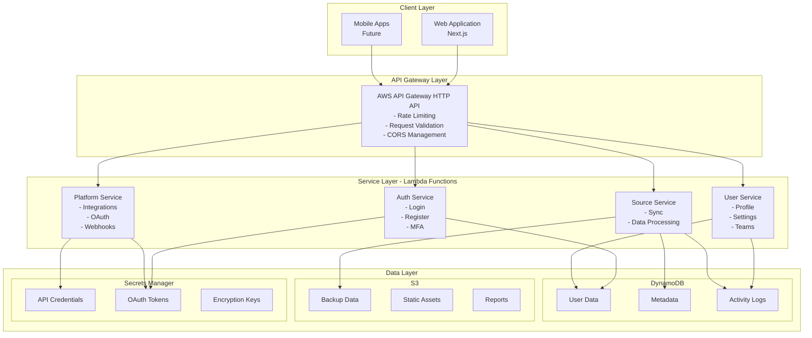
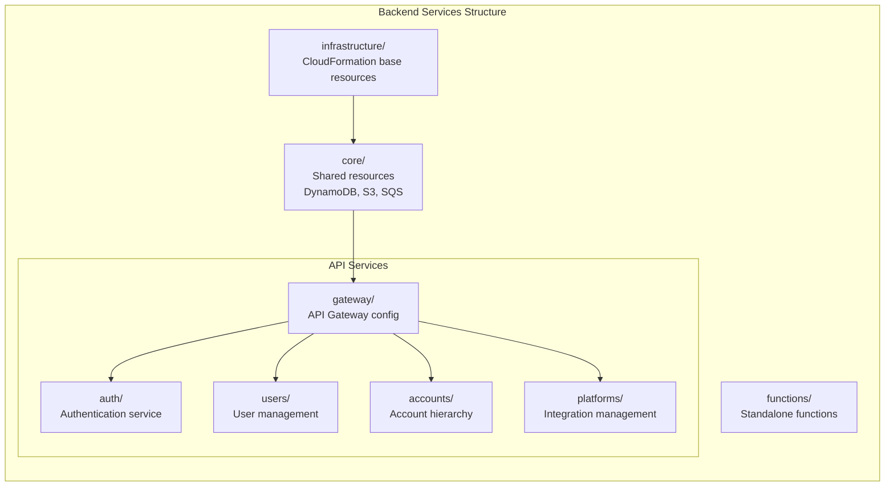
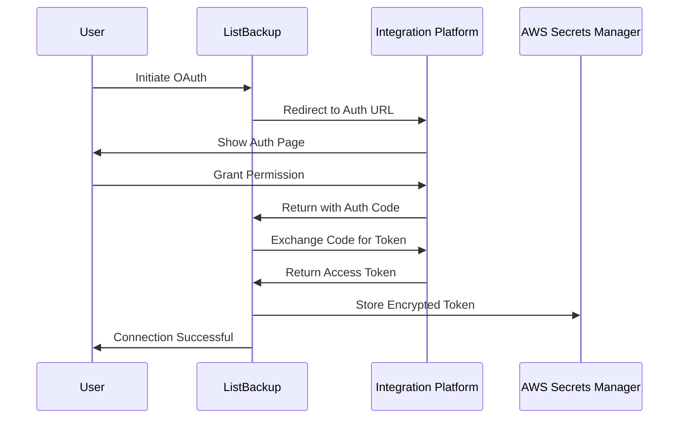
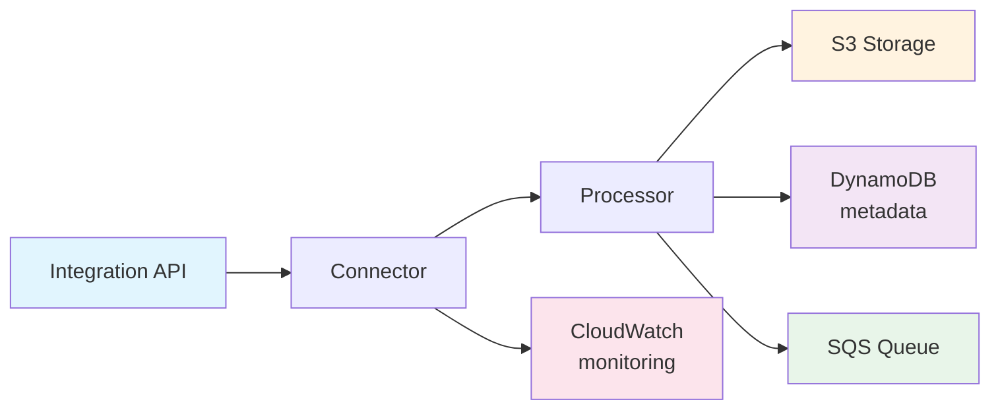
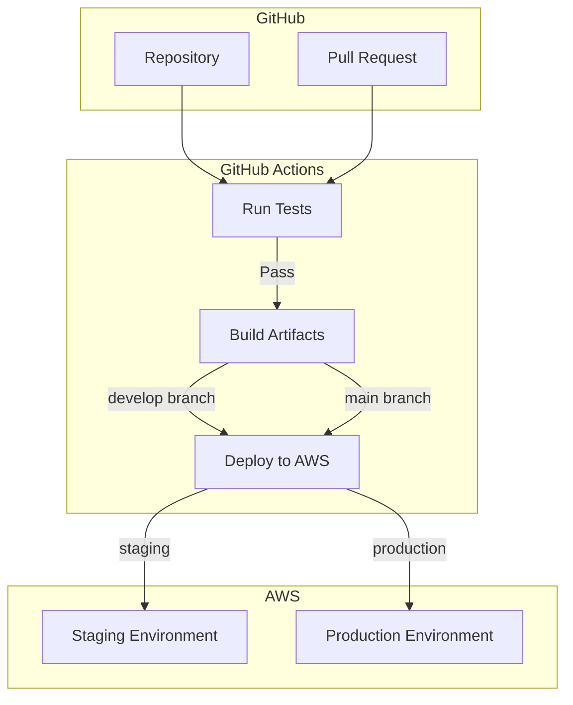

# ListBackup.ai Architecture

## Overview

ListBackup.ai is a cloud-native, serverless application built on AWS infrastructure. The system follows a microservices architecture pattern with clear separation between frontend, backend services, and data storage layers.

## System Architecture



## Core Components

### Frontend Application

**Technology Stack:**
- Next.js 14 with App Router
- TypeScript
- Tailwind CSS
- Radix UI Components
- React Query for data fetching

**Key Features:**
- Server-side rendering for optimal performance
- Progressive Web App capabilities
- Responsive design for all devices
- Real-time updates via WebSockets (planned)

### Backend Services

#### API Gateway
- AWS API Gateway HTTP API
- JWT authorizer for authentication
- Request throttling and quota management
- Custom domain with SSL certificate

#### Lambda Functions

**Language Distribution:**
- Go: Core services requiring high performance
- Node.js: Integration connectors and utilities

**Service Architecture:**


### Data Storage

#### DynamoDB Tables
- **users**: User profiles and authentication
- **accounts**: Hierarchical account structure
- **sources**: Integration configurations
- **activities**: Audit logs and activity tracking
- **tokens**: OAuth tokens (encrypted)

#### S3 Buckets
- **listbackup-{accountId}**: Isolated backup data per account
- **listbackup-assets**: Static assets and public files
- **listbackup-exports**: Temporary export files

#### Secrets Manager
- OAuth client credentials
- API keys for third-party services
- Encryption keys

### Security Architecture

#### Authentication & Authorization
- AWS Cognito for user authentication
- JWT tokens with short expiration
- Role-based access control (RBAC)
- Multi-factor authentication (MFA)

#### Data Protection
- Encryption at rest (AES-256)
- Encryption in transit (TLS 1.3)
- Per-account encryption keys
- Regular key rotation

#### Network Security
- VPC isolation for sensitive resources
- Security groups with least privilege
- WAF rules for common attacks
- DDoS protection via CloudFront

## Integration Architecture

### OAuth Flow


### Data Sync Pipeline


## Scalability Patterns

### Horizontal Scaling
- Lambda functions scale automatically
- DynamoDB auto-scaling for read/write capacity
- S3 provides unlimited storage
- CloudFront CDN for global distribution

### Performance Optimization
- Connection pooling for database connections
- Caching strategy with ElastiCache (planned)
- Lazy loading and code splitting
- Image optimization and CDN delivery

## Monitoring & Observability

### Logging
- CloudWatch Logs for all services
- Structured logging with correlation IDs
- Log aggregation and analysis

### Metrics
- CloudWatch Metrics for system health
- Custom metrics for business KPIs
- Real-time dashboards

### Tracing
- AWS X-Ray for distributed tracing
- Performance bottleneck identification
- Request flow visualization

## Deployment Architecture

### CI/CD Pipeline


### Environment Strategy
- **Development**: Feature branches → dev environment
- **Staging**: develop branch → staging environment
- **Production**: main branch → production environment

### Infrastructure as Code
- Serverless Framework v4 with Compose for orchestrated deployment
- Deployment order managed by serverless-compose.yml:
  1. Infrastructure services deployed first
  2. API services deployed after infrastructure
- CloudFormation for AWS resources
- Service dependencies handled automatically

### Deployment Process
```bash
# Deploy all services using Serverless Compose
cd backend/golang
serverless deploy --stage {stage}

# The serverless-compose.yml orchestrates:
# 1. Infrastructure stack (DynamoDB, S3, etc.)
# 2. API services (Auth, Users, Platforms, etc.)
```

## Disaster Recovery

### Backup Strategy
- Daily automated backups of all data
- Cross-region replication for critical data
- Point-in-time recovery for DynamoDB
- Versioning enabled on S3 buckets

### Recovery Procedures
- RTO (Recovery Time Objective): 1 hour
- RPO (Recovery Point Objective): 24 hours
- Automated failover for critical services
- Regular disaster recovery drills

## Future Architecture Considerations

### Planned Enhancements
1. **Event-Driven Architecture**
   - EventBridge for service communication
   - Event sourcing for audit trail
   - CQRS pattern for read/write separation

2. **Multi-Region Support**
   - Active-active configuration
   - Global data replication
   - Latency-based routing

3. **Kubernetes Migration**
   - Container-based deployments
   - Better resource utilization
   - Enhanced monitoring capabilities

4. **AI/ML Integration**
   - Anomaly detection in backups
   - Predictive analytics
   - Intelligent data classification

## Development Guidelines

### Code Organization
- Domain-driven design principles
- Clean architecture patterns
- Dependency injection
- Interface-based programming

### Testing Strategy
- Unit tests for business logic
- Integration tests for APIs
- End-to-end tests for critical paths
- Performance testing for scalability

### Documentation
- API documentation with OpenAPI
- Architecture decision records (ADRs)
- Runbooks for operations
- Knowledge base for support