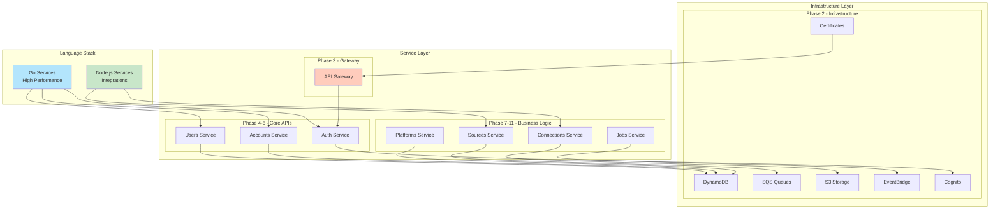
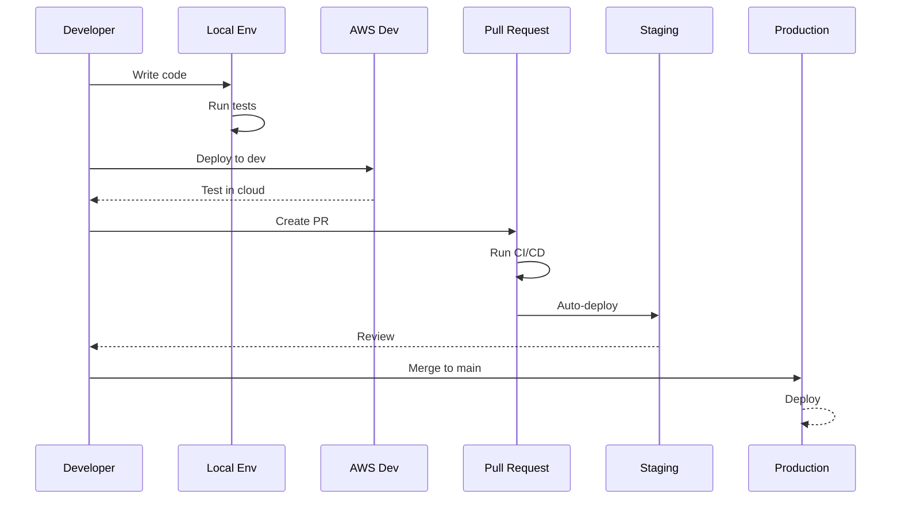
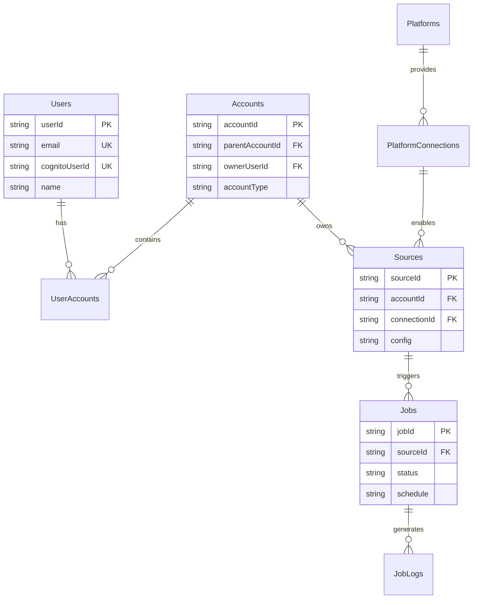
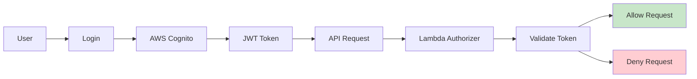

# ListBackup.ai Backend

Modern, scalable backend architecture for ListBackup.ai using AWS Serverless technologies.

## 🏗️ Architecture Overview



## 📁 Project Structure

```
backend/
├── docs/                      # Comprehensive documentation
│   ├── architecture/         # System design docs
│   ├── infrastructure/       # AWS resource docs
│   ├── api/                  # API documentation
│   ├── services/             # Service-specific docs
│   ├── deployment/           # Deployment guides
│   └── phases/               # Migration phase docs
├── golang/                    # Go services
│   ├── services/             # Serverless services
│   │   ├── infrastructure/   # AWS infrastructure
│   │   ├── core/            # Core resources
│   │   └── api/             # API services
│   ├── internal/            # Shared Go code
│   └── cmd/                 # Lambda handlers
├── nodejs-first-attempt/     # Legacy Node.js code
├── python/                   # Python processors
├── scripts/                  # Deployment scripts
└── shared/                   # Shared configs
```

## 🚀 Quick Start

### Prerequisites

```bash
# Required tools
- AWS CLI v2
- Go 1.21+
- Node.js 20+
- Serverless Framework v4
- Make

# AWS Configuration
aws configure --profile listbackup.ai
```

### Local Development

```bash
# Clone repository
git clone https://github.com/ListBackup-ai/listbackup-ai.git
cd listbackup-ai/backend

# Install dependencies
cd golang
go mod download
npm install -g serverless

# Deploy to development
serverless deploy --stage dev
```

## 📋 Service Architecture

### Infrastructure Services (Phase 2) ✅

| Service | Purpose | Status |
|---------|---------|--------|
| infrastructure-certificates | SSL/TLS certificates | ✅ Complete |
| infrastructure-dynamodb | 17 DynamoDB tables | ✅ Complete |
| infrastructure-sqs | 6 FIFO queues + DLQs | ✅ Complete |
| infrastructure-s3 | Object storage | ✅ Complete |
| infrastructure-eventbridge | Event bus | ✅ Complete |
| infrastructure-cognito | Authentication | ✅ Complete |

### API Services (Phase 3-6) ✅

| Service | Purpose | Status |
|---------|---------|--------|
| api/gateway | API Gateway configuration | ✅ Complete |
| api/auth | Authentication & authorization | ✅ Complete |
| api/users | User management | ✅ Complete |
| api/accounts | Account hierarchy | ✅ Complete |

### Business Services (Phase 7-11) 🚧

| Service | Purpose | Status |
|---------|---------|--------|
| api/platforms | Platform registry | 🚧 In Progress |
| api/connections | OAuth connections | 📋 Planned |
| api/sources | Data sources | 📋 Planned |
| api/jobs | Job processing | 📋 Planned |

## 🔧 Development Workflow



## 📊 Database Schema



## 🔒 Security

### Authentication Flow



### Security Layers

1. **Network**: CloudFront, WAF, API Gateway
2. **Authentication**: AWS Cognito, JWT tokens
3. **Authorization**: Custom Lambda authorizer, RBAC
4. **Encryption**: TLS 1.3, AES-256 at rest
5. **Secrets**: AWS Secrets Manager, KMS

## 🚢 Deployment

### Using Serverless Compose

```bash
# Deploy all services
cd backend/golang
serverless deploy --stage production

# Deploy specific service
cd backend/golang/services/api/users
serverless deploy --stage production

# Remove deployment
serverless remove --stage production
```

### Environment Variables

Required SSM parameters:
```
/listbackup/jwt-secret
/listbackup/cors-origin
/listbackup/ses-from-email
```

## 📈 Monitoring

### CloudWatch Dashboards

- System Overview: Lambda metrics, API Gateway stats
- Database Performance: DynamoDB metrics
- Queue Processing: SQS queue depths
- Error Tracking: Lambda errors, API 4xx/5xx

### Alerts

- High error rate (>5%)
- Lambda timeout
- DynamoDB throttling
- Queue backup (>1000 messages)

## 🧪 Testing

```bash
# Unit tests
cd golang
go test ./...

# Integration tests
cd golang/services/api/users
go test -tags=integration

# Load testing
artillery run tests/load/api-stress.yml
```

## 📚 Documentation

Comprehensive documentation available in `/backend/docs/`:

- [Architecture Overview](./docs/architecture/infrastructure-overview.md)
- [API Documentation](./docs/api/overview.md)
- [Deployment Guide](./docs/deployment/deployment-guide.md)
- [Development Setup](./docs/development/setup.md)

## 🤝 Contributing

1. Create feature branch from `develop`
2. Write tests for new functionality
3. Update documentation
4. Submit pull request
5. Ensure CI/CD passes

## 📄 License

Copyright © 2024 ListBackup.ai - All rights reserved