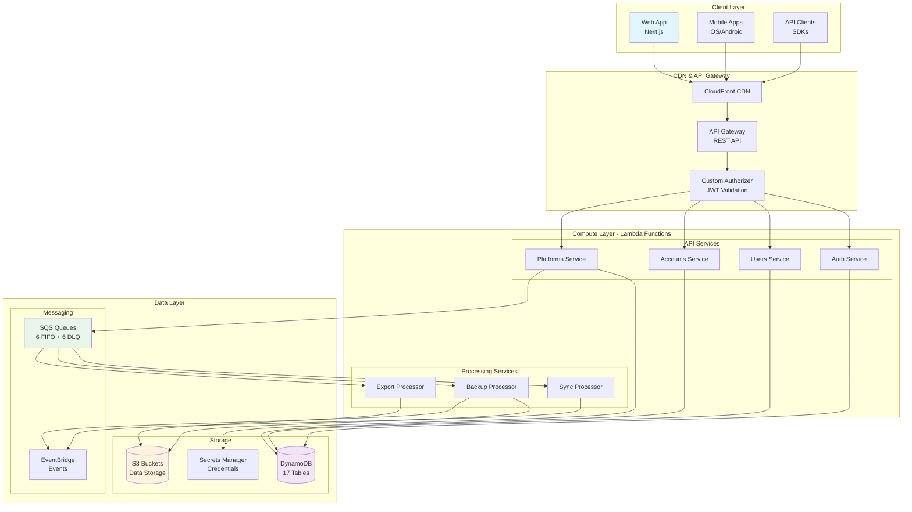

# Backend Documentation

Welcome to the ListBackup.ai backend documentation. This directory contains comprehensive documentation for all backend services, infrastructure, and APIs.

## 🏗️ System Architecture Overview

## 📚 Documentation Structure

### 🏗️ Architecture
- [Infrastructure Overview](./architecture/infrastructure-overview.md) - AWS infrastructure components
- [Service Architecture](./architecture/service-architecture.md) - Microservices design
- [Data Architecture](./architecture/data-architecture.md) - Database schemas and data flow
- [Security Architecture](./architecture/security-architecture.md) - Security implementation details

### 🔧 Infrastructure
- [DynamoDB Tables](./infrastructure/dynamodb-tables.md) - Complete table schemas
- [SQS Queues](./infrastructure/sqs-queues.md) - Queue configurations
- [S3 Buckets](./infrastructure/s3-buckets.md) - Storage structure
- [CloudFormation Exports](./infrastructure/cloudformation-exports.md) - Cross-stack references
- [IAM Permissions](./infrastructure/iam-permissions.md) - Security permissions matrix

### 📡 API Documentation
- [API Overview](./api/overview.md) - REST API architecture
- [Authentication](./api/authentication.md) - Auth endpoints and flows
- [User Management](./api/users.md) - User-related endpoints
- [Account Management](./api/accounts.md) - Account hierarchy endpoints
- [Platform Integration](./api/platforms.md) - Integration platform endpoints
- [Source Management](./api/sources.md) - Data source endpoints
- [Job Management](./api/jobs.md) - Backup job endpoints

### 🔌 Services
- [Auth Service](./services/auth-service.md) - Authentication and authorization
- [Users Service](./services/users-service.md) - User management
- [Accounts Service](./services/accounts-service.md) - Account hierarchy
- [Platforms Service](./services/platforms-service.md) - Integration platforms
- [Connections Service](./services/connections-service.md) - OAuth connections
- [Sources Service](./services/sources-service.md) - Data sources
- [Jobs Service](./services/jobs-service.md) - Backup jobs

### 🚀 Deployment
- [Deployment Guide](./deployment/deployment-guide.md) - Step-by-step deployment
- [Environment Configuration](./deployment/environment-config.md) - Environment variables
- [Serverless Configuration](./deployment/serverless-config.md) - Serverless framework setup
- [CI/CD Pipeline](./deployment/cicd-pipeline.md) - GitHub Actions workflow

### 📊 Migration Phases
- [Phase 1: Infrastructure Audit](./phases/phase1-audit/) - Complete infrastructure audit
- [Phase 2: Infrastructure Services](./phases/phase2-infrastructure.md) - Service separation
- [Phase 3: API Gateway](./phases/phase3-api-gateway/) - API Gateway configuration
- [Phase 4: Auth Service](./phases/phase4-auth.md) - Auth service updates
- [Phase 5: Users Service](./phases/phase5-users.md) - Users service updates
- [Phase 6: Accounts Service](./phases/phase6-accounts.md) - Accounts service updates
- [Phase 7-11: Remaining Services](./phases/phase7-11-services.md) - Platform and utility services

### 🔍 Development
- [Development Setup](./development/setup.md) - Local development environment
- [Testing Guide](./development/testing.md) - Unit and integration testing
- [Debugging Guide](./development/debugging.md) - Troubleshooting tips
- [Contributing](./development/contributing.md) - Contribution guidelines

## 🎯 Quick Links

### For New Developers
1. Start with [Infrastructure Overview](./architecture/infrastructure-overview.md)
2. Review [Service Architecture](./architecture/service-architecture.md)
3. Follow [Development Setup](./development/setup.md)
4. Check [API Overview](./api/overview.md)

### For DevOps
1. [Deployment Guide](./deployment/deployment-guide.md)
2. [Environment Configuration](./deployment/environment-config.md)
3. [IAM Permissions](./infrastructure/iam-permissions.md)
4. [CI/CD Pipeline](./deployment/cicd-pipeline.md)

### For API Integration
1. [API Overview](./api/overview.md)
2. [Authentication](./api/authentication.md)
3. Service-specific API docs in the [API section](./api/)

## 📋 Documentation Standards

- All documentation uses Markdown format
- Code examples include language specification
- API endpoints include request/response examples
- Diagrams use Mermaid syntax where applicable
- Keep documentation up-to-date with code changes

## 🔄 Version History

| Version | Date | Description |
|---------|------|-------------|
| 1.0.0 | June 2024 | Initial documentation structure |
| 1.1.0 | December 2024 | Phase 1-6 infrastructure migration complete |

## 📝 Contributing to Documentation

When updating documentation:
1. Follow the existing structure
2. Include practical examples
3. Update the table of contents
4. Add diagrams for complex concepts
5. Review for accuracy before committing

---

For questions or clarifications, please contact the backend team or create an issue in the repository.