# Authentication API Documentation

This document covers all authentication-related endpoints, flows, and security considerations for the ListBackup.ai platform.

## Authentication Flow Overview

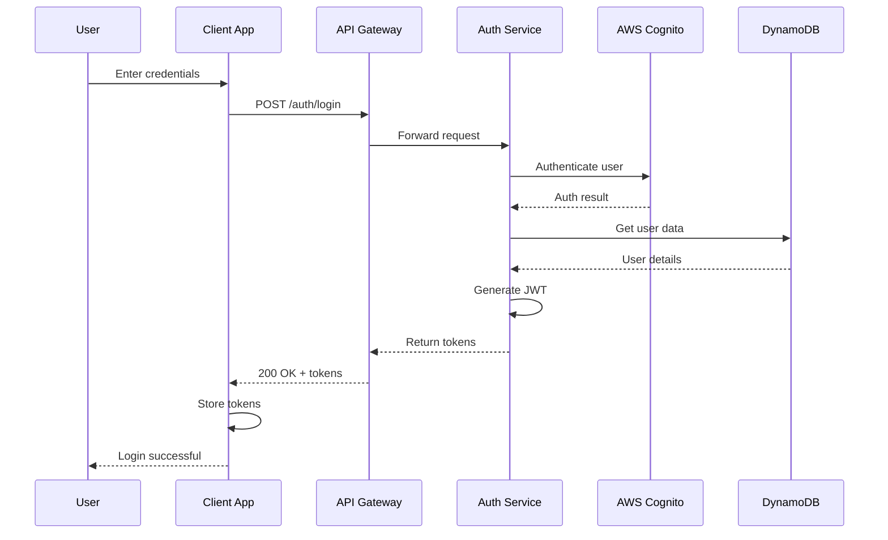

## Token Architecture

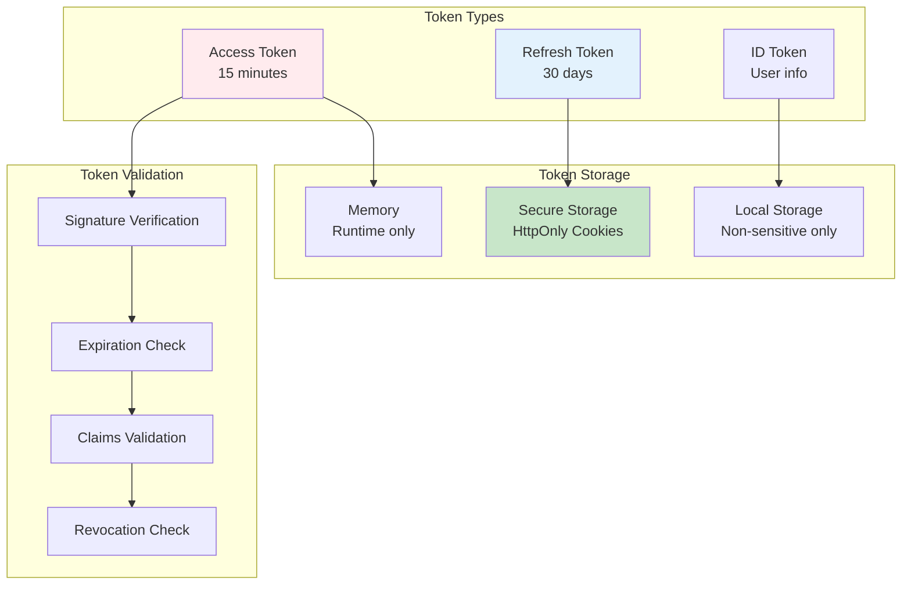

## API Endpoints

### 1. User Registration

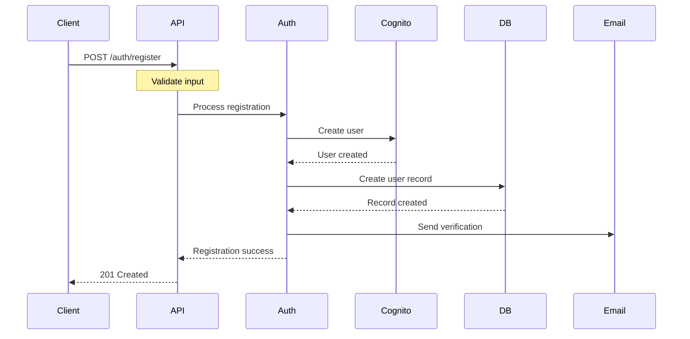

**Endpoint**: `POST /auth/register`

**Request Body**:
```json
{
  "email": "user@example.com",
  "password": "SecureP@ssw0rd!",
  "name": "John Doe",
  "company": "Acme Corp",
  "acceptTerms": true
}
```

**Validation Rules**:
- Email: Valid format, unique
- Password: 8+ chars, uppercase, lowercase, number, special char
- Name: 2-100 characters
- Company: Optional, 2-100 characters
- Accept Terms: Must be true

**Success Response** (201):
```json
{
  "success": true,
  "data": {
    "userId": "usr_abc123def456",
    "email": "user@example.com",
    "emailVerified": false,
    "createdAt": "2024-12-30T10:00:00Z"
  },
  "meta": {
    "timestamp": "2024-12-30T10:00:00Z"
  }
}
```

### 2. User Login

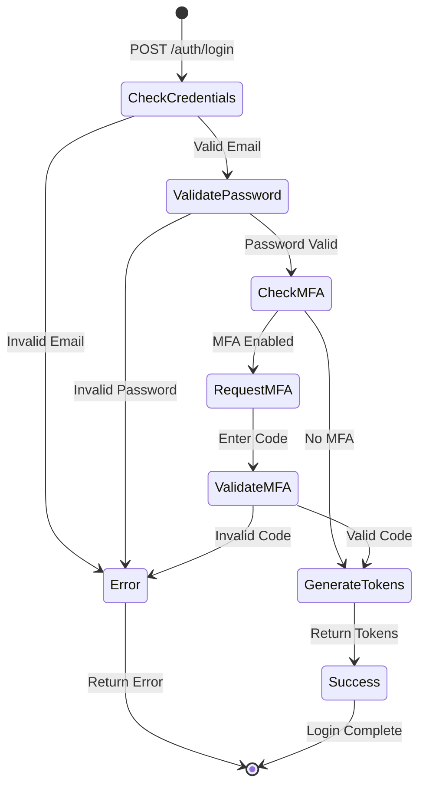

**Endpoint**: `POST /auth/login`

**Request Body**:
```json
{
  "email": "user@example.com",
  "password": "SecureP@ssw0rd!",
  "rememberMe": true
}
```

**Success Response** (200):
```json
{
  "success": true,
  "data": {
    "accessToken": "eyJhbGciOiJIUzI1NiIs...",
    "refreshToken": "eyJhbGciOiJIUzI1NiIs...",
    "idToken": "eyJhbGciOiJIUzI1NiIs...",
    "expiresIn": 900,
    "user": {
      "userId": "usr_abc123def456",
      "email": "user@example.com",
      "name": "John Doe",
      "accountId": "acc_789012",
      "role": "admin"
    }
  }
}
```

### 3. Token Refresh

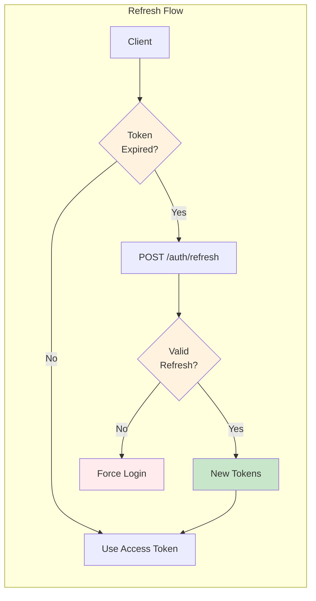

**Endpoint**: `POST /auth/refresh`

**Request Body**:
```json
{
  "refreshToken": "eyJhbGciOiJIUzI1NiIs..."
}
```

**Success Response** (200):
```json
{
  "success": true,
  "data": {
    "accessToken": "eyJhbGciOiJIUzI1NiIs...",
    "idToken": "eyJhbGciOiJIUzI1NiIs...",
    "expiresIn": 900
  }
}
```

### 4. Password Reset Flow

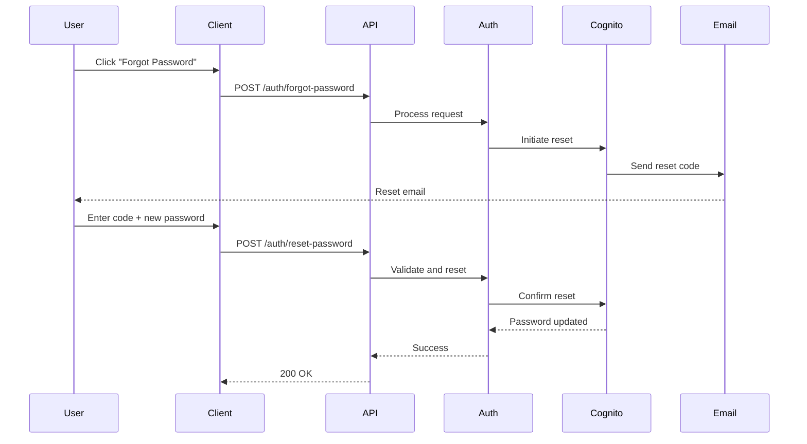

**Forgot Password Endpoint**: `POST /auth/forgot-password`

**Request**:
```json
{
  "email": "user@example.com"
}
```

**Reset Password Endpoint**: `POST /auth/reset-password`

**Request**:
```json
{
  "email": "user@example.com",
  "code": "123456",
  "newPassword": "NewSecureP@ssw0rd!"
}
```

### 5. Multi-Factor Authentication (MFA)

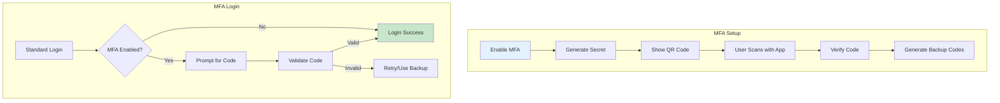

**Enable MFA**: `POST /auth/mfa/enable`

**Response**:
```json
{
  "success": true,
  "data": {
    "secret": "JBSWY3DPEHPK3PXP",
    "qrCode": "data:image/png;base64,iVBORw0KGgo...",
    "backupCodes": [
      "abc123def456",
      "ghi789jkl012",
      "mno345pqr678"
    ]
  }
}
```

**Verify MFA**: `POST /auth/mfa/verify`

**Request**:
```json
{
  "code": "123456",
  "sessionToken": "temp_session_token"
}
```

### 6. Email Verification

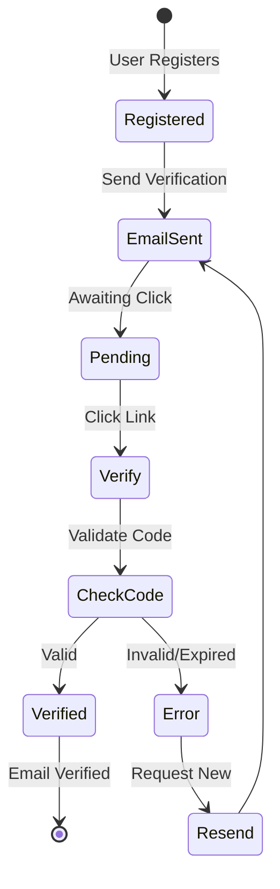

**Verify Email**: `POST /auth/verify-email`

**Request**:
```json
{
  "email": "user@example.com",
  "code": "verification_code_from_email"
}
```

**Resend Verification**: `POST /auth/resend-verification`

**Request**:
```json
{
  "email": "user@example.com"
}
```

## JWT Token Structure

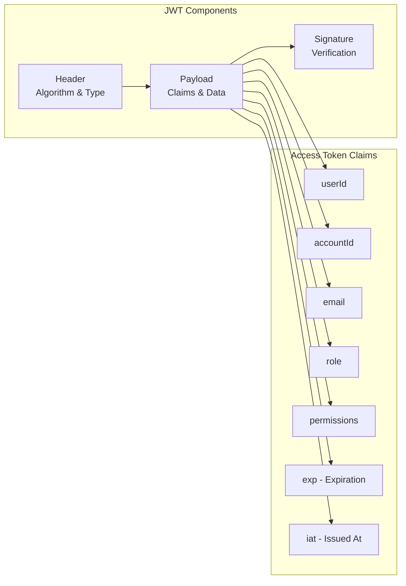

### Sample Decoded Token

```json
{
  "header": {
    "alg": "HS256",
    "typ": "JWT"
  },
  "payload": {
    "userId": "usr_abc123def456",
    "accountId": "acc_789012",
    "email": "user@example.com",
    "role": "admin",
    "permissions": [
      "sources:read",
      "sources:write",
      "jobs:create",
      "account:manage"
    ],
    "exp": 1704067200,
    "iat": 1704063600,
    "iss": "https://api.listbackup.ai"
  }
}
```

## Security Considerations

### Password Policy

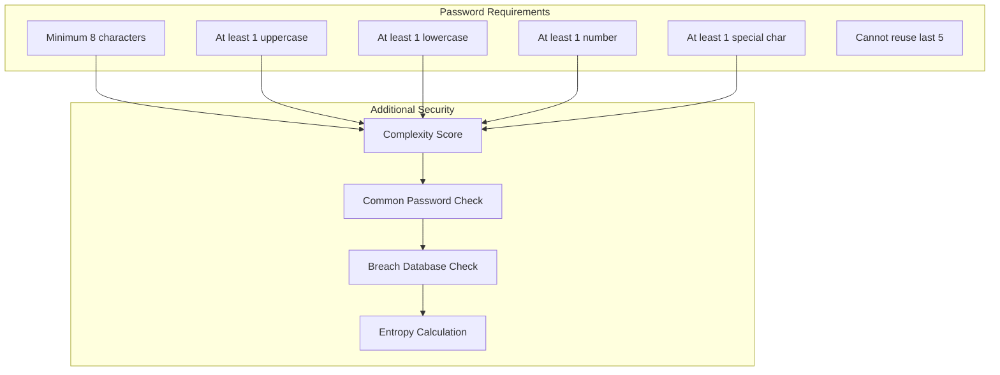

### Rate Limiting

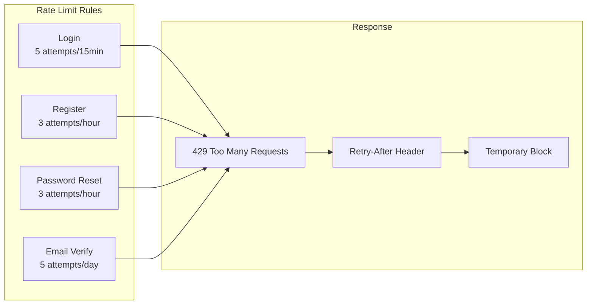

### Session Management

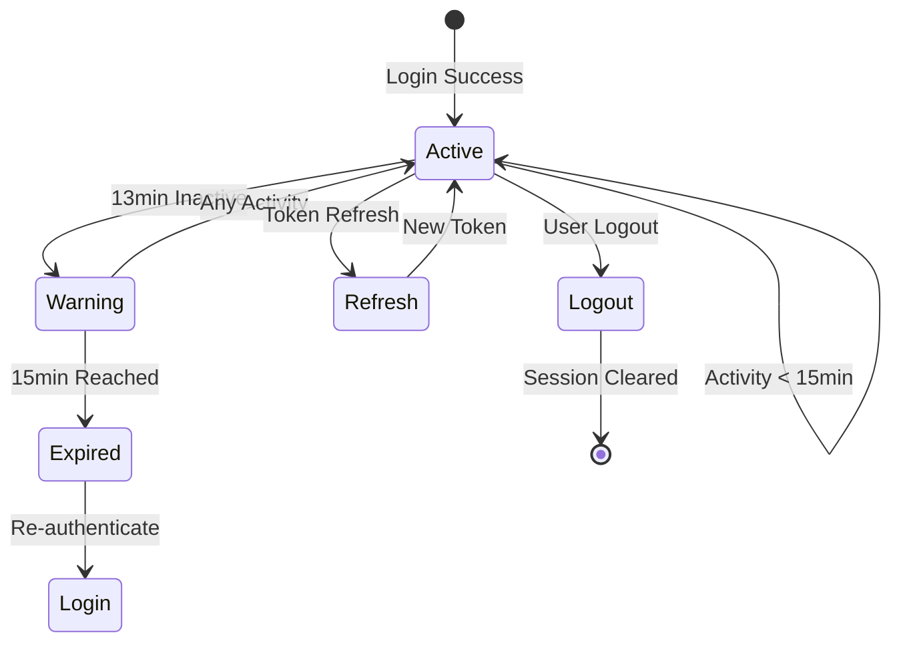

## Error Handling

### Common Error Responses

| Error Code | HTTP Status | Description |
|------------|-------------|-------------|
| AUTH_INVALID_CREDENTIALS | 401 | Invalid email or password |
| AUTH_USER_NOT_FOUND | 404 | User does not exist |
| AUTH_EMAIL_NOT_VERIFIED | 403 | Email verification required |
| AUTH_ACCOUNT_SUSPENDED | 403 | Account has been suspended |
| AUTH_MFA_REQUIRED | 428 | MFA code required |
| AUTH_MFA_INVALID | 401 | Invalid MFA code |
| AUTH_TOKEN_EXPIRED | 401 | Access token has expired |
| AUTH_TOKEN_INVALID | 401 | Invalid or malformed token |
| AUTH_REFRESH_INVALID | 401 | Invalid refresh token |
| AUTH_RATE_LIMITED | 429 | Too many attempts |

### Error Response Format

```json
{
  "success": false,
  "error": {
    "code": "AUTH_INVALID_CREDENTIALS",
    "message": "Invalid email or password",
    "details": {
      "attempts": 3,
      "maxAttempts": 5,
      "lockoutTime": null
    }
  },
  "meta": {
    "timestamp": "2024-12-30T10:00:00Z",
    "requestId": "req_abc123"
  }
}
```

## SDK Examples

### JavaScript/TypeScript

```typescript
import { AuthClient } from '@listbackup/sdk';

const auth = new AuthClient({
  baseURL: 'https://api.listbackup.ai'
});

// Login
try {
  const { accessToken, refreshToken, user } = await auth.login({
    email: 'user@example.com',
    password: 'SecureP@ssw0rd!'
  });
  
  // Store tokens securely
  await tokenStorage.save({ accessToken, refreshToken });
  
} catch (error) {
  if (error.code === 'AUTH_MFA_REQUIRED') {
    // Handle MFA flow
    const code = await promptMFACode();
    const result = await auth.verifyMFA({
      code,
      sessionToken: error.sessionToken
    });
  }
}

// Auto-refresh tokens
auth.onTokenExpired(async () => {
  const { refreshToken } = await tokenStorage.get();
  const newTokens = await auth.refresh(refreshToken);
  await tokenStorage.save(newTokens);
  return newTokens.accessToken;
});
```

### Go

```go
package main

import (
    "github.com/listbackup/sdk-go/auth"
)

func main() {
    client := auth.NewClient(auth.Config{
        BaseURL: "https://api.listbackup.ai",
    })
    
    // Login
    result, err := client.Login(auth.LoginRequest{
        Email:    "user@example.com",
        Password: "SecureP@ssw0rd!",
    })
    
    if err != nil {
        if authErr, ok := err.(*auth.Error); ok {
            switch authErr.Code {
            case "AUTH_MFA_REQUIRED":
                // Handle MFA
                code := promptMFACode()
                result, err = client.VerifyMFA(auth.MFARequest{
                    Code:         code,
                    SessionToken: authErr.SessionToken,
                })
            }
        }
    }
    
    // Use tokens
    tokenStore.Save(result.AccessToken, result.RefreshToken)
}
```

## Best Practices

### 1. Token Storage
- Never store tokens in localStorage for sensitive data
- Use httpOnly, secure cookies for refresh tokens
- Implement token rotation
- Clear tokens on logout

### 2. Security Headers
```http
Strict-Transport-Security: max-age=31536000; includeSubDomains
X-Content-Type-Options: nosniff
X-Frame-Options: DENY
X-XSS-Protection: 1; mode=block
Content-Security-Policy: default-src 'self'
```

### 3. CORS Configuration
- Whitelist specific origins
- Don't use wildcard (*) in production
- Validate preflight requests
- Limit exposed headers

### 4. Monitoring
- Track failed login attempts
- Monitor unusual patterns
- Alert on security events
- Regular security audits