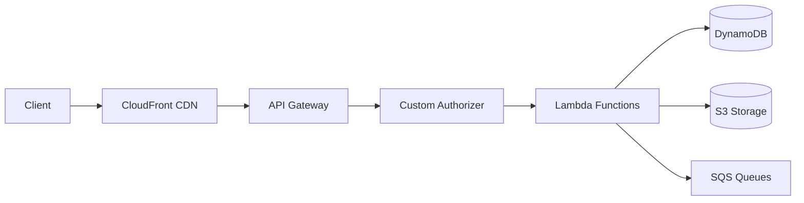

# API Overview

The ListBackup.ai API is a RESTful service built on AWS API Gateway with Lambda function backends. This document provides a comprehensive overview of the API architecture, conventions, and usage.

## Base URL

```
Production: https://api.listbackup.ai
Staging: https://staging.api.listbackup.ai
Development: https://dev.api.listbackup.ai
```

## API Architecture



## Authentication

All API requests (except auth endpoints) require authentication using JWT tokens.

### Headers
```
Authorization: Bearer <jwt_token>
Content-Type: application/json
```

### Token Structure
```json
{
  "userId": "usr_123456",
  "accountId": "acc_789012",
  "email": "user@example.com",
  "role": "admin",
  "exp": 1704067200,
  "iat": 1704063600
}
```

## API Conventions

### Request Format
- All requests use JSON format
- UTF-8 encoding required
- Maximum request size: 10MB

### Response Format
```json
{
  "success": true,
  "data": {
    // Response data
  },
  "meta": {
    "timestamp": "2024-12-30T10:00:00Z",
    "version": "1.0.0"
  }
}
```

### Error Response Format
```json
{
  "success": false,
  "error": {
    "code": "VALIDATION_ERROR",
    "message": "Invalid input parameters",
    "details": {
      "field": "email",
      "reason": "Invalid email format"
    }
  },
  "meta": {
    "timestamp": "2024-12-30T10:00:00Z",
    "requestId": "req_abc123"
  }
}
```

## HTTP Status Codes

| Code | Meaning | Usage |
|------|---------|-------|
| 200 | OK | Successful GET, PUT |
| 201 | Created | Successful POST creating resource |
| 204 | No Content | Successful DELETE |
| 400 | Bad Request | Invalid request parameters |
| 401 | Unauthorized | Missing or invalid authentication |
| 403 | Forbidden | Insufficient permissions |
| 404 | Not Found | Resource not found |
| 409 | Conflict | Resource conflict (duplicate) |
| 422 | Unprocessable Entity | Validation errors |
| 429 | Too Many Requests | Rate limit exceeded |
| 500 | Internal Server Error | Server error |
| 503 | Service Unavailable | Temporary unavailability |

## Rate Limiting

### Default Limits
- **Anonymous**: 10 requests/minute
- **Authenticated**: 100 requests/minute
- **Premium**: 1000 requests/minute

### Rate Limit Headers
```
X-RateLimit-Limit: 100
X-RateLimit-Remaining: 95
X-RateLimit-Reset: 1704064200
```

## Pagination

### Request Parameters
```
GET /api/sources?page=1&limit=20&sort=createdAt&order=desc
```

### Pagination Response
```json
{
  "data": [...],
  "pagination": {
    "page": 1,
    "limit": 20,
    "total": 156,
    "totalPages": 8,
    "hasNext": true,
    "hasPrev": false
  }
}
```

## Filtering and Sorting

### Filter Syntax
```
GET /api/sources?filter[status]=active&filter[platform]=stripe
```

### Sort Syntax
```
GET /api/sources?sort=-createdAt,name
```
- Prefix with `-` for descending order
- Multiple fields separated by comma

## API Versioning

The API uses header-based versioning:

```
X-API-Version: 1.0
```

If no version is specified, the latest stable version is used.

## Common Headers

### Request Headers
| Header | Required | Description |
|--------|----------|-------------|
| Authorization | Yes* | JWT Bearer token |
| Content-Type | Yes | application/json |
| X-API-Version | No | API version |
| X-Request-ID | No | Client request ID |
| X-Account-ID | No | Override account context |

*Not required for auth endpoints

### Response Headers
| Header | Description |
|--------|-------------|
| X-Request-ID | Request tracking ID |
| X-Response-Time | Processing time in ms |
| X-API-Version | API version used |
| Cache-Control | Caching directives |

## API Endpoints Summary

### Authentication
- `POST /auth/register` - User registration
- `POST /auth/login` - User login
- `POST /auth/logout` - User logout
- `POST /auth/refresh` - Refresh token
- `POST /auth/forgot-password` - Password reset
- `POST /auth/verify-email` - Email verification

### Users
- `GET /users/me` - Current user profile
- `PUT /users/me` - Update profile
- `DELETE /users/me` - Delete account
- `GET /users/{userId}` - Get user (admin)
- `GET /users` - List users (admin)

### Accounts
- `GET /accounts` - List accounts
- `POST /accounts` - Create account
- `GET /accounts/{accountId}` - Get account
- `PUT /accounts/{accountId}` - Update account
- `DELETE /accounts/{accountId}` - Delete account
- `GET /accounts/{accountId}/members` - List members
- `POST /accounts/{accountId}/members` - Add member

### Platforms
- `GET /platforms` - List available platforms
- `GET /platforms/{platformId}` - Get platform details
- `GET /platforms/{platformId}/sources` - Platform source types

### Connections
- `GET /connections` - List connections
- `POST /connections` - Create connection
- `GET /connections/{connectionId}` - Get connection
- `PUT /connections/{connectionId}` - Update connection
- `DELETE /connections/{connectionId}` - Delete connection
- `POST /connections/{connectionId}/test` - Test connection

### Sources
- `GET /sources` - List sources
- `POST /sources` - Create source
- `GET /sources/{sourceId}` - Get source
- `PUT /sources/{sourceId}` - Update source
- `DELETE /sources/{sourceId}` - Delete source
- `POST /sources/{sourceId}/sync` - Trigger sync

### Jobs
- `GET /jobs` - List jobs
- `POST /jobs` - Create job
- `GET /jobs/{jobId}` - Get job
- `PUT /jobs/{jobId}` - Update job
- `DELETE /jobs/{jobId}` - Delete job
- `POST /jobs/{jobId}/run` - Run job
- `GET /jobs/{jobId}/logs` - Get job logs

### Data
- `GET /data/files` - Browse files
- `GET /data/files/{fileId}` - Get file metadata
- `POST /data/search` - Search files
- `POST /data/export` - Export data
- `GET /data/download/{fileId}` - Download file

### Analytics
- `GET /analytics/overview` - Account overview
- `GET /analytics/storage` - Storage usage
- `GET /analytics/activity` - Activity metrics
- `GET /analytics/costs` - Cost analysis

## Webhooks

### Webhook Events
- `backup.started` - Backup job started
- `backup.completed` - Backup job completed
- `backup.failed` - Backup job failed
- `source.connected` - Source connected
- `source.disconnected` - Source disconnected
- `storage.limit.warning` - Storage limit warning

### Webhook Payload
```json
{
  "event": "backup.completed",
  "timestamp": "2024-12-30T10:00:00Z",
  "accountId": "acc_123456",
  "data": {
    "jobId": "job_789012",
    "sourceId": "src_345678",
    "filesProcessed": 1234,
    "bytesProcessed": 5678901234
  }
}
```

## SDK Support

### Official SDKs
- JavaScript/TypeScript
- Python
- Go
- PHP (coming soon)
- Ruby (coming soon)

### Example Usage (JavaScript)
```javascript
import { ListBackupClient } from '@listbackup/sdk';

const client = new ListBackupClient({
  apiKey: 'your-api-key',
  environment: 'production'
});

// List sources
const sources = await client.sources.list({
  filter: { status: 'active' },
  limit: 20
});

// Create backup job
const job = await client.jobs.create({
  sourceId: 'src_123456',
  schedule: '0 2 * * *', // 2 AM daily
  config: {
    incremental: true,
    compress: true
  }
});
```

## API Playground

Test API endpoints using our interactive playground:
- Production: https://api.listbackup.ai/playground
- Staging: https://staging.api.listbackup.ai/playground

## Best Practices

### 1. Error Handling
Always check for both HTTP status codes and error responses:
```javascript
try {
  const response = await fetch('/api/sources');
  if (!response.ok) {
    const error = await response.json();
    handleError(error);
  }
  const data = await response.json();
} catch (error) {
  // Network or parsing error
}
```

### 2. Pagination
Always use pagination for list endpoints:
```javascript
async function getAllSources() {
  const sources = [];
  let page = 1;
  let hasMore = true;
  
  while (hasMore) {
    const response = await getSources({ page, limit: 100 });
    sources.push(...response.data);
    hasMore = response.pagination.hasNext;
    page++;
  }
  
  return sources;
}
```

### 3. Rate Limiting
Implement exponential backoff:
```javascript
async function apiCallWithRetry(fn, maxRetries = 3) {
  for (let i = 0; i < maxRetries; i++) {
    try {
      return await fn();
    } catch (error) {
      if (error.status === 429) {
        const delay = Math.pow(2, i) * 1000;
        await sleep(delay);
      } else {
        throw error;
      }
    }
  }
}
```

### 4. Caching
Use ETags for conditional requests:
```javascript
const response = await fetch('/api/sources/src_123', {
  headers: {
    'If-None-Match': '"123456789"'
  }
});

if (response.status === 304) {
  // Use cached data
}
```

## Support

- API Status: https://status.listbackup.ai
- Documentation: https://docs.listbackup.ai
- Support: api-support@listbackup.ai
- Community: https://community.listbackup.ai