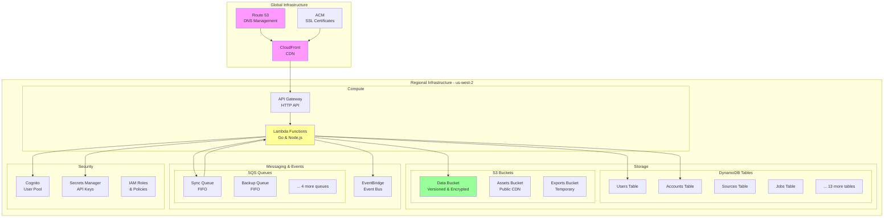
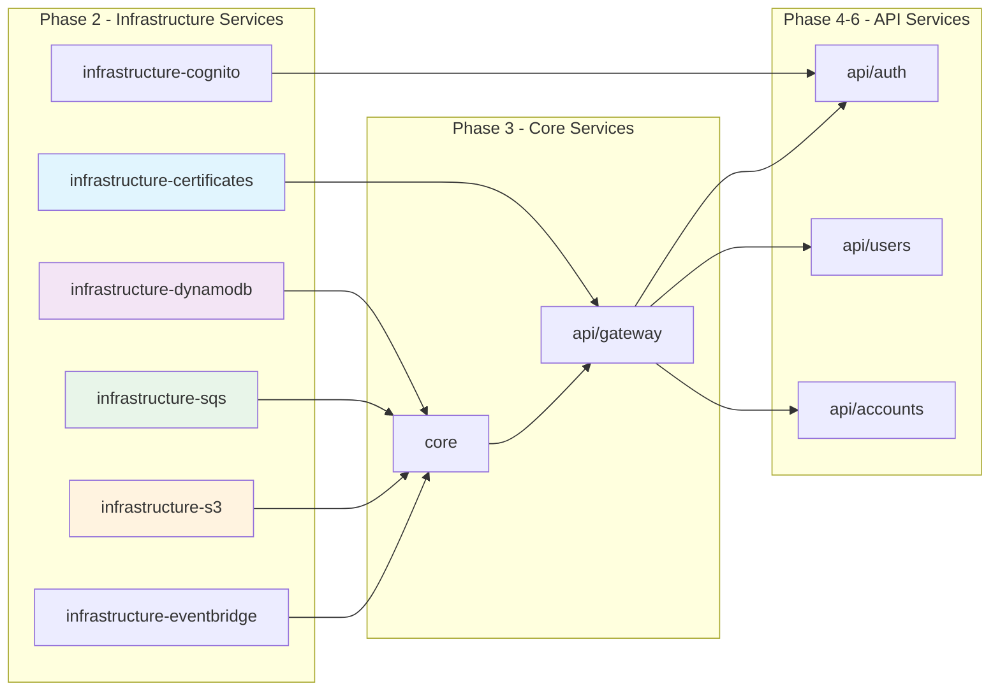
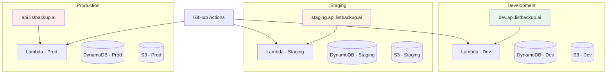
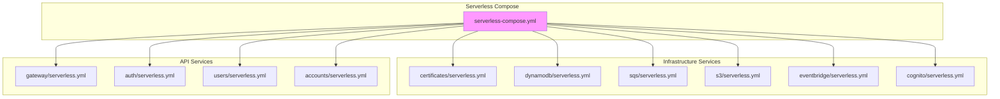
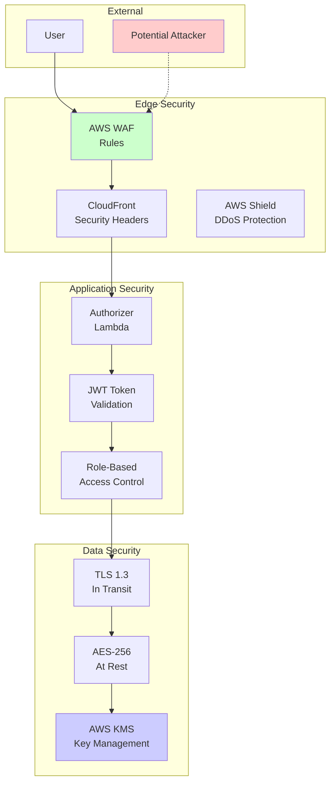
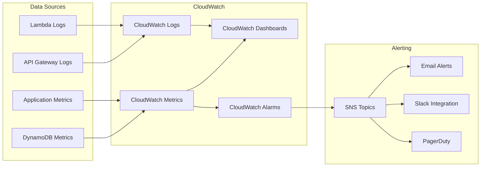
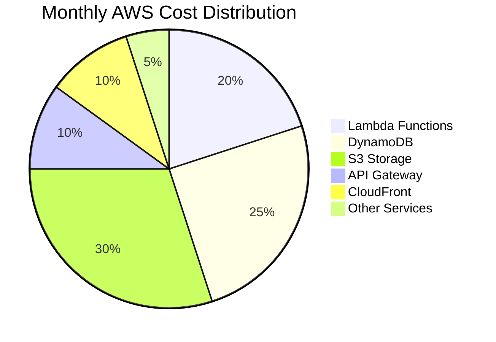
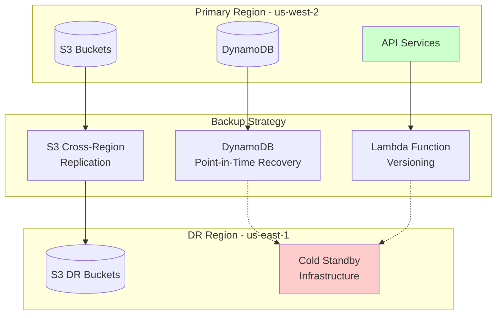
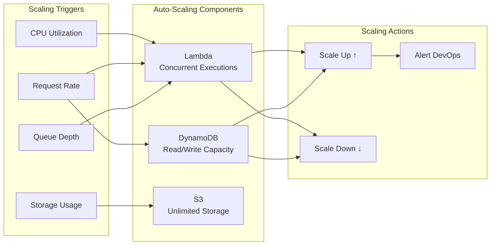
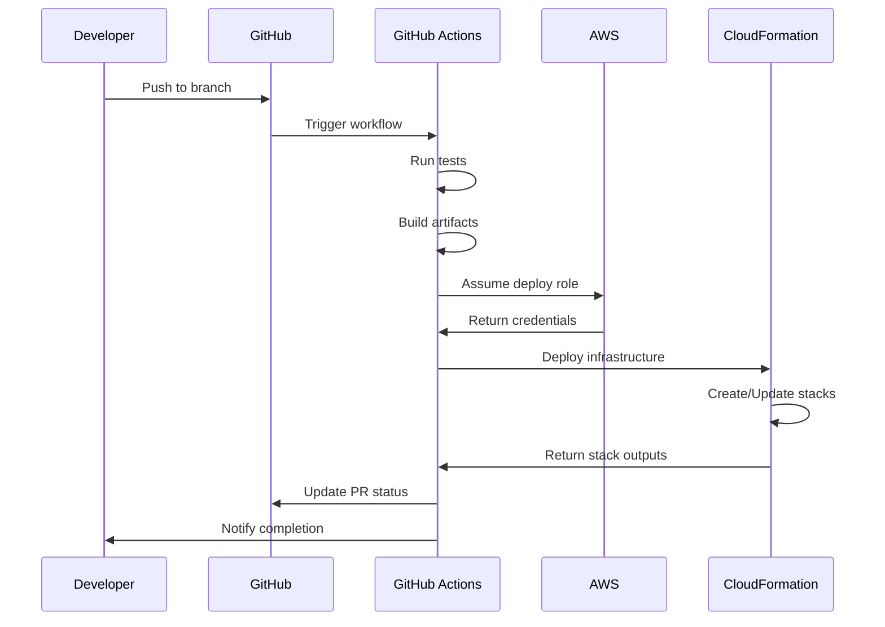

# Infrastructure Overview

This document provides a comprehensive overview of the ListBackup.ai AWS infrastructure components and their relationships.

## Infrastructure Architecture



## Service Dependencies



## Resource Naming Convention

All resources follow a consistent naming pattern:

```
{service}-{stage}-{resource}
```

### Examples:
- DynamoDB: `listbackup-dev-users`
- S3: `listbackup-data-dev`
- SQS: `listbackup-sync-queue-dev.fifo`
- Lambda: `listbackup-api-dev-getUsers`

## Multi-Stage Architecture



## Infrastructure as Code

### Serverless Framework Structure



## Security Architecture



## Monitoring and Observability



## Cost Optimization Strategy



### Cost Optimization Measures

1. **Lambda**: 
   - Provisioned concurrency only for critical functions
   - Memory optimization based on profiling
   - ARM-based Graviton2 processors

2. **DynamoDB**:
   - On-demand billing for unpredictable workloads
   - Auto-scaling for predictable patterns
   - Appropriate index projections

3. **S3**:
   - Intelligent-Tiering for automatic cost optimization
   - Lifecycle policies for old data
   - S3 Select for reduced data transfer

4. **API Gateway**:
   - Caching enabled for frequently accessed endpoints
   - Request throttling to prevent abuse

## Disaster Recovery



### RTO and RPO Targets

- **RTO (Recovery Time Objective)**: 1 hour
- **RPO (Recovery Point Objective)**: 24 hours
- **Backup Frequency**: Daily automated backups
- **Backup Retention**: 30 days

## Scaling Strategy



## Infrastructure Deployment Flow



## Key Infrastructure Components

### 1. **API Gateway**
- HTTP API (not REST) for better performance
- Custom domain with ACM certificate
- Request validation and throttling
- CORS configuration

### 2. **Lambda Functions**
- Go for performance-critical functions
- Node.js for integration handlers
- 1GB default memory allocation
- 5-minute timeout for processing functions

### 3. **DynamoDB**
- Single-table design where appropriate
- Global secondary indexes for access patterns
- On-demand billing for cost optimization
- Point-in-time recovery enabled

### 4. **S3 Storage**
- Separate buckets by concern
- Versioning for data protection
- Encryption at rest (SSE-S3)
- Lifecycle policies for cost management

### 5. **SQS Queues**
- FIFO queues for ordered processing
- Dead letter queues for error handling
- Long polling for efficiency
- Message retention: 14 days

### 6. **EventBridge**
- Central event bus for all services
- Event replay capability
- Schema registry for events
- Archive for compliance

## Next Steps

For detailed information about specific infrastructure components:
- [DynamoDB Tables](../infrastructure/dynamodb-tables.md)
- [SQS Queues](../infrastructure/sqs-queues.md)
- [S3 Buckets](../infrastructure/s3-buckets.md)
- [CloudFormation Exports](../infrastructure/cloudformation-exports.md)