# Service Architecture

This document details the microservices architecture of ListBackup.ai, including service boundaries, communication patterns, and design principles.

## Microservices Overview

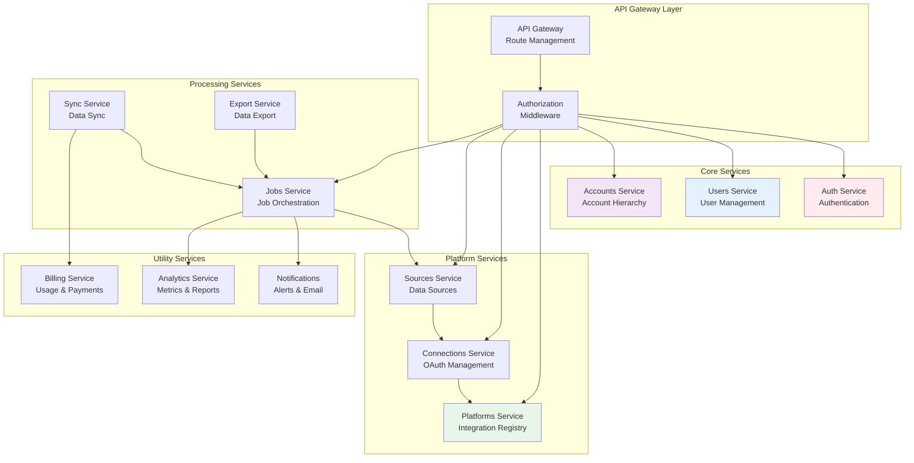

## Service Communication Patterns

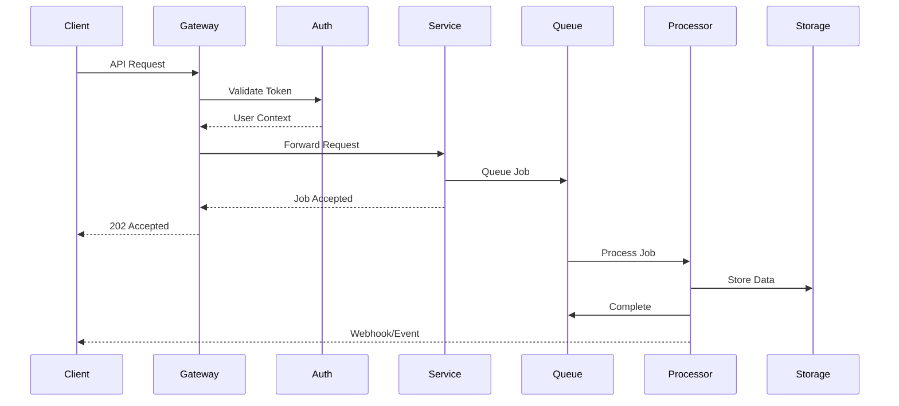

## Service Boundaries

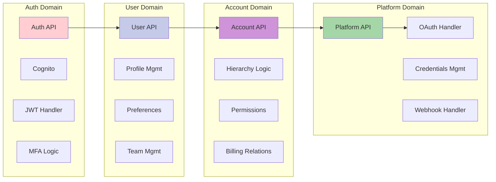

## Data Flow Architecture

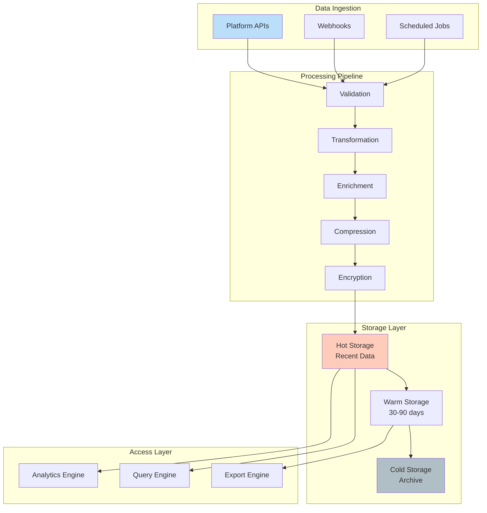

## Service Dependencies Matrix

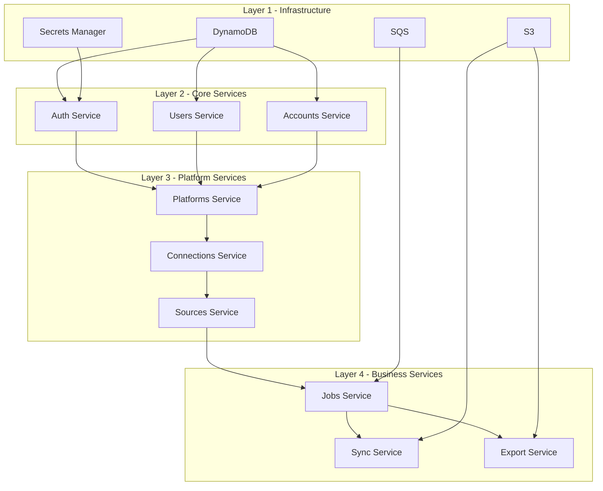

## Event-Driven Architecture

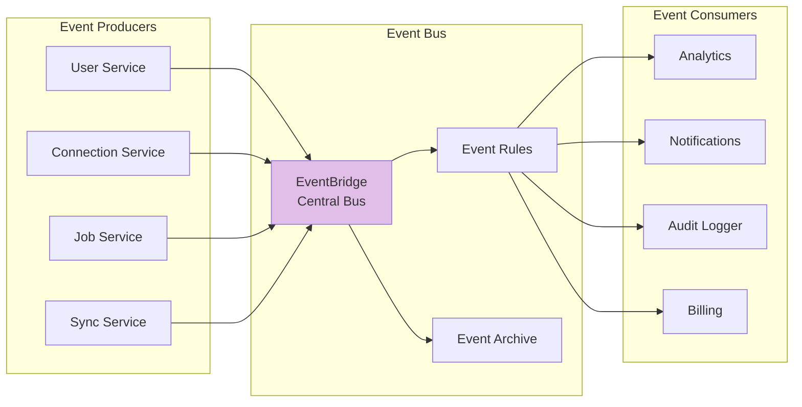

### Event Types

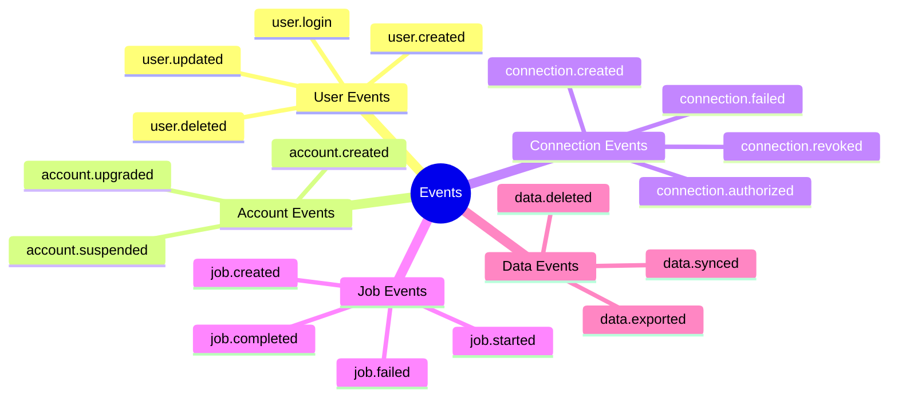

## Service Deployment Architecture

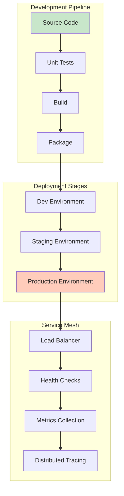

## API Design Patterns

### RESTful Resource Structure

```mermaid
graph TD
    subgraph "Resource Hierarchy"
        ACCOUNTS[/accounts]
        ACC_ID[/accounts/{id}]
        ACC_MEMBERS[/accounts/{id}/members]
        ACC_SOURCES[/accounts/{id}/sources]
        ACC_BILLING[/accounts/{id}/billing]
        
        SOURCES[/sources]
        SRC_ID[/sources/{id}]
        SRC_SYNC[/sources/{id}/sync]
        SRC_LOGS[/sources/{id}/logs]
        
        JOBS[/jobs]
        JOB_ID[/jobs/{id}]
        JOB_LOGS[/jobs/{id}/logs]
        JOB_CANCEL[/jobs/{id}/cancel]
    end
    
    ACCOUNTS --> ACC_ID
    ACC_ID --> ACC_MEMBERS
    ACC_ID --> ACC_SOURCES
    ACC_ID --> ACC_BILLING
    
    SOURCES --> SRC_ID
    SRC_ID --> SRC_SYNC
    SRC_ID --> SRC_LOGS
    
    JOBS --> JOB_ID
    JOB_ID --> JOB_LOGS
    JOB_ID --> JOB_CANCEL
```

## Security Architecture

```mermaid
graph TB
    subgraph "Security Layers"
        subgraph "Network Security"
            WAF[WAF Rules]
            NACL[Network ACLs]
            SG[Security Groups]
        end
        
        subgraph "Application Security"
            AUTHZ[Authorization]
            AUTHN[Authentication]
            RBAC[Role-Based Access]
            AUDIT[Audit Logging]
        end
        
        subgraph "Data Security"
            ENCRYPT_TRANSIT[TLS 1.3]
            ENCRYPT_REST[AES-256]
            TOKEN_MGMT[Token Management]
            SECRET_ROTATION[Secret Rotation]
        end
    end
    
    WAF --> NACL
    NACL --> SG
    SG --> AUTHZ
    AUTHZ --> AUTHN
    AUTHN --> RBAC
    RBAC --> AUDIT
    
    AUDIT --> ENCRYPT_TRANSIT
    ENCRYPT_TRANSIT --> ENCRYPT_REST
    ENCRYPT_REST --> TOKEN_MGMT
    TOKEN_MGMT --> SECRET_ROTATION
    
    style WAF fill:#ffcdd2
    style ENCRYPT_REST fill:#c5e1a5
```

## Service Health Monitoring

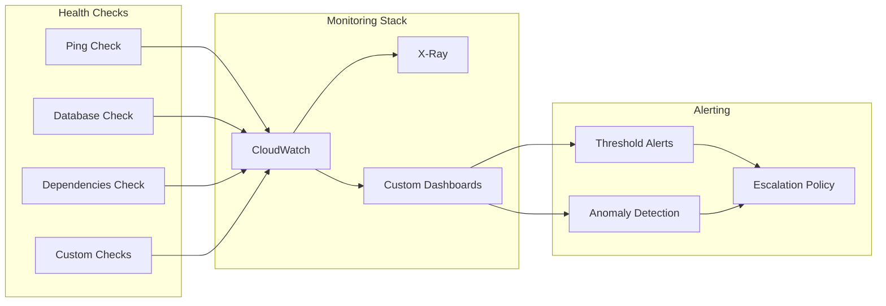

## Performance Optimization

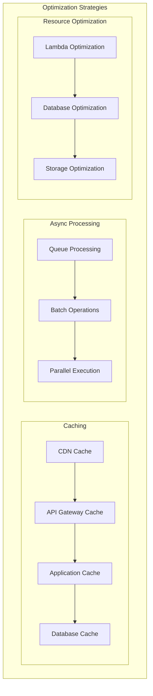

## Service Lifecycle

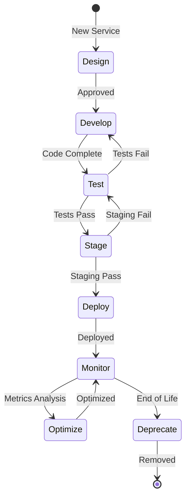

## Best Practices

### 1. Service Design
- Single responsibility principle
- Clear API contracts
- Idempotent operations
- Graceful degradation

### 2. Data Management
- Event sourcing for audit trails
- CQRS for read/write separation
- Eventual consistency where appropriate
- Data locality optimization

### 3. Error Handling
- Circuit breakers for external calls
- Exponential backoff with jitter
- Dead letter queues for failed messages
- Comprehensive error logging

### 4. Monitoring
- Business metrics alongside technical metrics
- Distributed tracing for request flow
- Proactive alerting
- Regular performance reviews

## Migration Path

For services still being migrated to the new architecture:

1. **Phase 1-6**: Infrastructure and core services ✅
2. **Phase 7**: Platform services (in progress)
3. **Phase 8**: Connection services
4. **Phase 9**: Source services
5. **Phase 10**: Job services
6. **Phase 11**: Utility services

See [Phase Documentation](../phases/) for detailed migration plans.