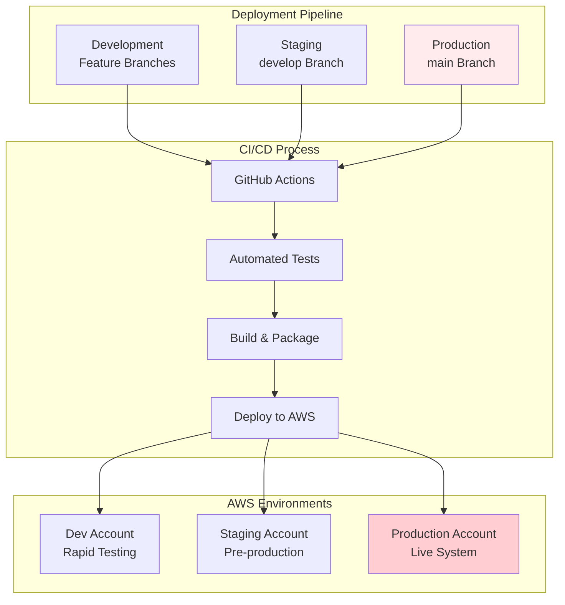
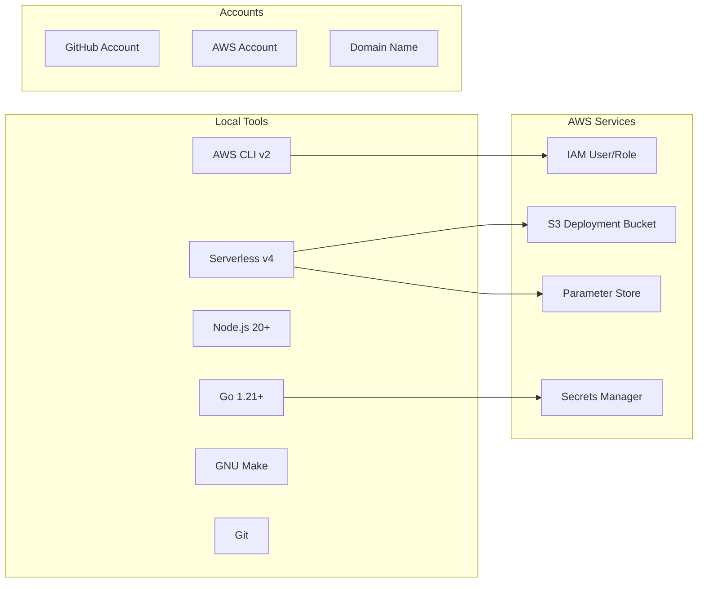
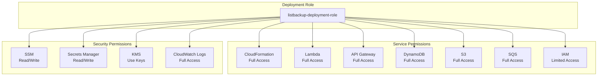
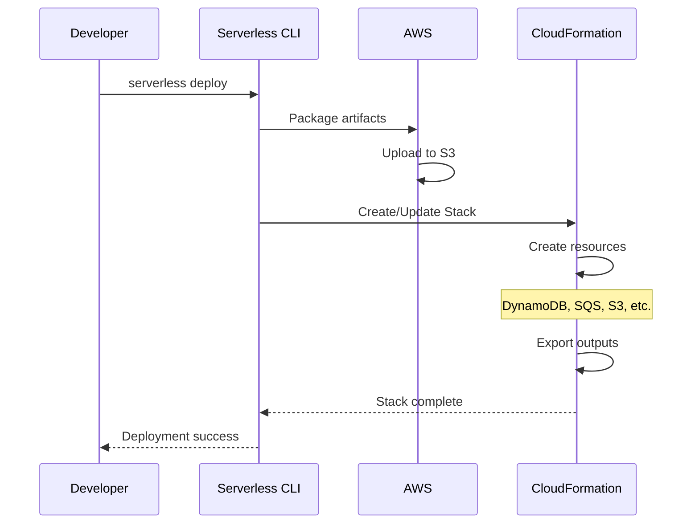
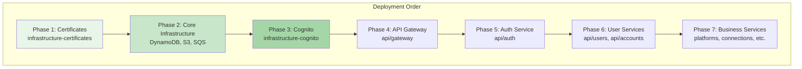
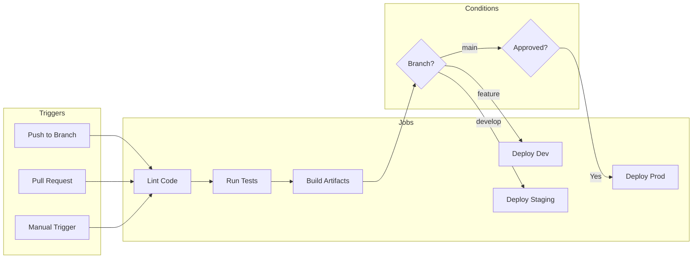
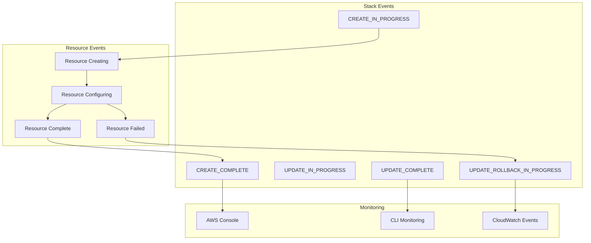
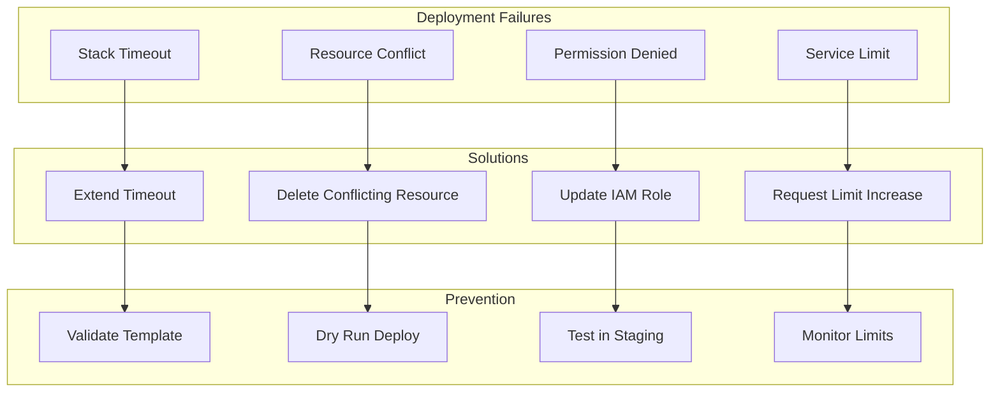
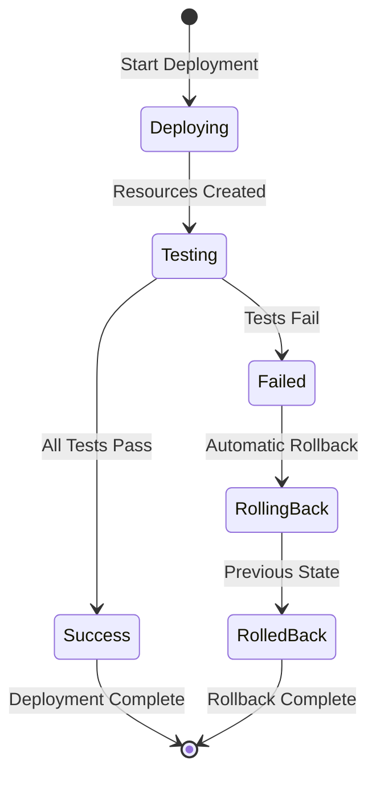
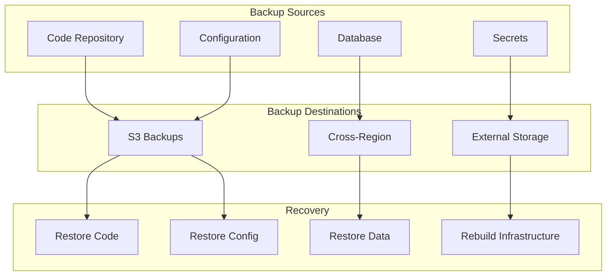

# Deployment Guide

This guide covers the complete deployment process for the ListBackup.ai backend services.

## Deployment Overview



## Prerequisites

### Required Tools



### Installation Steps

```bash
# Install AWS CLI
curl "https://awscli.amazonaws.com/AWSCLIV2.pkg" -o "AWSCLIV2.pkg"
sudo installer -pkg AWSCLIV2.pkg -target /

# Install Go
brew install go

# Install Node.js (via nvm)
curl -o- https://raw.githubusercontent.com/nvm-sh/nvm/v0.39.0/install.sh | bash
nvm install 20
nvm use 20

# Install Serverless Framework
npm install -g serverless

# Install Make
brew install make
```

## AWS Configuration

### Profile Setup

```bash
# Configure AWS profile
aws configure --profile listbackup.ai

# Verify configuration
aws sts get-caller-identity --profile listbackup.ai
```

### Required IAM Permissions



## Environment Setup

### SSM Parameters

```mermaid
graph LR
    subgraph "Required Parameters"
        JWT[/listbackup/jwt-secret]
        REFRESH[/listbackup/jwt-refresh-secret]
        CORS[/listbackup/cors-origin]
        EMAIL[/listbackup/ses-from-email]
    end
    
    subgraph "Optional Parameters"
        OPENAI[/listbackup/openai-api-key]
        SLACK[/listbackup/slack-webhook]
        SENTRY[/listbackup/sentry-dsn]
    end
    
    subgraph "Auto-generated"
        COGNITO_POOL[/listbackup/cognito-user-pool-id]
        COGNITO_CLIENT[/listbackup/cognito-client-id]
        API_URL[/listbackup/api-gateway-url]
    end
```

Create parameters:

```bash
# Create JWT secret
aws ssm put-parameter \
  --name "/listbackup/jwt-secret" \
  --value "$(openssl rand -base64 32)" \
  --type "SecureString" \
  --profile listbackup.ai

# Create CORS origin
aws ssm put-parameter \
  --name "/listbackup/cors-origin" \
  --value "https://app.listbackup.ai" \
  --type "String" \
  --profile listbackup.ai
```

## Deployment Process

### Step 1: Deploy Infrastructure



Deploy infrastructure services:

```bash
cd backend/golang
serverless deploy --stage dev
```

### Step 2: Service Dependencies



### Step 3: Deployment Commands

#### Full Deployment
```bash
# Deploy all services using Serverless Compose
cd backend/golang
serverless deploy --stage production --verbose
```

#### Individual Service Deployment
```bash
# Deploy specific service
cd backend/golang/services/api/users
serverless deploy --stage production

# Deploy with specific AWS profile
serverless deploy --stage production --aws-profile listbackup.ai
```

#### Rollback
```bash
# Rollback to previous version
serverless rollback --stage production --timestamp 1704067200
```

## CI/CD Pipeline

### GitHub Actions Workflow



### Workflow Configuration

```yaml
name: Deploy Backend

on:
  push:
    branches: [main, develop]
  pull_request:
    branches: [main]

jobs:
  test:
    runs-on: ubuntu-latest
    steps:
      - uses: actions/checkout@v4
      - uses: actions/setup-go@v5
        with:
          go-version: '1.21'
      - run: go test ./...

  deploy:
    needs: test
    runs-on: ubuntu-latest
    steps:
      - uses: actions/checkout@v4
      - name: Deploy to AWS
        env:
          AWS_ACCESS_KEY_ID: ${{ secrets.AWS_ACCESS_KEY_ID }}
          AWS_SECRET_ACCESS_KEY: ${{ secrets.AWS_SECRET_ACCESS_KEY }}
        run: |
          npm install -g serverless
          cd backend/golang
          serverless deploy --stage ${{ github.ref == 'refs/heads/main' && 'production' || 'staging' }}
```

## Monitoring Deployment

### CloudFormation Events



Monitor deployment:

```bash
# Watch stack events
aws cloudformation describe-stack-events \
  --stack-name listbackup-api-production \
  --profile listbackup.ai

# Get stack outputs
aws cloudformation describe-stacks \
  --stack-name listbackup-api-production \
  --query "Stacks[0].Outputs" \
  --profile listbackup.ai
```

## Post-Deployment Verification

### Health Checks

```mermaid
graph LR
    subgraph "API Health"
        ENDPOINT[/health Endpoint]
        AUTH_CHECK[Auth Service]
        DB_CHECK[Database Connection]
        QUEUE_CHECK[Queue Access]
    end
    
    subgraph "Integration Tests"
        LOGIN_TEST[Login Flow]
        API_TEST[API Operations]
        E2E_TEST[End-to-End]
    end
    
    subgraph "Monitoring"
        METRICS[CloudWatch Metrics]
        LOGS[CloudWatch Logs]
        TRACES[X-Ray Traces]
    end
    
    ENDPOINT --> AUTH_CHECK
    ENDPOINT --> DB_CHECK
    ENDPOINT --> QUEUE_CHECK
    
    AUTH_CHECK --> LOGIN_TEST
    DB_CHECK --> API_TEST
    QUEUE_CHECK --> E2E_TEST
    
    LOGIN_TEST --> METRICS
    API_TEST --> LOGS
    E2E_TEST --> TRACES
```

Verification commands:

```bash
# Test health endpoint
curl https://api.listbackup.ai/health

# Run integration tests
cd backend/golang
go test -tags=integration ./...

# Check CloudWatch logs
aws logs tail /aws/lambda/listbackup-api-production --follow
```

## Troubleshooting

### Common Issues



### Debug Commands

```bash
# Validate CloudFormation template
aws cloudformation validate-template \
  --template-body file://template.yml \
  --profile listbackup.ai

# Check service limits
aws service-quotas list-service-quotas \
  --service-code lambda \
  --profile listbackup.ai

# Get detailed error
aws cloudformation describe-stack-events \
  --stack-name listbackup-api-production \
  --query "StackEvents[?ResourceStatus=='CREATE_FAILED']" \
  --profile listbackup.ai
```

## Rollback Procedures

### Automatic Rollback

CloudFormation automatically rolls back on failure:



### Manual Rollback

```bash
# List previous versions
serverless rollback --list --stage production

# Rollback to specific version
serverless rollback --timestamp 1704067200 --stage production

# Emergency rollback via CloudFormation
aws cloudformation cancel-update-stack \
  --stack-name listbackup-api-production \
  --profile listbackup.ai
```

## Best Practices

### 1. Pre-deployment Checklist
- [ ] All tests passing
- [ ] Environment variables set
- [ ] Database migrations ready
- [ ] API documentation updated
- [ ] Monitoring alerts configured

### 2. Deployment Strategy
- Use blue-green deployments for zero downtime
- Deploy to staging first
- Run smoke tests post-deployment
- Monitor error rates during rollout

### 3. Security
- Rotate secrets regularly
- Use least-privilege IAM roles
- Enable CloudTrail logging
- Review security groups

### 4. Cost Optimization
- Set up billing alerts
- Use appropriate Lambda memory
- Enable auto-scaling for DynamoDB
- Clean up old deployments

## Disaster Recovery

### Backup Strategy



### Recovery Procedures

1. **Infrastructure Recovery**
   ```bash
   # Redeploy infrastructure
   cd backend/golang
   serverless deploy --stage disaster-recovery
   ```

2. **Data Recovery**
   ```bash
   # Restore DynamoDB from backup
   aws dynamodb restore-table-from-backup \
     --target-table-name listbackup-dr-users \
     --backup-arn arn:aws:dynamodb:... \
     --profile listbackup.ai
   ```

3. **DNS Failover**
   - Update Route 53 to point to DR region
   - Verify SSL certificates
   - Test all endpoints

## Next Steps

- Review [Environment Configuration](./environment-config.md)
- Set up [CI/CD Pipeline](./cicd-pipeline.md)
- Configure [Monitoring and Alerts](../monitoring/setup.md)
- Plan [Disaster Recovery](../dr/procedures.md)