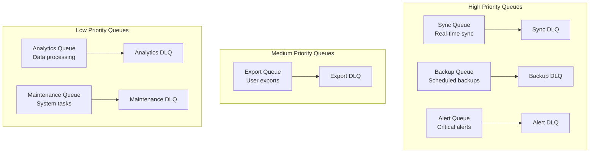

# SQS Queue Configuration Documentation

This document details the SQS queue infrastructure for the ListBackup.ai platform.

## Overview

ListBackup.ai uses 6 FIFO (First-In-First-Out) SQS queues with corresponding Dead Letter Queues (DLQs) for reliable message processing. All queues are designed for different priority levels and use cases.

## Queue Architecture



## Queue Specifications

### 1. SyncQueue (High Priority)
**Queue Name**: `listbackup-sync-queue-${stage}.fifo`  
**Dead Letter Queue**: `listbackup-sync-dlq-${stage}.fifo`

| Property | Value | Rationale |
|----------|-------|-----------|
| Queue Type | FIFO | Ordered processing required |
| Visibility Timeout | 300s (5 min) | Fast sync operations |
| Message Retention | 14 days | Long retention for reliability |
| Receive Wait Time | 20s | Long polling enabled |
| Max Receive Count | 3 | Moderate retry for real-time ops |
| Content Deduplication | Enabled | Prevent duplicate syncs |

**Use Cases**:
- Real-time data synchronization
- Webhook-triggered updates
- Live connection status changes

### 2. BackupQueue (High Priority)
**Queue Name**: `listbackup-backup-queue-${stage}.fifo`  
**Dead Letter Queue**: `listbackup-backup-dlq-${stage}.fifo`

| Property | Value | Rationale |
|----------|-------|-----------|
| Queue Type | FIFO | Maintain backup order |
| Visibility Timeout | 1800s (30 min) | Large backup operations |
| Message Retention | 14 days | Ensure no backups lost |
| Receive Wait Time | 20s | Long polling enabled |
| Max Receive Count | 2 | Limited retries for expensive ops |
| Content Deduplication | Enabled | Prevent duplicate backups |

**Use Cases**:
- Scheduled backup jobs
- Manual backup triggers
- Bulk data operations

### 3. ExportQueue (Medium Priority)
**Queue Name**: `listbackup-export-queue-${stage}.fifo`  
**Dead Letter Queue**: `listbackup-export-dlq-${stage}.fifo`

| Property | Value | Rationale |
|----------|-------|-----------|
| Queue Type | FIFO | Ordered export processing |
| Visibility Timeout | 900s (15 min) | Medium-duration exports |
| Message Retention | 14 days | Standard retention |
| Receive Wait Time | 20s | Long polling enabled |
| Max Receive Count | 3 | Standard retry policy |
| Content Deduplication | Enabled | Prevent duplicate exports |

**Use Cases**:
- User-requested data exports
- Report generation
- Data migration tasks

### 4. AnalyticsQueue (Low Priority)
**Queue Name**: `listbackup-analytics-queue-${stage}.fifo`  
**Dead Letter Queue**: `listbackup-analytics-dlq-${stage}.fifo`

| Property | Value | Rationale |
|----------|-------|-----------|
| Queue Type | FIFO | Maintain processing order |
| Visibility Timeout | 3600s (1 hour) | Long analytics processing |
| Message Retention | 14 days | Standard retention |
| Receive Wait Time | 20s | Long polling enabled |
| Max Receive Count | 2 | Limited retries for heavy ops |
| Content Deduplication | Enabled | Prevent duplicate processing |

**Use Cases**:
- Usage analytics calculations
- Trend analysis
- Data aggregation
- ML model training

### 5. MaintenanceQueue (Low Priority)
**Queue Name**: `listbackup-maintenance-queue-${stage}.fifo`  
**Dead Letter Queue**: `listbackup-maintenance-dlq-${stage}.fifo`

| Property | Value | Rationale |
|----------|-------|-----------|
| Queue Type | FIFO | Ordered maintenance tasks |
| Visibility Timeout | 1800s (30 min) | Various maintenance durations |
| Message Retention | 14 days | Standard retention |
| Receive Wait Time | 20s | Long polling enabled |
| Max Receive Count | 1 | Single retry for maintenance |
| Content Deduplication | Enabled | Prevent duplicate tasks |

**Use Cases**:
- Database cleanup
- Log rotation
- Cache invalidation
- System optimization

### 6. AlertQueue (Critical Priority)
**Queue Name**: `listbackup-alert-queue-${stage}.fifo`  
**Dead Letter Queue**: `listbackup-alert-dlq-${stage}.fifo`

| Property | Value | Rationale |
|----------|-------|-----------|
| Queue Type | FIFO | Ordered alert processing |
| Visibility Timeout | 60s (1 min) | Fast alert processing |
| Message Retention | 7 days | Shorter retention for alerts |
| Receive Wait Time | 1s | Fast polling for alerts |
| Max Receive Count | 5 | More retries for critical alerts |
| Content Deduplication | Enabled | Prevent alert spam |

**Use Cases**:
- System error notifications
- Security alerts
- Threshold breaches
- Critical status changes

## Message Format

### Standard Message Structure
```json
{
  "messageId": "uuid-v4",
  "messageGroupId": "accountId or jobType",
  "messageDeduplicationId": "hash of content",
  "messageAttributes": {
    "accountId": { "dataType": "String", "stringValue": "acc_123" },
    "userId": { "dataType": "String", "stringValue": "usr_456" },
    "priority": { "dataType": "Number", "stringValue": "1" },
    "type": { "dataType": "String", "stringValue": "backup.start" }
  },
  "messageBody": {
    "action": "startBackup",
    "sourceId": "src_789",
    "config": {
      "incremental": true,
      "compress": true
    },
    "timestamp": "2024-12-30T10:00:00Z"
  }
}
```

## Dead Letter Queue Strategy

### DLQ Configuration
- All DLQs use the same retention period as their main queue
- Failed messages are moved to DLQ after max receive count
- DLQs are monitored with CloudWatch alarms

### DLQ Processing
1. **Automated Retry**: Lambda function processes DLQ messages daily
2. **Manual Review**: Critical failures require manual intervention
3. **Metrics Tracking**: Failed message patterns analyzed for improvements

## Queue Consumers

### Lambda Function Mappings

| Queue | Lambda Function | Concurrency | Batch Size |
|-------|----------------|-------------|------------|
| SyncQueue | sync-processor | 10 | 1 |
| BackupQueue | backup-processor | 5 | 1 |
| ExportQueue | export-processor | 3 | 5 |
| AnalyticsQueue | analytics-processor | 2 | 10 |
| MaintenanceQueue | maintenance-processor | 1 | 5 |
| AlertQueue | alert-processor | 20 | 1 |

### Error Handling
```javascript
// Example error handling pattern
exports.handler = async (event) => {
  const failedMessageIds = [];
  
  for (const record of event.Records) {
    try {
      await processMessage(record);
    } catch (error) {
      console.error('Failed to process:', error);
      failedMessageIds.push(record.messageId);
      
      // Check if permanent failure
      if (isPermanentFailure(error)) {
        await moveToDeadLetter(record);
      }
    }
  }
  
  // Return failed message IDs for retry
  return {
    batchItemFailures: failedMessageIds.map(id => ({
      itemIdentifier: id
    }))
  };
};
```

## Monitoring and Alarms

### CloudWatch Metrics

| Metric | Alarm Threshold | Action |
|--------|----------------|--------|
| ApproximateNumberOfMessagesVisible | > 1000 | Scale up consumers |
| ApproximateAgeOfOldestMessage | > 3600s | Alert on-call |
| NumberOfMessagesSent | < 1 in 24h | Check producer health |
| NumberOfMessagesDeleted | < 1 in 24h | Check consumer health |

### Dashboard Widgets
- Queue depth over time
- Message processing rate
- DLQ message count
- Average processing time

## Cost Optimization

### FIFO Queue Pricing
- $0.50 per million requests (higher than standard queues)
- Deduplication reduces duplicate processing costs
- Message grouping improves throughput

### Best Practices
1. **Message Batching**: Send up to 10 messages per request
2. **Long Polling**: Reduces empty receive requests
3. **Appropriate Timeouts**: Prevents unnecessary retries
4. **Message Deduplication**: Prevents redundant processing

## Security

### Encryption
- Server-side encryption (SSE) enabled
- AWS managed keys (SSE-SQS)
- Encrypted in transit via HTTPS

### Access Control
```yaml
# IAM Policy Example
QueuePolicy:
  Version: '2012-10-17'
  Statement:
    - Effect: Allow
      Principal:
        Service: lambda.amazonaws.com
      Action:
        - sqs:ReceiveMessage
        - sqs:DeleteMessage
        - sqs:GetQueueAttributes
      Resource: !GetAtt Queue.Arn
```

## Implementation Examples

### Producer Code (Go)
```go
func SendToQueue(queueURL string, message Message) error {
    input := &sqs.SendMessageInput{
        QueueUrl:               aws.String(queueURL),
        MessageBody:           aws.String(message.Body),
        MessageGroupId:        aws.String(message.GroupID),
        MessageDeduplicationId: aws.String(message.DeduplicationID),
        MessageAttributes: map[string]*sqs.MessageAttributeValue{
            "accountId": {
                DataType:    aws.String("String"),
                StringValue: aws.String(message.AccountID),
            },
        },
    }
    
    _, err := svc.SendMessage(input)
    return err
}
```

### Consumer Code (Node.js)
```javascript
const processMessages = async (queueUrl) => {
  const params = {
    QueueUrl: queueUrl,
    MaxNumberOfMessages: 10,
    WaitTimeSeconds: 20,
    MessageAttributeNames: ['All']
  };
  
  const result = await sqs.receiveMessage(params).promise();
  
  for (const message of result.Messages || []) {
    try {
      await handleMessage(message);
      await deleteMessage(queueUrl, message.ReceiptHandle);
    } catch (error) {
      console.error('Processing failed:', error);
      // Message will return to queue after visibility timeout
    }
  }
};
```

## Migration Notes

These queues were extracted from the monolithic `core` service during Phase 2 of the infrastructure migration. The separation allows:

- Independent scaling of queue processing
- Better cost attribution
- Clearer monitoring and debugging
- Simplified deployment

For more details on the migration, see [Phase 2 Infrastructure Documentation](../phases/phase2-infrastructure.md).