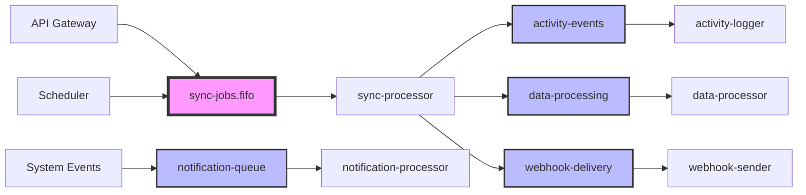

# SQS Queue Configuration Matrix

## Overview
This document provides a comprehensive matrix of all SQS queues in the Core service, their configurations, relationships, and message flow patterns.

## Queue Inventory

### 1. sync-jobs.fifo
**Type**: FIFO Queue  
**Purpose**: Ensures ordered processing of sync jobs per source  
**Dead Letter Queue**: sync-jobs-dlq  

**Configuration**:
| Parameter | Value | Rationale |
|-----------|-------|-----------|
| VisibilityTimeout | 300 seconds | 5 minutes for sync job processing |
| MessageRetentionPeriod | 345600 seconds | 4 days retention |
| MaxReceiveCount | 3 | Retry 3 times before DLQ |
| ContentBasedDeduplication | true | Prevent duplicate sync jobs |
| FifoThroughputLimit | perMessageGroupId | High throughput per source |

**Message Format**:
```json
{
  "sourceId": "string",
  "syncId": "string",
  "scheduleId": "string",
  "dataTypes": ["contacts", "orders"],
  "priority": "high|normal|low",
  "retryCount": 0
}
```

**Publishers**: 
- sync-scheduler Lambda
- manual-sync API endpoint
- retry-handler Lambda

**Consumers**: 
- sync-processor Lambda

---

### 2. activity-events
**Type**: Standard Queue  
**Purpose**: High-throughput activity logging  
**Dead Letter Queue**: activity-events-dlq  

**Configuration**:
| Parameter | Value | Rationale |
|-----------|-------|-----------|
| VisibilityTimeout | 60 seconds | Quick processing for logs |
| MessageRetentionPeriod | 86400 seconds | 1 day retention |
| MaxReceiveCount | 2 | Minimal retries for logs |
| ReceiveMessageWaitTimeSeconds | 20 | Long polling enabled |

**Message Format**:
```json
{
  "accountId": "string",
  "userId": "string",
  "eventType": "string",
  "resource": "string",
  "resourceId": "string",
  "action": "string",
  "timestamp": 1234567890,
  "metadata": {}
}
```

**Publishers**: 
- All API endpoints
- Internal service events
- Webhook processors

**Consumers**: 
- activity-logger Lambda
- analytics-processor Lambda

---

### 3. webhook-delivery
**Type**: Standard Queue  
**Purpose**: Reliable webhook delivery with retries  
**Dead Letter Queue**: webhook-delivery-dlq  

**Configuration**:
| Parameter | Value | Rationale |
|-----------|-------|-----------|
| VisibilityTimeout | 120 seconds | Time for HTTP delivery + retries |
| MessageRetentionPeriod | 86400 seconds | 1 day retention |
| MaxReceiveCount | 5 | More retries for external delivery |
| DelaySeconds | 0 | Immediate delivery |

**Message Format**:
```json
{
  "webhookId": "string",
  "url": "string",
  "payload": {},
  "headers": {},
  "secret": "string",
  "attempt": 1,
  "maxAttempts": 5
}
```

**Publishers**: 
- event-dispatcher Lambda
- sync-completion handlers

**Consumers**: 
- webhook-sender Lambda

---

### 4. notification-queue
**Type**: Standard Queue  
**Purpose**: In-app notification delivery  
**Dead Letter Queue**: notification-dlq  

**Configuration**:
| Parameter | Value | Rationale |
|-----------|-------|-----------|
| VisibilityTimeout | 30 seconds | Quick notification processing |
| MessageRetentionPeriod | 604800 seconds | 7 days for important notifications |
| MaxReceiveCount | 3 | Standard retry policy |
| MessageGroupingEnabled | false | Parallel processing |

**Message Format**:
```json
{
  "userId": "string",
  "type": "info|warning|error|success",
  "title": "string",
  "message": "string",
  "category": "string",
  "metadata": {},
  "priority": "high|normal|low"
}
```

**Publishers**: 
- System events
- Sync status changes
- Error handlers

**Consumers**: 
- notification-processor Lambda

---

### 5. data-processing
**Type**: Standard Queue  
**Purpose**: Post-sync data processing tasks  
**Dead Letter Queue**: data-processing-dlq  

**Configuration**:
| Parameter | Value | Rationale |
|-----------|-------|-----------|
| VisibilityTimeout | 900 seconds | 15 minutes for large data processing |
| MessageRetentionPeriod | 172800 seconds | 2 days retention |
| MaxReceiveCount | 2 | Limited retries for resource-intensive tasks |
| MaxMessageSize | 262144 | 256KB for metadata (data in S3) |

**Message Format**:
```json
{
  "jobId": "string",
  "sourceId": "string",
  "s3Location": "string",
  "processingType": "validation|transformation|aggregation",
  "config": {},
  "priority": "high|normal|low"
}
```

**Publishers**: 
- sync-processor Lambda
- manual-processing API

**Consumers**: 
- data-processor Lambda

---

## Dead Letter Queues

### Common DLQ Configuration
All DLQs share these settings:
- **MessageRetentionPeriod**: 1209600 seconds (14 days)
- **VisibilityTimeout**: 300 seconds
- **CloudWatch Alarms**: MessageCount > 10

### DLQ Inventory

1. **sync-jobs-dlq**
   - Source: sync-jobs.fifo
   - Alert Threshold: 5 messages
   - Recovery: Manual investigation required

2. **activity-events-dlq**
   - Source: activity-events
   - Alert Threshold: 100 messages
   - Recovery: Batch replay possible

3. **webhook-delivery-dlq**
   - Source: webhook-delivery
   - Alert Threshold: 20 messages
   - Recovery: Manual retry with backoff

4. **notification-dlq**
   - Source: notification-queue
   - Alert Threshold: 50 messages
   - Recovery: Batch notification resend

5. **data-processing-dlq**
   - Source: data-processing
   - Alert Threshold: 5 messages
   - Recovery: Manual data recovery

---

## Queue Relationships and Flow



---

## Message Priority Strategy

### High Priority
- Real-time sync requests
- Authentication events
- Critical error notifications
- Webhook deliveries for paid accounts

### Normal Priority
- Scheduled syncs
- Regular notifications
- Activity logging
- Standard data processing

### Low Priority
- Batch operations
- Analytics processing
- Cleanup tasks
- Archive operations

---

## Scaling Considerations

### Queue Metrics to Monitor

1. **ApproximateNumberOfMessages**
   - Alert if > 1000 for standard queues
   - Alert if > 100 for FIFO queues

2. **ApproximateAgeOfOldestMessage**
   - Alert if > 3600 seconds (1 hour)
   - Critical if > 7200 seconds (2 hours)

3. **NumberOfMessagesSent**
   - Track hourly/daily patterns
   - Identify peak usage times

4. **NumberOfMessagesDeleted**
   - Should match MessagesSent over time
   - Large delta indicates processing issues

### Auto-scaling Triggers

| Queue | Scale-up Trigger | Scale-down Trigger |
|-------|-----------------|-------------------|
| sync-jobs.fifo | Messages > 50 | Messages < 10 |
| activity-events | Messages > 1000 | Messages < 100 |
| webhook-delivery | Messages > 200 | Messages < 20 |
| notification-queue | Messages > 500 | Messages < 50 |
| data-processing | Messages > 100 | Messages < 10 |

### Lambda Concurrency Settings

| Consumer Lambda | Reserved Concurrency | Max Concurrency |
|----------------|---------------------|-----------------|
| sync-processor | 50 | 200 |
| activity-logger | 20 | 100 |
| webhook-sender | 30 | 150 |
| notification-processor | 10 | 50 |
| data-processor | 25 | 100 |

---

## Error Handling Patterns

### Retry Strategy

1. **Exponential Backoff**
   - Initial delay: 1 second
   - Max delay: 300 seconds
   - Backoff rate: 2x

2. **Circuit Breaker**
   - Threshold: 50% failure rate
   - Window: 5 minutes
   - Cooldown: 30 seconds

3. **Poison Message Handling**
   - Move to DLQ after max retries
   - Log full message details
   - Send alert to ops team

### Message Validation

All messages must include:
- `messageId` (UUID)
- `timestamp` (Unix epoch)
- `version` (Schema version)
- `correlationId` (Request tracking)

---

## Cost Optimization

### Batching Strategy

| Queue | Batch Size | Batch Window |
|-------|-----------|--------------|
| activity-events | 25 | 5 seconds |
| notification-queue | 10 | 3 seconds |
| data-processing | 5 | 10 seconds |

### Long Polling Configuration

All queues use ReceiveMessageWaitTimeSeconds = 20 to reduce API calls

### Message Compression

Large payloads (>10KB) are:
1. Compressed with gzip
2. Stored in S3
3. Queue message contains S3 reference

---

## Security Configuration

### Encryption
- All queues use AWS-managed KMS keys
- Server-side encryption enabled
- In-transit encryption via HTTPS

### Access Control
- Queue policies restrict access to specific Lambda roles
- Cross-account access disabled
- VPC endpoints for private access

### Message Integrity
- SHA-256 message signatures
- Timestamp validation (±5 minutes)
- Replay attack prevention

---

## Monitoring and Alerting

### CloudWatch Dashboards

1. **Queue Health Dashboard**
   - Message count trends
   - Processing latency
   - Error rates
   - DLQ message counts

2. **Performance Dashboard**
   - Messages per second
   - Lambda invocation rates
   - Processing duration
   - Cost analysis

### Alarms Configuration

| Metric | Threshold | Action |
|--------|-----------|--------|
| DLQ Messages | > 10 | Page on-call |
| Processing Age | > 1 hour | Email team |
| Error Rate | > 5% | Slack alert |
| Queue Depth | > 10K | Auto-scale |

---

## Disaster Recovery

### Backup Strategy
- DLQ messages backed up to S3 daily
- Message replay capability from S3
- Cross-region replication for critical queues

### Recovery Procedures
1. **Queue Corruption**
   - Fail over to backup region
   - Replay from S3 backup
   - Verify message integrity

2. **Mass Failure**
   - Pause producers
   - Fix root cause
   - Replay from DLQ/S3
   - Resume normal operation

### RTO/RPO Targets
- RTO: 15 minutes
- RPO: 5 minutes
- Data retention: 14 days