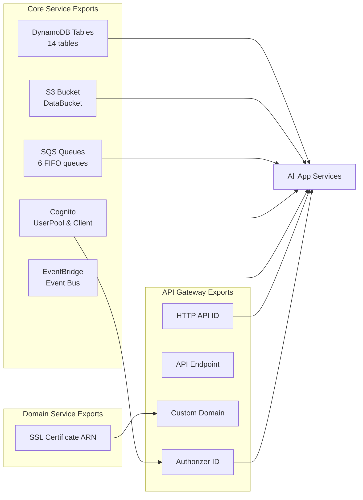
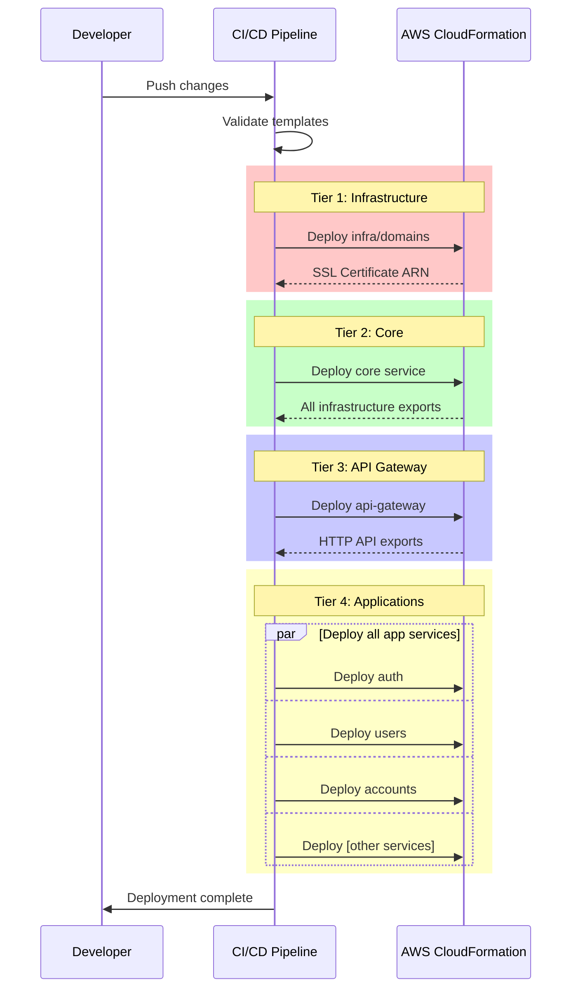

# Cross-Stack Dependencies - Visual Representation

## Dependency Flow Diagram

```mermaid
graph TD
    %% Infrastructure Layer
    subgraph "Infrastructure Layer (Tier 1)"
        DOMAINS[infra/domains<br/>SSL Certificates]
        DYNAMODB[infra/dynamodb<br/>Tables]
        S3[infra/s3<br/>Buckets]
        COGNITO[infra/cognito<br/>User Pools]
    end

    %% Core Layer
    subgraph "Core Layer (Tier 2)"
        CORE[core<br/>All Infrastructure<br/>Tables, S3, SQS, Cognito]
    end

    %% API Layer
    subgraph "API Layer (Tier 3)"
        API[api-gateway<br/>HTTP API]
    end

    %% Application Layer
    subgraph "Application Layer (Tier 4)"
        AUTH[auth]
        USERS[users]
        ACCOUNTS[accounts]
        TEAMS[teams]
        SOURCES[sources]
        PLATFORMS[platforms]
        INTEGRATIONS[integrations]
        JOBS[jobs]
        BILLING[billing]
        CONNECTIONS[connections]
        SOURCEGROUPS[source-groups]
        NOTIFICATIONS[notifications]
        SYSTEM[system]
        TAGS[tags]
        DASHBOARDS[dashboards]
        CLIENTS[clients]
    end

    %% Dependencies
    DOMAINS --> API
    CORE --> API
    CORE --> AUTH
    CORE --> USERS
    CORE --> ACCOUNTS
    CORE --> TEAMS
    CORE --> SOURCES
    CORE --> PLATFORMS
    CORE --> INTEGRATIONS
    CORE --> JOBS
    CORE --> BILLING
    CORE --> CONNECTIONS
    CORE --> SOURCEGROUPS
    CORE --> NOTIFICATIONS
    CORE --> SYSTEM
    CORE --> TAGS
    CORE --> DASHBOARDS
    CORE --> CLIENTS
    
    API --> AUTH
    API --> USERS
    API --> ACCOUNTS
    API --> TEAMS
    API --> SOURCES
    API --> PLATFORMS
    API --> INTEGRATIONS
    API --> JOBS
    API --> BILLING
    API --> CONNECTIONS
    API --> SOURCEGROUPS
    API --> NOTIFICATIONS
    API --> SYSTEM
    API --> TAGS
    API --> DASHBOARDS
    API --> CLIENTS

    %% Styling
    classDef infraStyle fill:#f9f,stroke:#333,stroke-width:2px
    classDef coreStyle fill:#9f9,stroke:#333,stroke-width:2px
    classDef apiStyle fill:#99f,stroke:#333,stroke-width:2px
    classDef appStyle fill:#ff9,stroke:#333,stroke-width:2px
    
    class DOMAINS,DYNAMODB,S3,COGNITO infraStyle
    class CORE coreStyle
    class API apiStyle
    class AUTH,USERS,ACCOUNTS,TEAMS,SOURCES,PLATFORMS,INTEGRATIONS,JOBS,BILLING,CONNECTIONS,SOURCEGROUPS,NOTIFICATIONS,SYSTEM,TAGS,DASHBOARDS,CLIENTS appStyle
```

## Resource Export Map

## Service Dependency Matrix

| Service | Depends On | Exports Used |
|---------|-----------|--------------|
| **infra/domains** | None | - |
| **core** | None | - |
| **api-gateway** | core, infra/domains | CognitoUserPoolId, CognitoUserPoolClientId, SSL Certificate |
| **auth** | core, api-gateway | CognitoUserPoolId, CognitoUserPoolClientId, HttpApiId |
| **users** | core, api-gateway | CognitoUserPoolId, CognitoUserPoolClientId, HttpApiId |
| **accounts** | core, api-gateway | CognitoUserPoolId, CognitoUserPoolClientId, HttpApiId |
| **teams** | core, api-gateway | CognitoUserPoolId, CognitoUserPoolClientId, HttpApiId |
| **sources** | core, api-gateway | CognitoUserPoolId, CognitoUserPoolClientId, HttpApiId |
| **platforms** | core, api-gateway | CognitoUserPoolId, CognitoUserPoolClientId, HttpApiId |
| **integrations** | core, api-gateway | CognitoUserPoolId, CognitoUserPoolClientId, HttpApiId |
| **jobs** | core, api-gateway | CognitoUserPoolId, CognitoUserPoolClientId, HttpApiId, JobsTableStreamArn |
| **billing** | core, api-gateway | CognitoUserPoolId, CognitoUserPoolClientId, HttpApiId |
| **connections** | core, api-gateway | CognitoUserPoolId, CognitoUserPoolClientId, HttpApiId |
| **source-groups** | core, api-gateway | CognitoUserPoolId, CognitoUserPoolClientId, HttpApiId |
| **notifications** | core, api-gateway | CognitoUserPoolId, CognitoUserPoolClientId, HttpApiId |
| **system** | core, api-gateway | CognitoUserPoolId, CognitoUserPoolClientId, HttpApiId |
| **tags** | core, api-gateway | CognitoUserPoolId, CognitoUserPoolClientId, HttpApiId |
| **dashboards** | core, api-gateway | CognitoUserPoolId, CognitoUserPoolClientId, HttpApiId |
| **clients** | core, api-gateway | CognitoUserPoolId, CognitoUserPoolClientId, HttpApiId |

## Deployment Pipeline

## Critical Path Analysis

The critical path for a full deployment is:

1. **infra/domains** (if SSL cert needed) - 5-10 minutes
2. **core** - 10-15 minutes (many resources)
3. **api-gateway** - 5 minutes
4. **Application services** - Can deploy in parallel (5-10 minutes each)

**Minimum deployment time**: ~25-30 minutes
**Typical deployment time**: ~35-45 minutes (with validation and testing)

## Failure Impact Analysis

| Failed Service | Impact | Recovery Action |
|---------------|--------|-----------------|
| **infra/domains** | API Gateway cannot deploy | Fix cert issues, redeploy |
| **core** | Nothing else can deploy | Fix core issues first |
| **api-gateway** | App services cannot attach to API | Fix API, then redeploy apps |
| **Any app service** | Only that service affected | Fix and redeploy single service |

## Resource Cleanup Order

When removing the infrastructure, follow the reverse order:

1. Delete all application services (can be done in parallel)
2. Delete api-gateway
3. Delete core
4. Delete infrastructure services

**Warning**: CloudFormation will prevent deletion of stacks with active exports. Ensure all dependent stacks are deleted first.