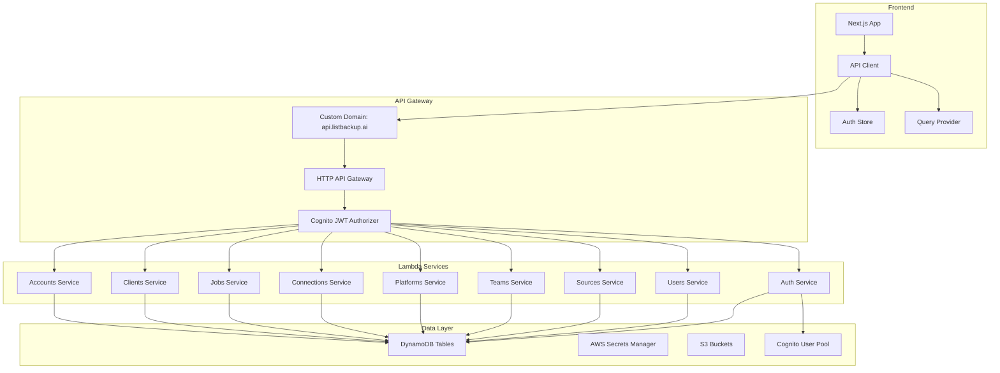
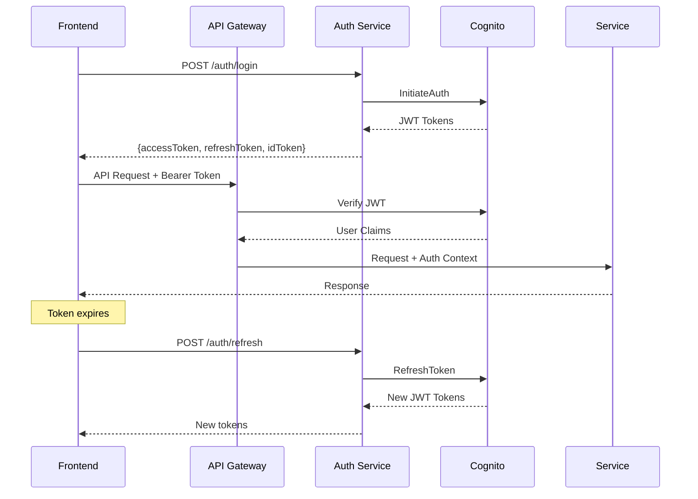
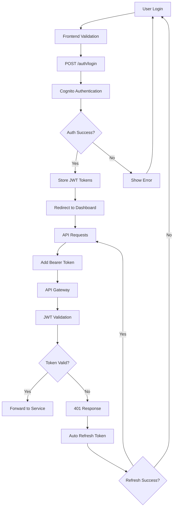
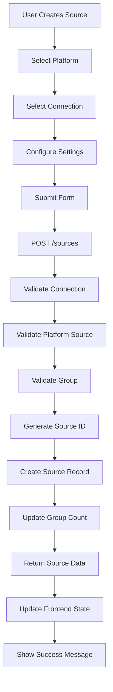

# ListBackup.ai v2 API Endpoints and Frontend-Backend Data Flow Documentation

## Executive Summary

This document provides a comprehensive analysis of the ListBackup.ai v2 API architecture, cataloging all endpoints, request/response patterns, authentication flows, and frontend-backend data integration. The system employs a modular serverless architecture using AWS Lambda functions behind API Gateway with Cognito JWT authentication.

## Table of Contents

1. [API Architecture Overview](#api-architecture-overview)
2. [Complete API Endpoint Catalog](#complete-api-endpoint-catalog)
3. [Authentication & Authorization](#authentication--authorization)
4. [Request/Response Patterns](#requestresponse-patterns)
5. [Frontend-Backend Integration](#frontend-backend-integration)
6. [Data Flow Diagrams](#data-flow-diagrams)
7. [Error Handling Patterns](#error-handling-patterns)
8. [API Versioning Strategy](#api-versioning-strategy)

## API Architecture Overview

### Infrastructure Components



### Service Architecture

The API is organized into **9 microservices**, each deployed independently:

1. **Auth Service** (`listbackup-auth`) - Authentication & authorization
2. **Users Service** (`listbackup-users`) - User profile management
3. **Sources Service** (`listbackup-sources`) - Data source management
4. **Teams Service** (`listbackup-teams`) - Team collaboration
5. **Platforms Service** (`listbackup-platforms`) - Platform integrations
6. **Connections Service** (`listbackup-connections`) - Platform connections
7. **Jobs Service** (`listbackup-jobs`) - Background job management
8. **Clients Service** (`listbackup-clients`) - Client/customer management
9. **Accounts Service** (`listbackup-account`) - Hierarchical account system

## Complete API Endpoint Catalog

### Authentication Service (`/auth`)

| Method | Path | Auth Required | Description |
|--------|------|---------------|-------------|
| POST | `/auth/register` | No | User registration with account creation |
| POST | `/auth/login` | No | User authentication with JWT tokens |
| POST | `/auth/logout` | No | Session invalidation |
| POST | `/auth/refresh` | No | JWT token refresh |
| GET | `/auth/status` | Yes | Authentication status check |
| GET | `/auth/profile` | Yes | User profile with account details |
| GET | `/auth/accounts` | Yes | Available accounts with roles |

**Request/Response Examples:**

```json
// POST /auth/login
{
  "email": "user@company.com",
  "password": "SecurePassword123!"
}

// Response
{
  "success": true,
  "message": "Login successful",
  "data": {
    "accessToken": "eyJraWQiOiJyVXBLS1VMN3Nk...",
    "idToken": "eyJraWQiOiJyVXBLS1VMN3Nk...",
    "refreshToken": "eyJjdHkiOiJKV1QiLCJlbmMi...",
    "expiresIn": 3600,
    "tokenType": "Bearer"
  }
}
```

### Users Service (`/users`)

| Method | Path | Auth Required | Description |
|--------|------|---------------|-------------|
| GET | `/users/me` | Yes | Current user profile |
| PUT | `/users/me` | Yes | Update user profile |
| GET | `/users/me/settings` | Yes | User preferences |
| PUT | `/users/me/settings` | Yes | Update user settings |
| GET | `/users/me/accounts` | Yes | User's account associations |

### Sources Service (`/sources`)

| Method | Path | Auth Required | Description |
|--------|------|---------------|-------------|
| GET | `/sources` | Yes | List all data sources |
| POST | `/sources` | Yes | Create new data source |
| GET | `/sources/{sourceId}` | Yes | Get source details |
| PUT | `/sources/{sourceId}` | Yes | Update source configuration |
| DELETE | `/sources/{sourceId}` | Yes | Delete data source |
| POST | `/sources/{sourceId}/sync` | Yes | Trigger manual sync |
| POST | `/sources/{sourceId}/test` | Yes | Test source connection |

**Source Creation Example:**

```json
// POST /sources
{
  "connectionId": "conn-123",
  "platformSourceId": "keap-contacts",
  "name": "Customer Contacts",
  "groupId": "group-456",
  "settings": {
    "enabled": true,
    "priority": "high",
    "frequency": "daily",
    "retentionDays": 365,
    "incrementalSync": true,
    "notifications": {
      "onSuccess": true,
      "onFailure": true
    }
  }
}
```

### Platforms Service (`/platforms`)

| Method | Path | Auth Required | Description |
|--------|------|---------------|-------------|
| GET | `/platforms` | Yes | List available platforms |
| GET | `/platforms/{id}` | Yes | Get platform details |
| GET | `/platforms/{platformId}/sources` | Yes | Platform data sources |
| GET | `/platforms/{platformId}/sources/{sourceId}` | Yes | Specific platform source |
| GET | `/platforms/{platformId}/connections` | Yes | Platform connections |
| POST | `/platforms/{platformId}/connections` | Yes | Create platform connection |

### Teams Service (`/teams`)

| Method | Path | Auth Required | Description |
|--------|------|---------------|-------------|
| GET | `/teams` | Yes | List user's teams |
| POST | `/teams` | Yes | Create new team |
| GET | `/teams/{teamId}` | Yes | Get team details |
| PUT | `/teams/{teamId}` | Yes | Update team |
| DELETE | `/teams/{teamId}` | Yes | Delete team |
| POST | `/teams/{teamId}/members` | Yes | Add team member |
| DELETE | `/teams/{teamId}/members/{userId}` | Yes | Remove team member |
| POST | `/teams/{teamId}/invite` | Yes | Send team invitation |
| GET | `/teams/{teamId}/invitations` | Yes | List pending invitations |
| GET | `/teams/{teamId}/accounts` | Yes | Team account access |

### Connections Service (`/connections`)

| Method | Path | Auth Required | Description |
|--------|------|---------------|-------------|
| GET | `/connections` | Yes | List platform connections |
| POST | `/connections` | Yes | Create new connection |
| GET | `/connections/{connectionId}` | Yes | Get connection details |
| PUT | `/connections/{connectionId}` | Yes | Update connection |
| DELETE | `/connections/{connectionId}` | Yes | Delete connection |
| POST | `/connections/{connectionId}/test` | Yes | Test connection |

### Jobs Service (`/jobs`)

| Method | Path | Auth Required | Description |
|--------|------|---------------|-------------|
| GET | `/jobs` | Yes | List background jobs |
| POST | `/jobs` | Yes | Create new job |
| GET | `/jobs/{jobId}` | Yes | Get job details |
| PUT | `/jobs/{jobId}` | Yes | Update job |
| DELETE | `/jobs/{jobId}` | Yes | Delete job |
| POST | `/jobs/{jobId}/queue` | Yes | Queue job for execution |

### Clients Service (`/clients`)

| Method | Path | Auth Required | Description |
|--------|------|---------------|-------------|
| GET | `/clients` | Yes | List clients |
| POST | `/clients` | Yes | Create new client |
| GET | `/clients/{clientId}` | Yes | Get client details |
| PUT | `/clients/{clientId}` | Yes | Update client |
| DELETE | `/clients/{clientId}` | Yes | Delete client |
| POST | `/clients/{clientId}/invite` | Yes | Send client invitation |
| POST | `/clients/{clientId}/login` | Yes | Client portal login |
| GET | `/clients/{clientId}/accounts` | Yes | Client account access |
| GET | `/clients/{clientId}/teams` | Yes | Client team access |

### Accounts Service (`/account`)

| Method | Path | Auth Required | Description |
|--------|------|---------------|-------------|
| GET | `/account` | Yes | Current account details |
| PUT | `/account` | Yes | Update account |
| POST | `/account/sub-accounts` | Yes | Create sub-account |
| GET | `/account/hierarchy` | Yes | Account hierarchy tree |
| POST | `/account/switch-context` | Yes | Switch account context |

### System Service (`/system`)

| Method | Path | Auth Required | Description |
|--------|------|---------------|-------------|
| GET | `/system/health` | No | API health check |
| GET | `/system/openapi` | No | OpenAPI specification |

## Authentication & Authorization

### JWT Token Flow



### Authorization Context

All authenticated endpoints receive authorization context:

```go
// Extract auth context from lambda authorizer
var userID, accountID string
if authLambda, ok := event.RequestContext.Authorizer["lambda"].(map[string]interface{}); ok {
    userID = authLambda["userId"].(string)
    accountID = authLambda["accountId"].(string)
} else {
    userID = event.RequestContext.Authorizer["userId"].(string)
    accountID = event.RequestContext.Authorizer["accountId"].(string)
}
```

### Token Storage (Frontend)

```typescript
// Token storage in localStorage
localStorage.setItem('serviceToken', data.data.accessToken)
localStorage.setItem('accessToken', data.data.accessToken)
localStorage.setItem('refreshToken', data.data.refreshToken)

// Automatic token refresh interceptor
apiClient.interceptors.response.use(
  (response) => response,
  async (error) => {
    if (error.response?.status === 401 && !originalRequest._retry) {
      // Auto-refresh logic
      const refreshToken = localStorage.getItem('refreshToken')
      const { data } = await authApiClient.post('/auth/refresh', { refreshToken })
      // Update tokens and retry request
    }
  }
)
```

## Request/Response Patterns

### Standard Response Structure

All API responses follow a consistent pattern:

```typescript
interface StandardResponse<T> {
  success: boolean
  message?: string
  data?: T
  error?: string
}
```

### Error Response Structure

```json
{
  "success": false,
  "error": "Error message describing what went wrong",
  "message": ""
}
```

### CORS Headers

All endpoints include CORS headers:

```go
Headers: map[string]string{
    "Access-Control-Allow-Origin":  "*",
    "Access-Control-Allow-Methods": "GET, POST, PUT, DELETE, OPTIONS",
    "Access-Control-Allow-Headers": "Content-Type, Authorization",
    "Content-Type":                 "application/json",
}
```

### Validation Patterns

Input validation follows consistent patterns:

```go
// Required field validation
if req.Email == "" {
    return createErrorResponse(400, "Email is required"), nil
}

// Email format validation
if !isValidEmail(req.Email) {
    return createErrorResponse(400, "Invalid email format"), nil
}

// Authorization validation
if userID == "" || accountID == "" {
    return createErrorResponse(401, "User not authenticated"), nil
}
```

## Frontend-Backend Integration

### API Client Architecture

The frontend uses **Axios-based API clients** with automatic token management:

```typescript
// Base API client configuration
export const apiClient = axios.create({
  baseURL: 'https://api.listbackup.ai',
  headers: { 'Content-Type': 'application/json' }
})

// Service-specific clients
export const authApi = {
  login: async (data: LoginRequest) => {
    const response = await authApiClient.post<LoginResponse>('/auth/login', data)
    return response.data
  }
}
```

### State Management Integration

```typescript
// Auth store integration
export const useAuthStore = create<AuthState>((set) => ({
  user: null,
  isAuthenticated: false,
  login: async (credentials) => {
    const response = await authApi.login(credentials)
    if (response.success && response.data) {
      set({ user: response.data.user, isAuthenticated: true })
    }
  }
}))
```

### React Query Integration

```typescript
// Data fetching with React Query
export const useSources = () => {
  return useQuery({
    queryKey: ['sources'],
    queryFn: () => sourcesApi.list(),
    enabled: !!user
  })
}
```

## Data Flow Diagrams

### User Authentication Flow



### Source Creation Flow



### Data Sync Flow

```mermaid
flowchart TD
    A[Manual Sync Trigger] --> B[POST /sources/{id}/sync]
    B --> C[Validate Source Access]
    C --> D[Get Connection Credentials]
    D --> E[Connect to Platform API]
    E --> F[Fetch Data]
    F --> G[Transform Data]
    G --> H[Store in S3]
    H --> I[Update Metadata]
    I --> J[Create Job Record]
    J --> K[Send Notifications]
    K --> L[Update Frontend]
```

### Team Collaboration Flow

```mermaid
flowchart TD
    A[Create Team] --> B[POST /teams]
    B --> C[Store Team Record]
    C --> D[Add Creator as Owner]
    D --> E[Invite Members]
    E --> F[POST /teams/{id}/invite]
    F --> G[Send Email Invitation]
    G --> H[Member Accepts]
    H --> I[POST /teams/accept-invitation]
    I --> J[Add to Team Members]
    J --> K[Grant Account Access]
    K --> L[Update Permissions]
```

## Error Handling Patterns

### HTTP Status Codes

| Status | Usage | Example |
|--------|-------|---------|
| 200 | Successful GET requests | Data retrieved |
| 201 | Successful resource creation | Source created |
| 400 | Bad request/validation errors | Missing required field |
| 401 | Authentication required | Invalid or expired token |
| 403 | Access denied | Insufficient permissions |
| 404 | Resource not found | Source doesn't exist |
| 500 | Internal server error | Database connection failed |

### Error Response Patterns

```go
// Cognito authentication errors
if strings.Contains(errStr, "NotAuthorizedException") {
    return createErrorResponse(401, "Invalid email or password")
} else if strings.Contains(errStr, "UserNotFoundException") {
    return createErrorResponse(401, "User not found")
}

// Resource ownership validation
if connection.UserID != userID || connection.AccountID != accountID {
    return createErrorResponse(403, "Access denied to connection")
}

// Resource state validation
if connection.Status != "active" {
    return createErrorResponse(400, "Connection is not active")
}
```

### Frontend Error Handling

```typescript
// Global error handling
apiClient.interceptors.response.use(
  (response) => response,
  async (error) => {
    if (error.response?.status === 401) {
      // Handle authentication errors
      await handleTokenRefresh()
    } else if (error.response?.status >= 500) {
      // Handle server errors
      showErrorNotification('Server error occurred')
    }
    return Promise.reject(error)
  }
)
```

## API Versioning Strategy

### Current Version: v1

- **URL Structure**: `https://api.listbackup.ai/v1/...` (implied)
- **Version Header**: `API_VERSION: v1`
- **Backward Compatibility**: Maintained for 6 months after new version release

### Future Versioning Plan

```typescript
// Version-aware client
const apiClient = axios.create({
  baseURL: `${API_BASE_URL}/v${API_VERSION}`,
  headers: {
    'API-Version': 'v1',
    'Content-Type': 'application/json'
  }
})
```

## Key Integration Points

### 1. Authentication Integration

- **Frontend**: Stores JWT tokens in localStorage
- **Backend**: Validates tokens via Cognito JWT authorizer
- **Auto-refresh**: Transparent token renewal on 401 responses

### 2. Account Context

- **Hierarchical Accounts**: Users can belong to multiple accounts
- **Context Switching**: Frontend can switch between account contexts
- **Data Isolation**: All data filtered by accountId

### 3. Real-time Updates

- **WebSocket**: For real-time job status updates
- **Polling**: For sync progress and notifications
- **Event-driven**: DynamoDB streams trigger notifications

### 4. File Upload/Download

- **Direct S3**: Presigned URLs for large file operations
- **API Proxy**: Small files through API Gateway
- **Progress Tracking**: Real-time upload/download progress

## Performance Considerations

### Caching Strategy

- **Frontend**: React Query for API response caching
- **Backend**: DynamoDB caching for frequently accessed data
- **CDN**: Static assets served via CloudFront

### Rate Limiting

- **API Gateway**: Built-in throttling (10,000 req/sec)
- **Per-user**: 100 requests per minute per user
- **Per-account**: 1,000 requests per minute per account

### Monitoring

- **X-Ray Tracing**: End-to-end request tracing
- **CloudWatch**: Metrics and logging
- **Error Tracking**: Centralized error reporting

## Security Features

### Data Protection

- **Encryption in Transit**: TLS 1.2+ for all API calls
- **Encryption at Rest**: DynamoDB and S3 encryption
- **Token Security**: JWT tokens with short expiration

### Access Control

- **Resource Ownership**: Users can only access their resources
- **Account Isolation**: Strict data separation by accountId
- **Role-based Access**: Different permissions per account role

### Audit Trail

- **Activity Logging**: All API calls logged with user context
- **Data Changes**: Change tracking for sensitive operations
- **Compliance**: GDPR and SOC2 compliance patterns

## Conclusion

The ListBackup.ai v2 API employs a modern, scalable serverless architecture with comprehensive authentication, clear data flow patterns, and robust error handling. The modular service design enables independent scaling and deployment while maintaining consistency across all endpoints.

The frontend-backend integration is seamless with automatic token management, real-time updates, and comprehensive error handling. The hierarchical account system supports complex organizational structures while maintaining strict data isolation and security.

This architecture provides a solid foundation for current operations and future growth, with clear patterns for adding new services and extending functionality.