# ListBackup.ai v2 - Frontend Architecture and User Flows

**Generated**: 2025-06-20  
**Focus**: Complete Frontend Website Structure, User Journeys, and Page-to-Backend Connections  
**Coverage**: All user types, flows, and integration patterns  

## 🎯 Executive Summary

ListBackup.ai v2 features a sophisticated Next.js 14 frontend with hierarchical account management, multi-platform integrations, client portal capabilities, and comprehensive user flows supporting everything from individual users to enterprise conglomerates.

### Key Frontend Features
- **🏗️ Modern Architecture**: Next.js 14 App Router with TypeScript
- **👥 Multi-User Support**: Owners, team members, sub-account managers, clients
- **🔗 Platform Integrations**: 50+ supported platforms with OAuth flows
- **🏢 Enterprise Features**: Hierarchical accounts, team management, client portals
- **📱 Responsive Design**: Mobile-first with cross-platform consistency

---

## 📋 Table of Contents

1. [Complete Website Structure](#complete-website-structure)
2. [User Types and Personas](#user-types-and-personas)
3. [Detailed User Journeys](#detailed-user-journeys)
4. [Frontend-Backend API Mapping](#frontend-backend-api-mapping)
5. [Page Architecture and Routing](#page-architecture-and-routing)
6. [User Flow Diagrams](#user-flow-diagrams)
7. [Component Architecture](#component-architecture)
8. [State Management Patterns](#state-management-patterns)

---

## 🌐 Complete Website Structure

### Public Marketing Pages

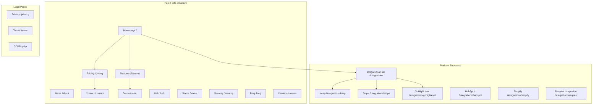

### Authentication Flow Pages

```mermaid
graph LR
    subgraph "Auth Pages (/(auth)/)"
        LOGIN[Login /login]
        SIGNUP[Signup /signup]
        FORGOT[Forgot Password /forgot-password]
        RESET[Reset Password /reset-password]
    end
    
    subgraph "OAuth Flows"
        OAUTH_START[OAuth Start /oauth/start/{platform}]
        OAUTH_CALLBACK[OAuth Callback /oauth/callback]
        OAUTH_SUCCESS[Connection Success]
        OAUTH_ERROR[Connection Error]
    end
    
    LOGIN --> OAUTH_START
    SIGNUP --> OAUTH_START
    OAUTH_START --> OAUTH_CALLBACK
    OAUTH_CALLBACK --> OAUTH_SUCCESS
    OAUTH_CALLBACK --> OAUTH_ERROR
```

### Main Application Dashboard

```mermaid
graph TB
    subgraph "Core Dashboard Pages"
        DASHBOARD[Dashboard /dashboard]
        SOURCES[Sources /dashboard/sources]
        JOBS[Jobs /dashboard/jobs]
        BROWSE[Browse /dashboard/browse]
        MONITOR[Monitor /dashboard/monitor]
        ANALYTICS[Analytics /dashboard/analytics]
        BILLING[Billing /dashboard/billing]
        BACKUPS[Backups /dashboard/backups]
        NOTIFICATIONS[Notifications /dashboard/notifications]
    end
    
    subgraph "Advanced Features (Enterprise)"
        ACCOUNTS[Accounts /dashboard/accounts]
        TEAMS[Teams /dashboard/teams]
        CLIENTS[Clients /dashboard/clients]
        CONNECTIONS[Connections /dashboard/connections]
    end
    
    subgraph "Settings & Configuration"
        SETTINGS[Settings /dashboard/settings]
        ACCOUNT_SETTINGS[Account Settings /dashboard/settings/account]
        USER_SETTINGS[User Settings /dashboard/settings/user]
    end
    
    subgraph "Dynamic Routes"
        SOURCE_DETAIL[Source Detail /dashboard/sources/[sourceId]]
        SOURCE_NEW[New Source /dashboard/sources/new]
        JOB_DETAIL[Job Detail /dashboard/jobs/[jobId]]
        TEAM_DETAIL[Team Detail /dashboard/teams/[teamId]]
    end
    
    DASHBOARD --> SOURCES
    DASHBOARD --> JOBS
    DASHBOARD --> ACCOUNTS
    SOURCES --> SOURCE_DETAIL
    SOURCES --> SOURCE_NEW
    JOBS --> JOB_DETAIL
    TEAMS --> TEAM_DETAIL
```

### Client Portal (Enterprise Feature)

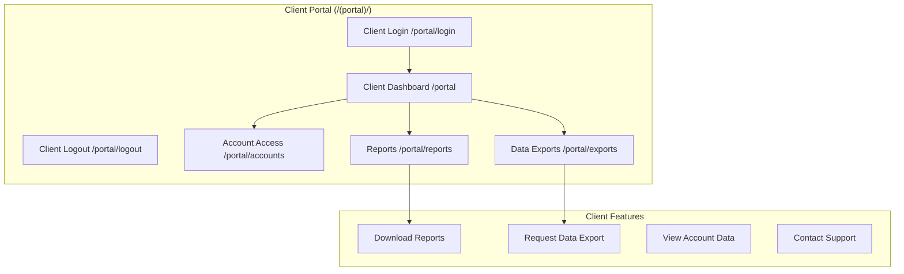

---

## 👥 User Types and Personas

### Primary User Classifications

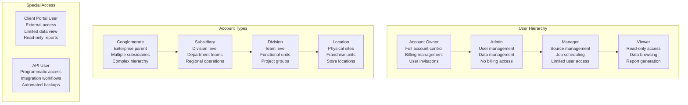

### User Permission Matrix

| Permission | Owner | Admin | Manager | Viewer | Client |
|------------|:-----:|:-----:|:-------:|:------:|:------:|
| **Create Sub-Accounts** | ✅ | ✅ | ❌ | ❌ | ❌ |
| **Invite Users** | ✅ | ✅ | ✅* | ❌ | ❌ |
| **Manage Integrations** | ✅ | ✅ | ✅ | ❌ | ❌ |
| **View All Data** | ✅ | ✅ | ✅ | ✅ | ✅* |
| **Manage Billing** | ✅ | ❌ | ❌ | ❌ | ❌ |
| **Delete Account** | ✅ | ❌ | ❌ | ❌ | ❌ |
| **Export Data** | ✅ | ✅ | ✅ | ✅ | ✅* |
| **Create Backup Jobs** | ✅ | ✅ | ✅ | ❌ | ❌ |

*Limited to specific accounts/data

---

## 🚀 Detailed User Journeys

### Journey 1: Complete Signup Flow

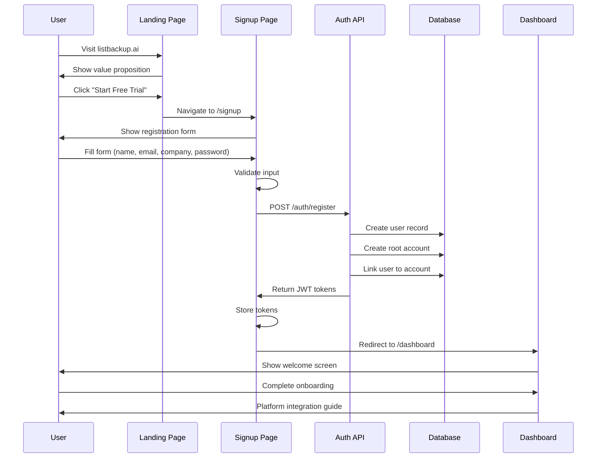

### Journey 2: Platform Integration Setup

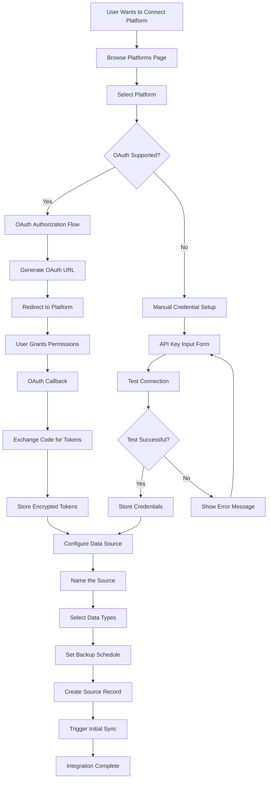

### Journey 3: Account Hierarchy Management

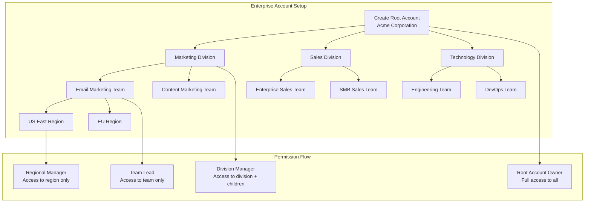

### Journey 4: Team Collaboration Flow

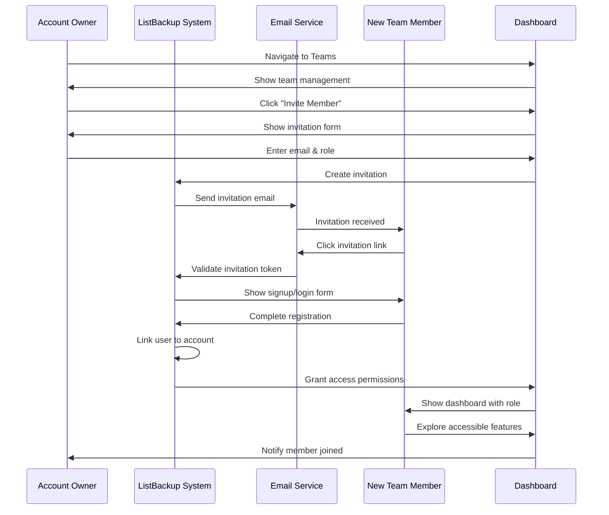

### Journey 5: Data Backup Process

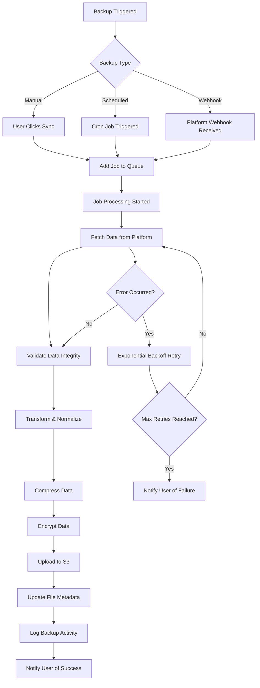

---

## 🔌 Frontend-Backend API Mapping

### Authentication Pages → Auth Service

```typescript
// Login Page API Connections
const loginMutation = useMutation({
  mutationFn: async (data: LoginData) => {
    return await api.auth.login(data) // POST /auth/login
  },
  onSuccess: (response) => {
    // Store JWT tokens
    localStorage.setItem('serviceToken', response.data.accessToken)
    localStorage.setItem('refreshToken', response.data.refreshToken)
    
    // Update auth state
    setAuth(response.data.user, response.data.accessToken, response.data.refreshToken)
    
    // Redirect to dashboard
    router.push('/dashboard')
  }
})

// Signup Page API Connections
const signupMutation = useMutation({
  mutationFn: async (data: SignupData) => {
    return await api.auth.signup(data) // POST /auth/register
  },
  onSuccess: (response) => {
    // Auto-login after successful signup
    setAuth(response.data.user, response.data.accessToken, response.data.refreshToken)
    router.push('/dashboard')
  }
})
```

### Dashboard Pages → Multiple Services

```typescript
// Main Dashboard - Consolidated Data Fetching
const useDashboardData = () => {
  // Sources from Sources Service
  const { data: sources } = useQuery({
    queryKey: ['sources'],
    queryFn: () => api.sources.list(), // GET /sources
    staleTime: 5 * 60 * 1000
  })

  // Jobs from Jobs Service  
  const { data: jobs } = useQuery({
    queryKey: ['jobs'],
    queryFn: () => api.jobs.list(), // GET /jobs
    staleTime: 5 * 60 * 1000
  })

  // Activity from Activity Service
  const { data: activity } = useQuery({
    queryKey: ['activity'],
    queryFn: () => api.activity.list({ limit: 10 }), // GET /activity
    staleTime: 2 * 60 * 1000
  })

  // Account from Accounts Service
  const { data: account } = useQuery({
    queryKey: ['account'],
    queryFn: () => api.accounts.get(), // GET /accounts/current
    staleTime: 10 * 60 * 1000
  })

  return { sources, jobs, activity, account }
}
```

### Platform Integration → Platforms & Connections Services

```typescript
// Platform Browse Component
const PlatformsBrowser = () => {
  // Get available platforms
  const { data: platforms } = useQuery({
    queryKey: ['platforms'],
    queryFn: () => api.platforms.list(), // GET /platforms
    staleTime: 30 * 60 * 1000 // Cache for 30 minutes
  })

  // OAuth connection flow
  const connectPlatform = async (platformType: string) => {
    try {
      // Initiate OAuth flow
      const response = await api.platforms.initiateOAuth(platformType, {
        returnUrl: window.location.href
      }) // POST /platforms/{type}/oauth/start
      
      // Store state for verification
      sessionStorage.setItem('oauth_state', response.state)
      
      // Redirect to OAuth provider
      window.location.href = response.authUrl
    } catch (error) {
      toast.error('Failed to connect platform')
    }
  }

  return (
    <div className="platforms-grid">
      {platforms?.map(platform => (
        <PlatformCard 
          key={platform.id}
          platform={platform}
          onConnect={() => connectPlatform(platform.type)}
        />
      ))}
    </div>
  )
}
```

### Account Management → Accounts & Teams Services

```typescript
// Account Context Provider
const AccountContextProvider = ({ children }) => {
  const [currentAccount, setCurrentAccount] = useState(null)
  const [userPermissions, setUserPermissions] = useState({})

  // Load user's accessible accounts
  const { data: accounts } = useQuery({
    queryKey: ['user-accounts'],
    queryFn: () => api.accounts.getUserAccounts(), // GET /accounts
    staleTime: 10 * 60 * 1000
  })

  // Switch account context
  const switchAccount = async (accountId: string) => {
    try {
      const response = await api.accounts.switchContext(accountId) // POST /accounts/switch
      setCurrentAccount(response.account)
      setUserPermissions(response.permissions)
      
      // Invalidate all queries to refetch with new context
      queryClient.invalidateQueries()
    } catch (error) {
      toast.error('Failed to switch account')
    }
  }

  return (
    <AccountContext.Provider value={{ 
      currentAccount, 
      accounts, 
      userPermissions,
      switchAccount 
    }}>
      {children}
    </AccountContext.Provider>
  )
}
```

### Real-time Features → Jobs & Activity Services

```typescript
// Job Status Monitoring
const JobStatusMonitor = ({ jobId }: { jobId: string }) => {
  // Poll job status while running
  const { data: jobStatus } = useQuery({
    queryKey: ['jobs', jobId, 'status'],
    queryFn: () => api.jobs.get(jobId), // GET /jobs/{jobId}
    refetchInterval: (data) => {
      // Poll every 2 seconds if job is running
      return data?.status === 'running' ? 2000 : false
    },
    enabled: !!jobId
  })

  // Real-time progress updates
  useEffect(() => {
    if (jobStatus?.status === 'running') {
      // Update progress bar
      setProgress(jobStatus.progress?.percentage || 0)
    } else if (jobStatus?.status === 'completed') {
      // Show success notification
      toast.success('Backup completed successfully')
    } else if (jobStatus?.status === 'failed') {
      // Show error notification
      toast.error(`Backup failed: ${jobStatus.error}`)
    }
  }, [jobStatus])

  return (
    <div className="job-progress">
      <ProgressBar value={progress} />
      <span>{jobStatus?.status}</span>
    </div>
  )
}
```

---

## 🏗️ Page Architecture and Routing

### Next.js App Router Structure

```
app/
├── (auth)/                    # Auth group with shared layout
│   ├── layout.tsx            # Centered auth layout
│   ├── login/
│   │   └── page.tsx          # Login form
│   └── signup/
│       └── page.tsx          # Registration form
├── dashboard/                 # Main app group
│   ├── layout.tsx            # Dashboard layout with sidebar
│   ├── page.tsx              # Dashboard overview
│   ├── sources/
│   │   ├── page.tsx          # Sources list
│   │   ├── [sourceId]/
│   │   │   └── page.tsx      # Source details
│   │   └── new/
│   │       └── page.tsx      # Create source wizard
│   ├── jobs/
│   │   ├── page.tsx          # Jobs list
│   │   └── [jobId]/
│   │       └── page.tsx      # Job details
│   ├── accounts/
│   │   ├── page.tsx          # Account management
│   │   └── [accountId]/
│   │       └── page.tsx      # Account details
│   ├── teams/
│   │   ├── page.tsx          # Teams list
│   │   └── [teamId]/
│   │       └── page.tsx      # Team management
│   └── settings/
│       ├── page.tsx          # General settings
│       ├── account/
│       │   └── page.tsx      # Account settings
│       └── user/
│           └── page.tsx      # User profile
├── (portal)/                 # Client portal group
│   ├── layout.tsx            # Portal layout
│   ├── login/
│   │   └── page.tsx          # Client login
│   ├── page.tsx              # Portal dashboard
│   ├── accounts/
│   │   └── page.tsx          # Account access
│   ├── reports/
│   │   └── page.tsx          # Report downloads
│   └── exports/
│       └── page.tsx          # Data exports
├── integrations/             # Platform showcase
│   ├── page.tsx              # Integrations hub
│   ├── [platform]/
│   │   └── page.tsx          # Platform details
│   └── request/
│       └── page.tsx          # Integration request
├── layout.tsx                # Root layout
├── page.tsx                  # Landing page
├── pricing/
│   └── page.tsx              # Pricing page
└── api/                      # API routes
    └── oauth/
        └── callback/
            └── route.ts      # OAuth callback handler
```

### Routing Middleware and Protection

```typescript
// middleware.ts - Route Protection
import { NextResponse } from 'next/server'
import type { NextRequest } from 'next/server'

export function middleware(request: NextRequest) {
  const { pathname } = request.nextUrl
  const token = request.cookies.get('serviceToken')?.value

  // Public routes that don't require authentication
  const publicPaths = [
    '/', '/login', '/signup', '/pricing', '/features', 
    '/about', '/contact', '/integrations', '/privacy', '/terms'
  ]

  // Check if path is public
  const isPublicPath = publicPaths.some(path => 
    pathname === path || pathname.startsWith(`${path}/`)
  )

  // Redirect unauthenticated users from protected routes
  if (!isPublicPath && !token) {
    return NextResponse.redirect(new URL('/login', request.url))
  }

  // Redirect authenticated users from auth pages
  if ((pathname === '/login' || pathname === '/signup') && token) {
    return NextResponse.redirect(new URL('/dashboard', request.url))
  }

  // Redirect authenticated users from landing page
  if (pathname === '/' && token) {
    return NextResponse.redirect(new URL('/dashboard', request.url))
  }

  return NextResponse.next()
}

export const config = {
  matcher: ['/((?!api|_next/static|_next/image|favicon.ico).*)']
}
```

---

## 📊 User Flow Diagrams

### Complete Onboarding Flow

```mermaid
flowchart TD
    LAND[User Lands on Homepage] --> VALUE_PROP[Review Value Proposition]
    VALUE_PROP --> INTEREST{Interested?}
    INTEREST -->|No| EXIT[Leave Site]
    INTEREST -->|Yes| EXPLORE[Explore Features/Pricing]
    
    EXPLORE --> DECISION{Ready to Sign Up?}
    DECISION -->|No| NURTURE[Newsletter/Retargeting]
    DECISION -->|Yes| SIGNUP[Click "Start Free Trial"]
    
    SIGNUP --> FORM[Fill Registration Form]
    FORM --> VALIDATE[Form Validation]
    VALIDATE --> SUBMIT[Submit Registration]
    SUBMIT --> ACCOUNT_CREATED[Account Created]
    
    ACCOUNT_CREATED --> LOGIN_AUTO[Auto-login]
    LOGIN_AUTO --> DASHBOARD[Dashboard First Visit]
    DASHBOARD --> ONBOARDING{First Time User?}
    
    ONBOARDING -->|Yes| WELCOME[Welcome Screen]
    ONBOARDING -->|No| NORMAL_DASH[Normal Dashboard]
    
    WELCOME --> PLATFORM_GUIDE[Platform Integration Guide]
    PLATFORM_GUIDE --> SELECT_PLATFORM[Select First Platform]
    SELECT_PLATFORM --> OAUTH_SETUP[OAuth Setup]
    OAUTH_SETUP --> FIRST_SOURCE[Create First Source]
    FIRST_SOURCE --> INITIAL_SYNC[Initial Data Sync]
    INITIAL_SYNC --> SUCCESS[Onboarding Complete]
    
    SUCCESS --> NORMAL_DASH
```

### Account Hierarchy Creation Flow

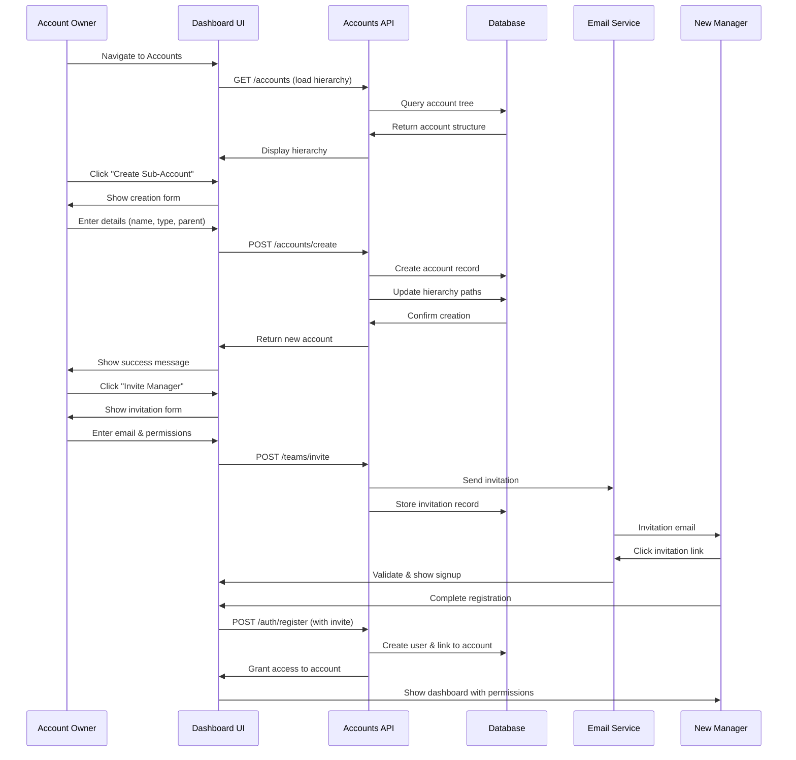

### Client Portal Access Flow

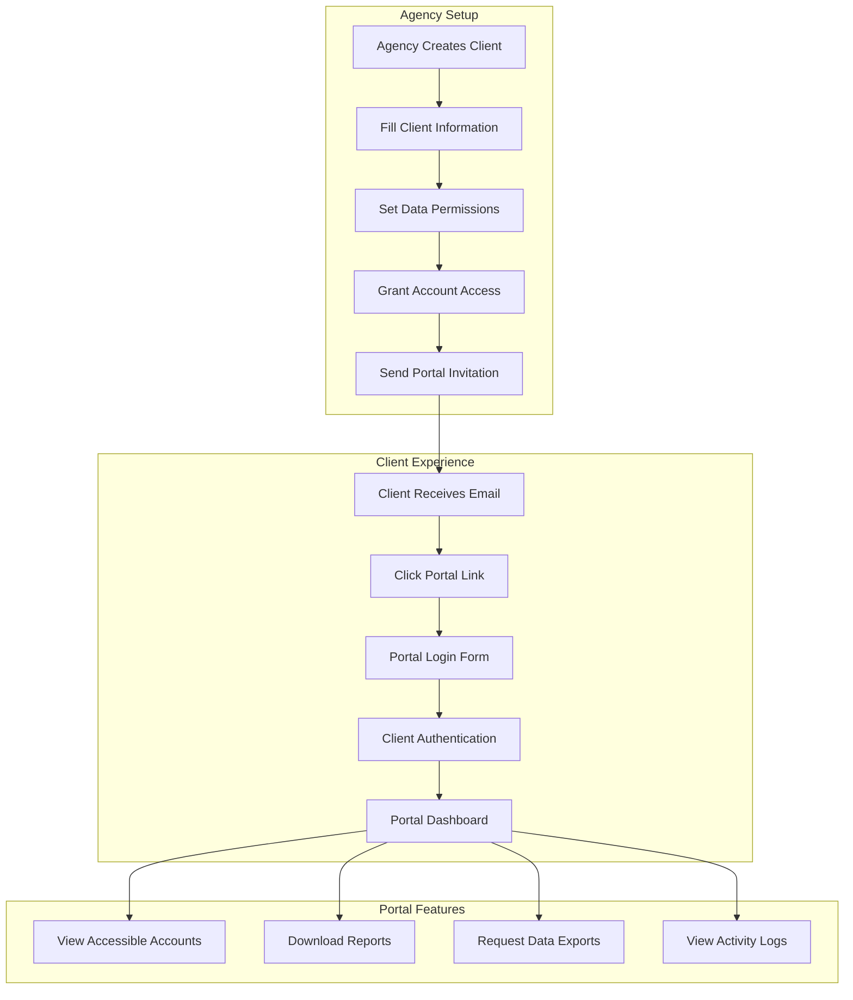

### Error Handling and Recovery Flow

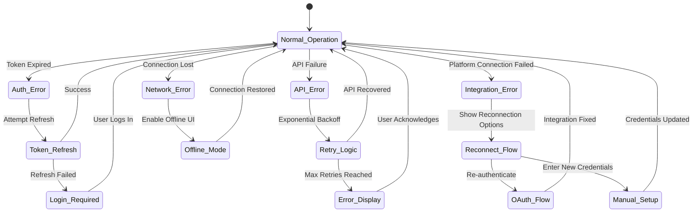

---

## 🧩 Component Architecture

### Shared Component Library

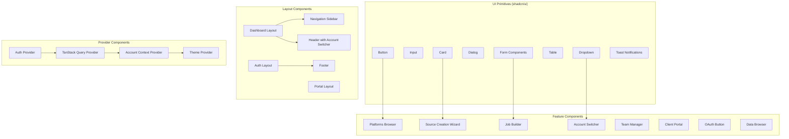

---

## 🔄 State Management Patterns

### Zustand Auth Store

```typescript
interface AuthState {
  user: User | null
  serviceToken: string | null
  refreshToken: string | null
  isAuthenticated: boolean
  login: (user: User, accessToken: string, refreshToken: string) => void
  logout: () => void
  refreshTokens: () => Promise<void>
}

const useAuthStore = create<AuthState>((set, get) => ({
  user: null,
  serviceToken: null,
  refreshToken: null,
  isAuthenticated: false,

  login: (user, accessToken, refreshToken) => {
    // Store tokens
    localStorage.setItem('serviceToken', accessToken)
    localStorage.setItem('refreshToken', refreshToken)
    
    // Update state
    set({
      user,
      serviceToken: accessToken,
      refreshToken,
      isAuthenticated: true
    })
  },

  logout: () => {
    // Clear storage
    localStorage.removeItem('serviceToken')
    localStorage.removeItem('refreshToken')
    
    // Clear state
    set({
      user: null,
      serviceToken: null,
      refreshToken: null,
      isAuthenticated: false
    })
    
    // Redirect to login
    window.location.href = '/login'
  },

  refreshTokens: async () => {
    const refreshToken = get().refreshToken
    if (!refreshToken) throw new Error('No refresh token')

    const response = await api.auth.refresh(refreshToken)
    const { accessToken, refreshToken: newRefreshToken } = response.data

    // Update tokens
    localStorage.setItem('serviceToken', accessToken)
    localStorage.setItem('refreshToken', newRefreshToken)
    
    set({
      serviceToken: accessToken,
      refreshToken: newRefreshToken
    })
  }
}))
```

### TanStack Query Configuration

```typescript
const queryClient = new QueryClient({
  defaultOptions: {
    queries: {
      staleTime: 5 * 60 * 1000, // 5 minutes
      gcTime: 10 * 60 * 1000,   // 10 minutes
      retry: (failureCount, error) => {
        // Don't retry auth errors
        if (error?.response?.status === 401) return false
        // Retry up to 3 times for other errors
        return failureCount < 3
      },
      refetchOnWindowFocus: false,
      refetchOnReconnect: true
    },
    mutations: {
      retry: 1,
      onError: (error) => {
        // Global error handling
        if (error?.response?.status === 401) {
          useAuthStore.getState().logout()
        } else {
          toast.error(error.message || 'An error occurred')
        }
      }
    }
  }
})
```

### Account Context Management

```typescript
interface AccountContextType {
  currentAccount: Account | null
  accounts: Account[]
  userRole: string
  permissions: Permissions
  switchAccount: (accountId: string) => Promise<void>
  canCreateSubAccounts: boolean
  canInviteUsers: boolean
  canManageBilling: boolean
}

const AccountContext = createContext<AccountContextType | null>(null)

export const useAccountContext = () => {
  const context = useContext(AccountContext)
  if (!context) {
    throw new Error('useAccountContext must be used within AccountProvider')
  }
  return context
}
```

---

## 📈 Performance and Optimization

### Loading State Management

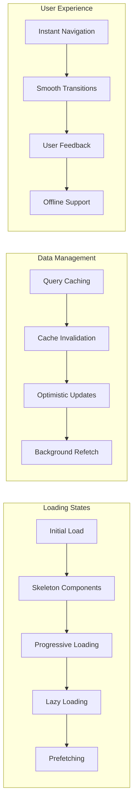

### Code Splitting and Lazy Loading

```typescript
// Dynamic imports for large components
const PlatformsBrowser = lazy(() => import('./components/platforms/platforms-browser'))
const AccountManager = lazy(() => import('./components/account/account-manager'))
const ClientPortal = lazy(() => import('./components/portal/client-portal'))

// Route-based code splitting with loading states
const Dashboard = lazy(() => 
  import('./pages/dashboard').then(module => ({
    default: module.DashboardPage
  }))
)

// Wrap with Suspense for loading states
<Suspense fallback={<DashboardSkeleton />}>
  <Dashboard />
</Suspense>
```

This comprehensive frontend architecture documentation provides a complete understanding of how users interact with the ListBackup.ai v2 platform, from initial discovery through advanced enterprise features. The hierarchical account system, multi-platform integrations, and sophisticated user flows support complex organizational structures while maintaining an intuitive user experience.

<function_calls>
<invoke name="TodoWrite">
<parameter name="todos">[{"id": "12", "content": "Update main architecture documentation with detailed frontend analysis", "status": "completed", "priority": "high"}]