# Authentication & Authorization - Hierarchical Account System

**🔐 Comprehensive guide to authentication and authorization in ListBackup.ai v2's hierarchical account architecture**

---

## 📋 Table of Contents

1. [Authentication Overview](#authentication-overview)
2. [JWT Token Structure](#jwt-token-structure)
3. [Hierarchical Account Model](#hierarchical-account-model)
4. [Authorization Patterns](#authorization-patterns)
5. [Permission Inheritance](#permission-inheritance)
6. [API Authentication](#api-authentication)
7. [Account Context Switching](#account-context-switching)
8. [Security Best Practices](#security-best-practices)

---

## Authentication Overview

### Multi-Factor Authentication Architecture

```mermaid
graph TB
    subgraph "Authentication Flow"
        LOGIN[🔑 User Login<br/>Email + Password<br/>Captcha verification<br/>Device fingerprinting]
        
        MFA_CHECK[🛡️ MFA Requirement Check<br/>Account security policy<br/>Risk assessment<br/>Geographic analysis]
        
        MFA_METHODS[📱 MFA Methods<br/>• SMS verification<br/>• Authenticator app (TOTP)<br/>• Email verification<br/>• Hardware tokens (future)]
        
        DEVICE_TRUST[📲 Device Trust<br/>Device registration<br/>Trust verification<br/>Session persistence]
    end
    
    subgraph "Token Generation"
        COGNITO[🔐 AWS Cognito<br/>User Pool validation<br/>Password policy check<br/>Account status verification]
        
        JWT_CREATION[🎫 JWT Creation<br/>Access token (1 hour)<br/>ID token (1 hour)<br/>Refresh token (7 days)<br/>Account context injection]
        
        SESSION_MGT[⏰ Session Management<br/>Concurrent session limits<br/>Session timeout handling<br/>Automatic renewal]
    end
    
    subgraph "Account Resolution"
        ACCOUNT_LOOKUP[🏢 Account Discovery<br/>User-account associations<br/>Permission mapping<br/>Role resolution]
        
        HIERARCHY_BUILD[🌳 Hierarchy Building<br/>Parent-child relationships<br/>Access inheritance<br/>Context validation]
        
        PERMISSION_CALC[⚡ Permission Calculation<br/>Role-based permissions<br/>Resource-level access<br/>Dynamic policy evaluation]
    end
    
    %% Flow Connections
    LOGIN --> MFA_CHECK
    MFA_CHECK --> MFA_METHODS
    MFA_METHODS --> DEVICE_TRUST
    
    DEVICE_TRUST --> COGNITO
    COGNITO --> JWT_CREATION
    JWT_CREATION --> SESSION_MGT
    
    JWT_CREATION --> ACCOUNT_LOOKUP
    ACCOUNT_LOOKUP --> HIERARCHY_BUILD
    HIERARCHY_BUILD --> PERMISSION_CALC
```

### Authentication Methods

| Method | Security Level | Use Case | Implementation |
|--------|---------------|----------|----------------|
| **Email + Password** | Medium | Standard login | AWS Cognito User Pool |
| **MFA (SMS)** | High | High-risk accounts | Twilio integration |
| **MFA (TOTP)** | High | Enterprise accounts | Google Authenticator/Authy |
| **Social Login** | Medium | Quick onboarding | OAuth with Google/Microsoft |
| **SSO/SAML** | High | Enterprise integration | Cognito Identity Federation |
| **API Keys** | High | Service-to-service | Scoped programmatic access |

---

## JWT Token Structure

### Access Token Claims

```json
{
  "header": {
    "alg": "RS256",
    "typ": "JWT",
    "kid": "cognito-key-id-123"
  },
  "payload": {
    "sub": "usr-12345678-1234-1234-1234-123456789012",
    "aud": "listbackup-client-id",
    "iss": "https://cognito-idp.us-east-1.amazonaws.com/us-east-1_YourUserPool",
    "exp": 1624387200,
    "iat": 1624383600,
    "token_use": "access",
    "scope": "openid email profile",
    "username": "user@company.com",
    
    "custom:account_context": {
      "currentAccountId": "acc-87654321",
      "availableAccounts": [
        {
          "accountId": "acc-87654321",
          "name": "Main Account",
          "role": "owner",
          "permissions": ["admin", "read", "write"],
          "level": 0,
          "path": "/main-account/"
        },
        {
          "accountId": "acc-12345678",
          "name": "Sub Account",
          "role": "admin",
          "permissions": ["read", "write"],
          "level": 1,
          "path": "/main-account/sub-account/"
        }
      ]
    },
    
    "custom:user_metadata": {
      "userId": "usr-12345678",
      "name": "John Doe",
      "email": "user@company.com",
      "status": "active",
      "mfaEnabled": true,
      "lastLogin": "2025-06-20T14:30:00Z",
      "deviceId": "dev-abc123def456"
    },
    
    "custom:permissions": {
      "global": ["api_access", "dashboard_access"],
      "account_specific": {
        "acc-87654321": ["sources.create", "sources.read", "sources.update", "sources.delete", "teams.manage", "billing.view"],
        "acc-12345678": ["sources.read", "sources.update", "teams.view"]
      }
    }
  }
}
```

### ID Token Structure

```json
{
  "sub": "usr-12345678-1234-1234-1234-123456789012",
  "aud": "listbackup-client-id",
  "cognito:username": "user@company.com",
  "email_verified": true,
  "email": "user@company.com",
  "name": "John Doe",
  "family_name": "Doe",
  "given_name": "John",
  "picture": "https://example.com/avatar.jpg",
  
  "custom:account_associations": [
    {
      "accountId": "acc-87654321",
      "role": "owner",
      "linkedAt": "2025-01-15T10:30:00Z",
      "status": "active"
    }
  ],
  
  "custom:user_preferences": {
    "theme": "light",
    "timezone": "America/New_York",
    "language": "en",
    "notifications": {
      "email": true,
      "browser": true,
      "mobile": false
    }
  }
}
```

---

## Hierarchical Account Model

### Account Structure

```mermaid
graph TB
    subgraph "Enterprise Conglomerate Structure"
        ROOT[🏢 Root Account<br/>PepsiCo Global<br/>Level: 0<br/>Path: /pepsico/]
        
        SUBSIDIARY1[🏬 Subsidiary<br/>Frito-Lay North America<br/>Level: 1<br/>Path: /pepsico/frito-lay/]
        
        SUBSIDIARY2[🏬 Subsidiary<br/>PepsiCo Beverages<br/>Level: 1<br/>Path: /pepsico/beverages/]
        
        BRAND1[🎯 Brand Division<br/>Lay's Brand<br/>Level: 2<br/>Path: /pepsico/frito-lay/lays/]
        
        BRAND2[🎯 Brand Division<br/>Pepsi Brand<br/>Level: 2<br/>Path: /pepsico/beverages/pepsi/]
        
        REGION1[🌍 Regional<br/>Lay's Northeast<br/>Level: 3<br/>Path: /pepsico/frito-lay/lays/northeast/]
        
        REGION2[🌍 Regional<br/>Pepsi West Coast<br/>Level: 3<br/>Path: /pepsico/beverages/pepsi/west-coast/]
        
        LOCATION1[📍 Location<br/>Boston Distribution<br/>Level: 4<br/>Path: /pepsico/frito-lay/lays/northeast/boston/]
        
        LOCATION2[📍 Location<br/>Los Angeles Plant<br/>Level: 4<br/>Path: /pepsico/beverages/pepsi/west-coast/la-plant/]
    end
    
    %% Hierarchy Relationships
    ROOT --> SUBSIDIARY1
    ROOT --> SUBSIDIARY2
    SUBSIDIARY1 --> BRAND1
    SUBSIDIARY2 --> BRAND2
    BRAND1 --> REGION1
    BRAND2 --> REGION2
    REGION1 --> LOCATION1
    REGION2 --> LOCATION2
```



### Account Data Model

```typescript
interface Account {
  accountId: string;              // Unique identifier
  parentAccountId?: string;       // Parent in hierarchy
  ownerUserId: string;           // Account owner
  name: string;                  // Display name
  company: string;               // Legal entity name
  accountPath: string;           // Hierarchical path
  level: number;                 // Depth in hierarchy
  plan: 'trial' | 'subscription' | 'enterprise';
  status: 'active' | 'suspended' | 'deleted';
  
  // Account-specific configuration
  settings: {
    timezone: string;
    currency: string;
    dataRetention: number;       // Days
    features: {
      apiAccess: boolean;
      customBranding: boolean;
      advancedAnalytics: boolean;
      prioritySupport: boolean;
    };
  };
  
  // Usage limits and quotas
  limits: {
    maxSources: number;
    maxTeamMembers: number;
    maxClients: number;
    storageQuotaGB: number;
    apiRequestsPerMonth: number;
  };
  
  // Current usage statistics
  usage: {
    activeSources: number;
    teamMembers: number;
    clients: number;
    storageUsedGB: number;
    apiRequestsThisMonth: number;
  };
  
  createdAt: string;
  updatedAt: string;
}
```

---

## Authorization Patterns

### Role-Based Access Control (RBAC)

```mermaid
graph TB
    subgraph "Account Roles"
        OWNER[👑 Owner<br/>• Full account control<br/>• Billing management<br/>• User management<br/>• Sub-account creation<br/>• Data export/deletion]
        
        ADMIN[⚡ Administrator<br/>• User management<br/>• Source management<br/>• Team management<br/>• Settings configuration<br/>• Limited billing access]
        
        MANAGER[🎯 Manager<br/>• Team management<br/>• Source creation/editing<br/>• Job management<br/>• Limited user access<br/>• Report generation]
        
        MEMBER[👤 Member<br/>• Source access (assigned)<br/>• Basic operations<br/>• Personal settings<br/>• Limited data access<br/>• No admin functions]
        
        VIEWER[👁️ Viewer<br/>• Read-only access<br/>• Dashboard viewing<br/>• Report access<br/>• No modifications<br/>• Limited data export]
        
        CLIENT[👥 Client<br/>• Portal access only<br/>• Assigned data viewing<br/>• Report downloads<br/>• No system access<br/>• Limited account info]
    end
    
    subgraph "Permission Categories"
        ACCOUNT_PERMS[🏢 Account Permissions<br/>• account.read<br/>• account.update<br/>• account.create_sub<br/>• account.delete<br/>• account.billing]
        
        USER_PERMS[👤 User Permissions<br/>• users.invite<br/>• users.manage<br/>• users.remove<br/>• users.assign_roles<br/>• users.view_activity]
        
        SOURCE_PERMS[📊 Source Permissions<br/>• sources.create<br/>• sources.read<br/>• sources.update<br/>• sources.delete<br/>• sources.sync]
        
        TEAM_PERMS[👥 Team Permissions<br/>• teams.create<br/>• teams.manage<br/>• teams.invite<br/>• teams.remove_members<br/>• teams.assign_accounts]
        
        CLIENT_PERMS[👨‍💼 Client Permissions<br/>• clients.create<br/>• clients.manage<br/>• clients.grant_access<br/>• clients.revoke_access<br/>• clients.portal_config]
    end
    
    %% Role-Permission Mapping
    OWNER --> ACCOUNT_PERMS
    OWNER --> USER_PERMS
    OWNER --> SOURCE_PERMS
    OWNER --> TEAM_PERMS
    OWNER --> CLIENT_PERMS
    
    ADMIN --> USER_PERMS
    ADMIN --> SOURCE_PERMS
    ADMIN --> TEAM_PERMS
    ADMIN --> CLIENT_PERMS
    
    MANAGER --> SOURCE_PERMS
    MANAGER --> TEAM_PERMS
```

### Permission Matrix

| Permission | Owner | Admin | Manager | Member | Viewer | Client |
|------------|-------|-------|---------|--------|--------|--------|
| **Account Management** |
| View account details | ✅ | ✅ | ✅ | ✅ | ✅ | ❌ |
| Update account settings | ✅ | ✅ | ❌ | ❌ | ❌ | ❌ |
| Create sub-accounts | ✅ | ❌ | ❌ | ❌ | ❌ | ❌ |
| Delete account | ✅ | ❌ | ❌ | ❌ | ❌ | ❌ |
| Billing management | ✅ | ⚠️ | ❌ | ❌ | ❌ | ❌ |
| **User Management** |
| Invite users | ✅ | ✅ | ⚠️ | ❌ | ❌ | ❌ |
| Assign roles | ✅ | ✅ | ❌ | ❌ | ❌ | ❌ |
| Remove users | ✅ | ✅ | ❌ | ❌ | ❌ | ❌ |
| View user activity | ✅ | ✅ | ✅ | ❌ | ❌ | ❌ |
| **Source Management** |
| Create sources | ✅ | ✅ | ✅ | ⚠️ | ❌ | ❌ |
| Update sources | ✅ | ✅ | ✅ | ⚠️ | ❌ | ❌ |
| Delete sources | ✅ | ✅ | ✅ | ❌ | ❌ | ❌ |
| View source data | ✅ | ✅ | ✅ | ⚠️ | ⚠️ | ⚠️ |
| Trigger sync | ✅ | ✅ | ✅ | ⚠️ | ❌ | ❌ |
| **Team Management** |
| Create teams | ✅ | ✅ | ✅ | ❌ | ❌ | ❌ |
| Manage team members | ✅ | ✅ | ✅ | ❌ | ❌ | ❌ |
| Assign team accounts | ✅ | ✅ | ❌ | ❌ | ❌ | ❌ |
| **Client Portal** |
| Create clients | ✅ | ✅ | ⚠️ | ❌ | ❌ | ❌ |
| Grant data access | ✅ | ✅ | ⚠️ | ❌ | ❌ | ❌ |
| Portal configuration | ✅ | ✅ | ❌ | ❌ | ❌ | ❌ |
| Access portal | ❌ | ❌ | ❌ | ❌ | ❌ | ✅ |

**Legend:**
- ✅ Full access
- ⚠️ Limited/conditional access
- ❌ No access

---

## Permission Inheritance

### Hierarchical Access Model

```mermaid
graph TB
    subgraph "Permission Inheritance Flow"
        PARENT[🏢 Parent Account<br/>PepsiCo Global<br/>• Full admin access<br/>• All data visibility<br/>• Cross-subsidiary reporting]
        
        CHILD1[🏬 Child Account<br/>Frito-Lay Division<br/>• Inherits read access<br/>• Local admin rights<br/>• Limited cross-division access]
        
        CHILD2[🏬 Child Account<br/>Beverages Division<br/>• Inherits read access<br/>• Local admin rights<br/>• Limited cross-division access]
        
        GRANDCHILD1[🎯 Grandchild Account<br/>Lay's Brand<br/>• Inherits division access<br/>• Brand-specific admin<br/>• No cross-brand access]
        
        GRANDCHILD2[🎯 Grandchild Account<br/>Pepsi Brand<br/>• Inherits division access<br/>• Brand-specific admin<br/>• No cross-brand access]
    end
    
    subgraph "Access Control Rules"
        RULE1[📜 Rule 1: Downward Visibility<br/>Parent accounts can view<br/>all child account data<br/>with full permissions]
        
        RULE2[📜 Rule 2: Sibling Isolation<br/>Child accounts cannot<br/>access sibling data<br/>unless explicitly granted]
        
        RULE3[📜 Rule 3: Role Inheritance<br/>User roles apply to<br/>current account and<br/>all subordinate accounts]
        
        RULE4[📜 Rule 4: Permission Escalation<br/>Higher-level accounts<br/>can override permissions<br/>in subordinate accounts]
    end
    
    %% Inheritance Flow
    PARENT --> CHILD1
    PARENT --> CHILD2
    CHILD1 --> GRANDCHILD1
    CHILD2 --> GRANDCHILD2
    
    PARENT -.-> RULE1
    CHILD1 -.-> RULE2
    GRANDCHILD1 -.-> RULE3
    GRANDCHILD2 -.-> RULE4
```



### Permission Calculation Algorithm

```typescript
interface PermissionContext {
  userId: string;
  currentAccountId: string;
  requestedResource: string;
  requestedAction: string;
}

function calculatePermissions(context: PermissionContext): boolean {
  // 1. Get user's direct role in current account
  const directRole = getUserAccountRole(context.userId, context.currentAccountId);
  
  // 2. Check inherited permissions from parent accounts
  const inheritedPermissions = getInheritedPermissions(
    context.userId, 
    context.currentAccountId
  );
  
  // 3. Check resource-specific permissions
  const resourcePermissions = getResourcePermissions(
    context.userId,
    context.requestedResource,
    context.currentAccountId
  );
  
  // 4. Apply permission hierarchy rules
  const finalPermission = evaluatePermissionHierarchy(
    directRole,
    inheritedPermissions,
    resourcePermissions,
    context.requestedAction
  );
  
  return finalPermission;
}

function getInheritedPermissions(userId: string, accountId: string): Permission[] {
  const accountHierarchy = getAccountHierarchy(accountId);
  const inheritedPermissions: Permission[] = [];
  
  // Walk up the account hierarchy
  for (const parentAccount of accountHierarchy.parents) {
    const parentRole = getUserAccountRole(userId, parentAccount.accountId);
    if (parentRole) {
      // Parent account permissions apply to child accounts
      inheritedPermissions.push({
        accountId: parentAccount.accountId,
        role: parentRole,
        scope: 'inherited',
        level: parentAccount.level
      });
    }
  }
  
  return inheritedPermissions;
}
```

---

## API Authentication

### Request Authentication Flow


### Standard Auth Context Extraction

```go
// Standard pattern used across all Go services
func extractAuthContext(event events.APIGatewayV2HTTPRequest) (AuthContext, error) {
    var ctx AuthContext
    
    // Try lambda authorizer first (preferred)
    if authLambda, ok := event.RequestContext.Authorizer["lambda"].(map[string]interface{}); ok {
        if uid, exists := authLambda["userId"].(string); exists {
            ctx.UserID = uid
        }
        if aid, exists := authLambda["accountId"].(string); exists {
            ctx.AccountID = aid
        }
        if perms, exists := authLambda["permissions"].([]interface{}); exists {
            ctx.Permissions = convertToStringArray(perms)
        }
        if role, exists := authLambda["role"].(string); exists {
            ctx.Role = role
        }
    } else {
        // Fallback to direct authorizer
        if uid, exists := event.RequestContext.Authorizer["userId"].(string); exists {
            ctx.UserID = uid
        }
        if aid, exists := event.RequestContext.Authorizer["accountId"].(string); exists {
            ctx.AccountID = aid
        }
    }
    
    // Validate required fields
    if ctx.UserID == "" || ctx.AccountID == "" {
        return ctx, errors.New("authentication context missing")
    }
    
    // Extract account hierarchy for permission checking
    hierarchy, err := getAccountHierarchy(ctx.AccountID)
    if err != nil {
        return ctx, fmt.Errorf("failed to get account hierarchy: %w", err)
    }
    ctx.AccountHierarchy = hierarchy
    
    return ctx, nil
}

type AuthContext struct {
    UserID           string              `json:"userId"`
    AccountID        string              `json:"accountId"`
    Role             string              `json:"role"`
    Permissions      []string            `json:"permissions"`
    AccountHierarchy AccountHierarchy    `json:"accountHierarchy"`
}

type AccountHierarchy struct {
    CurrentAccount Account    `json:"currentAccount"`
    ParentAccounts []Account  `json:"parentAccounts"`
    ChildAccounts  []Account  `json:"childAccounts"`
    AccessLevel    int        `json:"accessLevel"`
}
```

---

## Account Context Switching

### Context Switching Flow

```mermaid
graph TB
    subgraph "Context Switch Process"
        REQUEST[📱 Switch Context Request<br/>• Target account ID<br/>• User validation<br/>• Permission check]
        
        VALIDATION[✅ Access Validation<br/>• User-account association<br/>• Role verification<br/>• Status check<br/>• Hierarchy validation]
        
        TOKEN_UPDATE[🎫 Token Update<br/>• Generate new access token<br/>• Update account context<br/>• Refresh permissions<br/>• Maintain session]
        
        RESPONSE[📤 Context Response<br/>• New JWT tokens<br/>• Updated account info<br/>• Permission matrix<br/>• UI state update]
    end
    
    subgraph "Validation Checks"
        USER_ASSOC[👤 User Association<br/>Check if user has access<br/>to target account]
        
        ROLE_CHECK[🎯 Role Verification<br/>Verify user role in<br/>target account]
        
        STATUS_CHECK[📊 Status Check<br/>Account active status<br/>User active status<br/>No suspensions]
        
        HIERARCHY_CHECK[🌳 Hierarchy Check<br/>Account relationship<br/>Permission inheritance<br/>Access boundaries]
    end
    
    REQUEST --> VALIDATION
    VALIDATION --> TOKEN_UPDATE
    TOKEN_UPDATE --> RESPONSE
    
    VALIDATION --> USER_ASSOC
    VALIDATION --> ROLE_CHECK
    VALIDATION --> STATUS_CHECK
    VALIDATION --> HIERARCHY_CHECK
```



### Context Switch API

```bash
# Switch to different account context
curl -X POST https://api.listbackup.ai/account/switch-context \
  -H "Authorization: Bearer YOUR_ACCESS_TOKEN" \
  -H "Content-Type: application/json" \
  -d '{
    "accountId": "acc-new-account-id"
  }'
```

**Response:**
```json
{
  "success": true,
  "data": {
    "accessToken": "eyJhbGciOiJSUzI1NiIsInR5cCI6IkpXVCJ9...",
    "refreshToken": "eyJjdHkiOiJKV1QiLCJlbmMiOiJBMjU2R0NNIi...",
    "expiresIn": 3600,
    "account": {
      "accountId": "acc-new-account-id",
      "name": "Target Account",
      "role": "admin",
      "permissions": ["read", "write", "manage_users"],
      "level": 1,
      "path": "/parent/target-account/"
    },
    "availableAccounts": [
      // Updated list of accessible accounts
    ]
  }
}
```

---

## Security Best Practices

### Authentication Security

1. **Token Security**
   - Short-lived access tokens (1 hour)
   - Secure refresh token rotation
   - Token binding to device/IP
   - Automatic token revocation on suspicious activity

2. **Multi-Factor Authentication**
   - Mandatory for high-privilege accounts
   - Risk-based MFA triggers
   - Multiple MFA method support
   - Backup authentication codes

3. **Session Management**
   - Concurrent session limits
   - Session timeout policies
   - Device registration and trust
   - Session activity monitoring

### Authorization Security

1. **Principle of Least Privilege**
   - Minimal default permissions
   - Explicit permission grants
   - Regular permission audits
   - Time-limited elevated access

2. **Permission Validation**
   - Server-side permission checks
   - Resource-level authorization
   - Context-aware decisions
   - Audit trail for all actions

3. **Account Isolation**
   - Strong data segregation
   - Query-level filtering
   - Cross-account access prevention
   - Secure account switching

### Implementation Checklist

- **✅ JWT Token Validation**
  - Signature verification
  - Expiration checking
  - Issuer validation
  - Audience validation

- **✅ Account Context Security**
  - Account ownership verification
  - Hierarchy permission checks
  - Resource access validation
  - Cross-account prevention

- **✅ Permission Enforcement**
  - Role-based access control
  - Resource-level permissions
  - Action-specific checks
  - Inheritance rules

- **✅ Audit and Monitoring**
  - Authentication event logging
  - Permission change tracking
  - Suspicious activity detection
  - Regular security reviews

---

## Error Handling

### Authentication Errors

```json
{
  "error": "AUTHENTICATION_FAILED",
  "message": "Invalid or expired authentication token",
  "details": {
    "code": "TOKEN_EXPIRED",
    "expiredAt": "2025-06-20T14:30:00Z",
    "action": "refresh_token"
  },
  "timestamp": "2025-06-20T15:30:00Z"
}
```

### Authorization Errors

```json
{
  "error": "AUTHORIZATION_FAILED",
  "message": "Insufficient permissions for this operation",
  "details": {
    "required_permission": "sources.delete",
    "user_role": "member",
    "account_context": "acc-12345678",
    "resource": "src-87654321"
  },
  "timestamp": "2025-06-20T15:30:00Z"
}
```

### Account Context Errors

```json
{
  "error": "ACCOUNT_CONTEXT_INVALID",
  "message": "User does not have access to specified account",
  "details": {
    "requested_account": "acc-87654321",
    "user_accounts": ["acc-12345678", "acc-11111111"],
    "action": "verify_account_access"
  },
  "timestamp": "2025-06-20T15:30:00Z"
}
```

---

*This authentication and authorization documentation provides the foundation for secure, scalable access control in ListBackup.ai v2's hierarchical account system. For additional security considerations, see the [Security Architecture Documentation](../architecture/complete-architecture.md#oauth-security-architecture).*

**📚 Related Documentation:**
- [API Reference](./explorer.md)
- [OAuth Integration Guide](../user-guide/oauth-setup.md)
- [Security Best Practices](../security/best-practices.md)

**🔒 Security Level**: Enterprise  
**📅 Last Updated**: 2025-06-20  
**🎯 Compliance**: SOC 2, GDPR, HIPAA Ready