# ListBackup.ai v2 - Complete System Architecture

**🏗️ Comprehensive technical architecture documentation for the ListBackup.ai v2 platform**

---

## 📋 Table of Contents

1. [Executive Summary](#executive-summary)
2. [System Architecture Overview](#system-architecture-overview)
3. [Backend Go Services](#backend-go-services)
4. [Frontend Architecture](#frontend-architecture)
5. [API Gateway & Authentication](#api-gateway--authentication)
6. [Database & Storage Architecture](#database--storage-architecture)
7. [Infrastructure & AWS Services](#infrastructure--aws-services)
8. [Integration Patterns](#integration-patterns)
9. [Security Architecture](#security-architecture)
10. [Performance & Scalability](#performance--scalability)

---

## Executive Summary

ListBackup.ai v2 is an enterprise-grade, multi-tenant backup and data management platform built on AWS serverless architecture. The system supports complex organizational hierarchies and integrates with 9+ platforms through OAuth-based connections.

### Key Architectural Highlights
- **🏗️ Microservices Architecture**: 12 independent Go services with 80+ endpoints
- **🌐 Multi-Platform Frontend**: Next.js web, React Native mobile, Swift iOS
- **☁️ AWS-Native Infrastructure**: Serverless with auto-scaling capabilities
- **🔐 Enterprise Security**: JWT authentication, hierarchical permissions, data isolation
- **📊 Scalable Data Layer**: DynamoDB + S3 with KMS encryption
- **🔌 Platform Integrations**: OAuth 2.0 connections to major business platforms

---

## System Architecture Overview

### Complete System Architecture

```mermaid
graph TB
    subgraph "Client Applications"
        WEB[📱 Web App<br/>Next.js 15<br/>React 19<br/>TypeScript 5.8]
        MOBILE[📱 Mobile App<br/>React Native + Expo<br/>Cross-platform]
        IOS[📱 iOS App<br/>Swift + SwiftUI<br/>Native iOS]
    end
    
    subgraph "Content Delivery & DNS"
        CDN[☁️ CloudFront CDN<br/>Global Edge Locations<br/>SSL Termination]
        R53[🌐 Route53 DNS<br/>listbackup.ai<br/>*.app.listbackup.ai]
    end
    
    subgraph "API Gateway Layer"
        APIGW[🚪 API Gateway v2<br/>HTTP API<br/>Custom Domains<br/>api.listbackup.ai]
        AUTH_AUTHORIZER[🔐 JWT Authorizer<br/>Cognito Integration<br/>Request Validation]
        CORS[🌐 CORS Handler<br/>Cross-origin Support<br/>Preflight Handling]
    end
    
    subgraph "Go Backend Microservices"
        AUTH_SVC[🔐 Auth Service<br/>7 endpoints<br/>User authentication<br/>JWT management]
        USERS_SVC[👤 Users Service<br/>5 endpoints<br/>Profile management<br/>Settings]
        ACCOUNTS_SVC[🏢 Accounts Service<br/>10 endpoints<br/>Hierarchy management<br/>Context switching]
        TEAMS_SVC[👥 Teams Service<br/>14 endpoints<br/>Collaboration<br/>Invitations]
        CLIENTS_SVC[👨‍💼 Clients Service<br/>20 endpoints<br/>Customer management<br/>Portal access]
        SOURCES_SVC[📊 Sources Service<br/>7 endpoints<br/>Data source management<br/>Sync operations]
        GROUPS_SVC[📁 Source Groups Service<br/>8 endpoints<br/>Logical organization<br/>Batch operations]
        CONNECTIONS_SVC[🔗 Connections Service<br/>6 endpoints<br/>Platform connections<br/>OAuth management]
        PLATFORMS_SVC[🔌 Platforms Service<br/>6 endpoints<br/>Integration definitions<br/>Configuration]
        JOBS_SVC[⚙️ Jobs Service<br/>6 endpoints<br/>Background processing<br/>Queue management]
        DOMAINS_SVC[🌐 Domains Service<br/>8 endpoints<br/>Custom domain setup<br/>DNS management]
        SYSTEM_SVC[🛠️ System Service<br/>3 endpoints<br/>Health checks<br/>System status]
    end
    
    subgraph "Python Processing Layer"
        BACKUP_ORCHESTRATOR[🎼 Backup Orchestrator<br/>Job coordination<br/>Process management]
        GDRIVE_PROCESSOR[📁 Google Drive Processor<br/>File synchronization<br/>Metadata extraction]
        DROPBOX_PROCESSOR[📦 Dropbox Processor<br/>File management<br/>Version tracking]
        SLACK_PROCESSOR[💬 Slack Processor<br/>Message archival<br/>Channel backups]
        FILE_PROCESSOR[📄 File Processor<br/>Content processing<br/>Format conversion]
    end
    
    subgraph "Data Storage Layer"
        DDB[(🗄️ DynamoDB<br/>16+ Tables<br/>Pay-per-request<br/>Global Secondary Indexes)]
        S3[(🪣 S3 Buckets<br/>Encrypted storage<br/>Lifecycle policies<br/>Versioning)]
        SECRETS[🔐 Secrets Manager<br/>OAuth tokens<br/>API credentials<br/>Auto-rotation)]
    end
    
    subgraph "Message Queue System"
        SQS_SYNC[📨 Sync Queue<br/>High Priority<br/>Real-time processing]
        SQS_BACKUP[💾 Backup Queue<br/>High Priority<br/>Data operations]
        SQS_EXPORT[📤 Export Queue<br/>Medium Priority<br/>Data exports]
        SQS_ANALYTICS[📊 Analytics Queue<br/>Low Priority<br/>Reporting]
        SQS_MAINTENANCE[🔧 Maintenance Queue<br/>Low Priority<br/>Cleanup tasks]
        SQS_ALERTS[🚨 Alert Queue<br/>Highest Priority<br/>Notifications]
    end
    
    subgraph "Authentication & Identity"
        COGNITO[🆔 AWS Cognito<br/>User Pool<br/>JWT Token Issuer<br/>MFA Support]
        IAM[🛡️ IAM Roles<br/>Service permissions<br/>Least privilege<br/>Resource-based policies]
    end
    
    subgraph "OAuth-Enabled Platform APIs"
        KEAP[🔗 Keap CRM<br/>OAuth 2.0: Full scope<br/>Contact management<br/>Lead tracking]
        STRIPE[💳 Stripe Connect<br/>OAuth 2.0: Read-only<br/>Transaction data<br/>Customer records]
        GHL[🎯 GoHighLevel<br/>OAuth 2.0: 10+ scopes<br/>Marketing automation<br/>Campaign management]
        HUBSPOT[📈 HubSpot<br/>OAuth 2.0: CRM export<br/>Sales pipeline<br/>Deal tracking]
        GOOGLE[🔍 Google Workspace<br/>OAuth 2.0: Drive, Sheets, BigQuery<br/>Document management<br/>Cloud platform read-only]
        DROPBOX_EXT[📦 Dropbox<br/>OAuth 2.0: Files, metadata, sharing<br/>File storage<br/>Team folders]
        BOX[📁 Box<br/>OAuth 2.0: Root read/write<br/>Enterprise file storage<br/>Collaboration features]
        QUICKBOOKS[💼 QuickBooks<br/>OAuth 2.0: Accounting data<br/>Financial records<br/>Business analytics]
        SHOPIFY[🛒 Shopify<br/>OAuth 2.0: Store data<br/>E-commerce platform<br/>Product management]
    end
    
    subgraph "OAuth Infrastructure"
        OAUTH_SERVICE[🔐 OAuth Service<br/>Token lifecycle management<br/>Multi-provider support<br/>9 platform integrations<br/>Automatic token refresh]
        OAUTH_STATES[🎯 OAuth States Table<br/>Secure state management<br/>CSRF protection<br/>TTL-based cleanup<br/>Request validation]
        TOKEN_STORAGE[🔒 Token Storage<br/>AWS Secrets Manager<br/>Encrypted at rest<br/>Automatic rotation<br/>Access logging]
    end
    
    %% Frontend Connections
    WEB --> CDN
    MOBILE --> CDN
    IOS --> CDN
    CDN --> R53
    R53 --> APIGW
    
    %% API Gateway Flow
    APIGW --> AUTH_AUTHORIZER
    APIGW --> CORS
    AUTH_AUTHORIZER --> COGNITO
    
    %% Service Connections
    APIGW --> AUTH_SVC
    APIGW --> USERS_SVC
    APIGW --> ACCOUNTS_SVC
    APIGW --> TEAMS_SVC
    APIGW --> CLIENTS_SVC
    APIGW --> SOURCES_SVC
    APIGW --> GROUPS_SVC
    APIGW --> CONNECTIONS_SVC
    APIGW --> PLATFORMS_SVC
    APIGW --> JOBS_SVC
    APIGW --> DOMAINS_SVC
    APIGW --> SYSTEM_SVC
    
    %% Job Processing Flow
    JOBS_SVC --> SQS_SYNC
    JOBS_SVC --> SQS_BACKUP
    JOBS_SVC --> SQS_EXPORT
    JOBS_SVC --> SQS_ANALYTICS
    JOBS_SVC --> SQS_MAINTENANCE
    JOBS_SVC --> SQS_ALERTS
    
    SQS_BACKUP --> BACKUP_ORCHESTRATOR
    BACKUP_ORCHESTRATOR --> GDRIVE_PROCESSOR
    BACKUP_ORCHESTRATOR --> DROPBOX_PROCESSOR
    BACKUP_ORCHESTRATOR --> SLACK_PROCESSOR
    BACKUP_ORCHESTRATOR --> FILE_PROCESSOR
    
    %% Data Layer Connections
    AUTH_SVC --> DDB
    USERS_SVC --> DDB
    ACCOUNTS_SVC --> DDB
    TEAMS_SVC --> DDB
    CLIENTS_SVC --> DDB
    SOURCES_SVC --> DDB
    GROUPS_SVC --> DDB
    CONNECTIONS_SVC --> DDB
    PLATFORMS_SVC --> DDB
    JOBS_SVC --> DDB
    DOMAINS_SVC --> DDB
    
    %% Storage Connections
    SOURCES_SVC --> S3
    JOBS_SVC --> S3
    GDRIVE_PROCESSOR --> S3
    DROPBOX_PROCESSOR --> S3
    SLACK_PROCESSOR --> S3
    FILE_PROCESSOR --> S3
    
    %% OAuth Infrastructure Connections
    CONNECTIONS_SVC --> OAUTH_SERVICE
    OAUTH_SERVICE --> OAUTH_STATES
    OAUTH_SERVICE --> TOKEN_STORAGE
    
    %% Secrets Management
    CONNECTIONS_SVC --> SECRETS
    AUTH_SVC --> SECRETS
    TOKEN_STORAGE --> SECRETS
    
    %% OAuth Platform Connections
    OAUTH_SERVICE --> KEAP
    OAUTH_SERVICE --> STRIPE
    OAUTH_SERVICE --> GHL
    OAUTH_SERVICE --> HUBSPOT
    OAUTH_SERVICE --> GOOGLE
    OAUTH_SERVICE --> DROPBOX_EXT
    OAUTH_SERVICE --> BOX
    OAUTH_SERVICE --> QUICKBOOKS
    OAUTH_SERVICE --> SHOPIFY
    
    %% Processing Layer Connections
    GDRIVE_PROCESSOR --> GOOGLE
    DROPBOX_PROCESSOR --> DROPBOX_EXT
    
    %% Styling
    classDef service fill:#e1f5fe,stroke:#01579b,stroke-width:2px,color:#000
    classDef storage fill:#f3e5f5,stroke:#4a148c,stroke-width:2px,color:#000
    classDef external fill:#e8f5e8,stroke:#1b5e20,stroke-width:2px,color:#000
    classDef queue fill:#fff3e0,stroke:#e65100,stroke-width:2px,color:#000
    classDef frontend fill:#fce4ec,stroke:#c2185b,stroke-width:2px,color:#000
    classDef gateway fill:#f1f8e9,stroke:#33691e,stroke-width:2px,color:#000
    
    class AUTH_SVC,USERS_SVC,ACCOUNTS_SVC,TEAMS_SVC,CLIENTS_SVC,SOURCES_SVC,GROUPS_SVC,CONNECTIONS_SVC,PLATFORMS_SVC,JOBS_SVC,DOMAINS_SVC,SYSTEM_SVC,OAUTH_SERVICE service
    class DDB,S3,SECRETS,OAUTH_STATES,TOKEN_STORAGE storage
    class KEAP,STRIPE,GHL,HUBSPOT,GOOGLE,DROPBOX_EXT,BOX,QUICKBOOKS,SHOPIFY external
    class SQS_SYNC,SQS_BACKUP,SQS_EXPORT,SQS_ANALYTICS,SQS_MAINTENANCE,SQS_ALERTS queue
    class WEB,MOBILE,IOS,CDN,R53 frontend
    class APIGW,AUTH_AUTHORIZER,CORS gateway
```

### Technology Stack Overview

| Layer | Technology | Purpose | Version |
|-------|------------|---------|---------|
| **Frontend Web** | Next.js, React, TypeScript | Web application | 15.x, 19.x, 5.8.x |
| **Frontend Mobile** | React Native, Expo | Cross-platform mobile | Latest |
| **Frontend iOS** | Swift, SwiftUI | Native iOS application | Latest |
| **Backend Services** | Go, AWS Lambda | Business logic microservices | 1.21+ |
| **Processing** | Python, AWS Lambda | Data processing pipelines | 3.11+ |
| **Database** | AWS DynamoDB | Primary data store | Latest |
| **Storage** | AWS S3 | File and backup storage | Latest |
| **Authentication** | AWS Cognito, JWT | Identity management | Latest |
| **API Gateway** | AWS API Gateway v2 | HTTP API management | Latest |
| **Message Queues** | AWS SQS FIFO | Asynchronous processing | Latest |
| **Secrets** | AWS Secrets Manager | Credential management | Latest |
| **OAuth Integration** | Multi-provider OAuth 2.0 | Platform authentication | 9 platforms |
| **Token Management** | JWT + OAuth tokens | Secure token storage | KMS encrypted |
| **Monitoring** | CloudWatch, X-Ray | Observability | Latest |

---

## Backend Go Services

### Service Architecture and Responsibilities

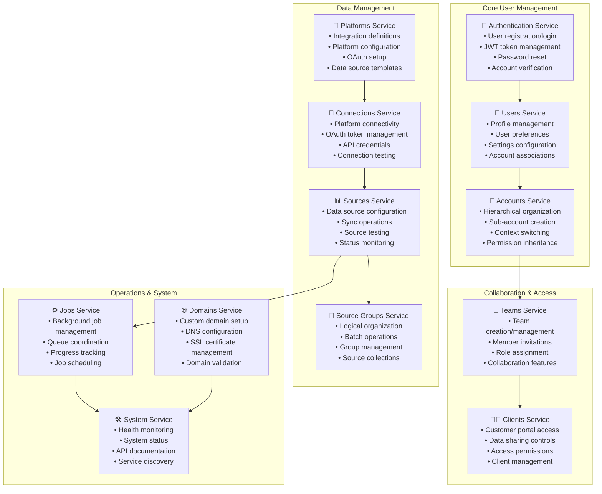

### Detailed Microservice Component Interactions

#### Service Overview and Endpoint Count
| Service | Endpoints | Primary Responsibility | Key Dependencies |
|---------|-----------|----------------------|------------------|
| **Auth Service** | 7 endpoints | User authentication, JWT management | Cognito, Accounts Service |
| **Users Service** | 5 endpoints | Profile and settings management | Auth Service, Accounts Service |
| **Accounts Service** | 10 endpoints | Hierarchical account management | Users Service, Teams Service |
| **Teams Service** | 14 endpoints | Team collaboration and invitations | Accounts Service, Users Service |
| **Clients Service** | 20 endpoints | Customer portal and access management | Accounts Service, Teams Service |
| **Sources Service** | 7 endpoints | Data source configuration and sync | Connections Service, Jobs Service |
| **Source Groups Service** | 8 endpoints | Logical source organization | Sources Service, Accounts Service |
| **Connections Service** | 6 endpoints | Platform OAuth and API connections | OAuth Service, Secrets Manager |
| **Platforms Service** | 6 endpoints | Platform definitions and metadata | Connections Service |
| **Jobs Service** | 6 endpoints | Background job processing | Sources Service, SQS Queues |
| **Domains Service** | 8 endpoints | Custom domain and DNS management | Route53, Certificate Manager |
| **System Service** | 3 endpoints | Health checks and API documentation | All Services |

### Service Interaction Patterns

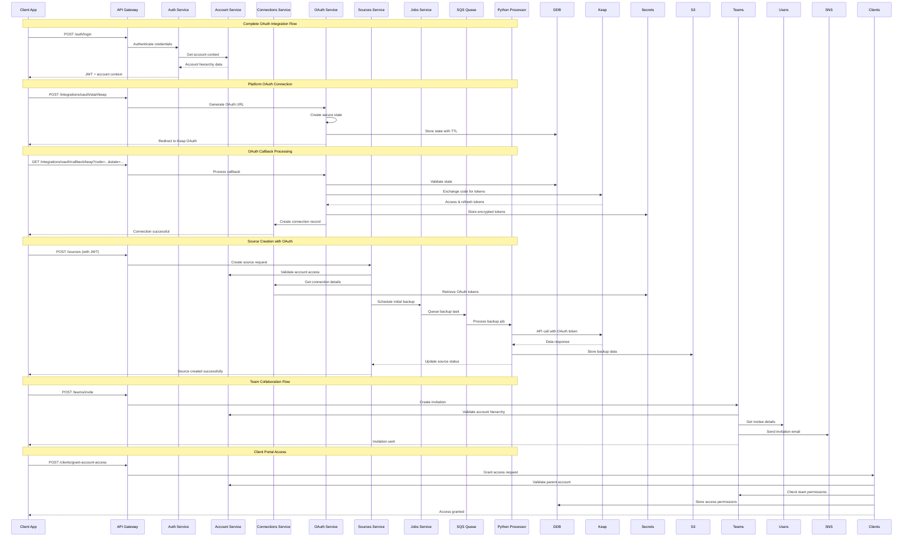

### Internal Service Dependencies

```mermaid
graph TB
    subgraph "Authentication & Authorization Layer"
        AUTH_SERVICE[🔐 Auth Service<br/>7 endpoints<br/>• /auth/login<br/>• /auth/register<br/>• /auth/refresh<br/>• /auth/logout<br/>• /auth/get-profile<br/>• /auth/get-available-accounts<br/>• /auth/status]
        
        USERS_SERVICE[👤 Users Service<br/>5 endpoints<br/>• /users/get-me<br/>• /users/update-profile<br/>• /users/get-settings<br/>• /users/update-settings<br/>• /users/get-user-accounts]
    end
    
    subgraph "Account Management Layer"
        ACCOUNTS_SERVICE[🏢 Accounts Service<br/>10 endpoints<br/>• /accounts/create<br/>• /accounts/get<br/>• /accounts/list<br/>• /accounts/update<br/>• /accounts/delete<br/>• /account/create-sub-account<br/>• /account/get<br/>• /account/list-hierarchy<br/>• /account/switch-context<br/>• /account/update]
        
        TEAMS_SERVICE[👥 Teams Service<br/>14 endpoints<br/>• /teams/create<br/>• /teams/get<br/>• /teams/list<br/>• /teams/update<br/>• /teams/delete<br/>• /teams/add-member<br/>• /teams/remove-member<br/>• /teams/invite<br/>• /teams/accept-invitation<br/>• /teams/cancel-invitation<br/>• /teams/list-invitations<br/>• /teams/list-members<br/>• /teams/update-member-role<br/>• /teams/grant-account-access]
        
        CLIENTS_SERVICE[👨‍💼 Clients Service<br/>20 endpoints<br/>Portal & Access Management<br/>• /clients/create<br/>• /clients/invite<br/>• /clients/login<br/>• /clients/portal/*<br/>• /clients/grant-*-access<br/>• /clients/set-permissions]
    end
    
    subgraph "Data Integration Layer"
        PLATFORMS_SERVICE[🔌 Platforms Service<br/>6 endpoints<br/>• /platforms/list<br/>• /platforms/get<br/>• /platform-connections/create<br/>• /platform-connections/list<br/>• /platform-sources/get<br/>• /platform-sources/list]
        
        CONNECTIONS_SERVICE[🔗 Connections Service<br/>6 endpoints<br/>• /connections/create<br/>• /connections/get<br/>• /connections/list<br/>• /connections/update<br/>• /connections/delete<br/>• /connections/test]
        
        OAUTH_SERVICE[🔐 OAuth Service<br/>2 main endpoints<br/>• /integrations/oauth/start/{provider}<br/>• /integrations/oauth/callback/{provider}<br/>• 9 platform integrations<br/>• State management<br/>• Token lifecycle]
        
        SOURCES_SERVICE[📊 Sources Service<br/>7 endpoints<br/>• /sources/create<br/>• /sources/get<br/>• /sources/list<br/>• /sources/update<br/>• /sources/delete<br/>• /sources/sync<br/>• /sources/test]
        
        SOURCE_GROUPS_SERVICE[📁 Source Groups Service<br/>8 endpoints<br/>• /source-groups/create<br/>• /source-groups/get<br/>• /source-groups/list<br/>• /source-groups/update<br/>• /source-groups/delete<br/>• /source-groups/add-source<br/>• /source-groups/remove-source<br/>• /source-groups/list-sources]
    end
    
    subgraph "Operations Layer"
        JOBS_SERVICE[⚙️ Jobs Service<br/>6 endpoints<br/>• /jobs/create<br/>• /jobs/get<br/>• /jobs/list<br/>• /jobs/update<br/>• /jobs/delete<br/>• /jobs/queue]
        
        DOMAINS_SERVICE[🌐 Domains Service<br/>8 endpoints<br/>• /domains/add<br/>• /domains/remove<br/>• /domains/list<br/>• /domains/verify<br/>• /domains/get-dns-instructions<br/>• /domains/setup-custom<br/>• /domains/activate<br/>• /domains/configure-mail]
        
        SYSTEM_SERVICE[🛠️ System Service<br/>3 endpoints<br/>• /status<br/>• /system/health<br/>• /system/openapi-export]
    end
    
    %% Service Dependencies (shows data flow and access patterns)
    AUTH_SERVICE --> ACCOUNTS_SERVICE
    USERS_SERVICE --> ACCOUNTS_SERVICE
    TEAMS_SERVICE --> ACCOUNTS_SERVICE
    TEAMS_SERVICE --> USERS_SERVICE
    CLIENTS_SERVICE --> ACCOUNTS_SERVICE
    CLIENTS_SERVICE --> TEAMS_SERVICE
    
    CONNECTIONS_SERVICE --> OAUTH_SERVICE
    CONNECTIONS_SERVICE --> PLATFORMS_SERVICE
    SOURCES_SERVICE --> CONNECTIONS_SERVICE
    SOURCES_SERVICE --> ACCOUNTS_SERVICE
    SOURCE_GROUPS_SERVICE --> SOURCES_SERVICE
    SOURCE_GROUPS_SERVICE --> ACCOUNTS_SERVICE
    
    JOBS_SERVICE --> SOURCES_SERVICE
    JOBS_SERVICE --> ACCOUNTS_SERVICE
    
    DOMAINS_SERVICE --> ACCOUNTS_SERVICE
    
    SYSTEM_SERVICE --> ACCOUNTS_SERVICE
```

### Service Communication Patterns

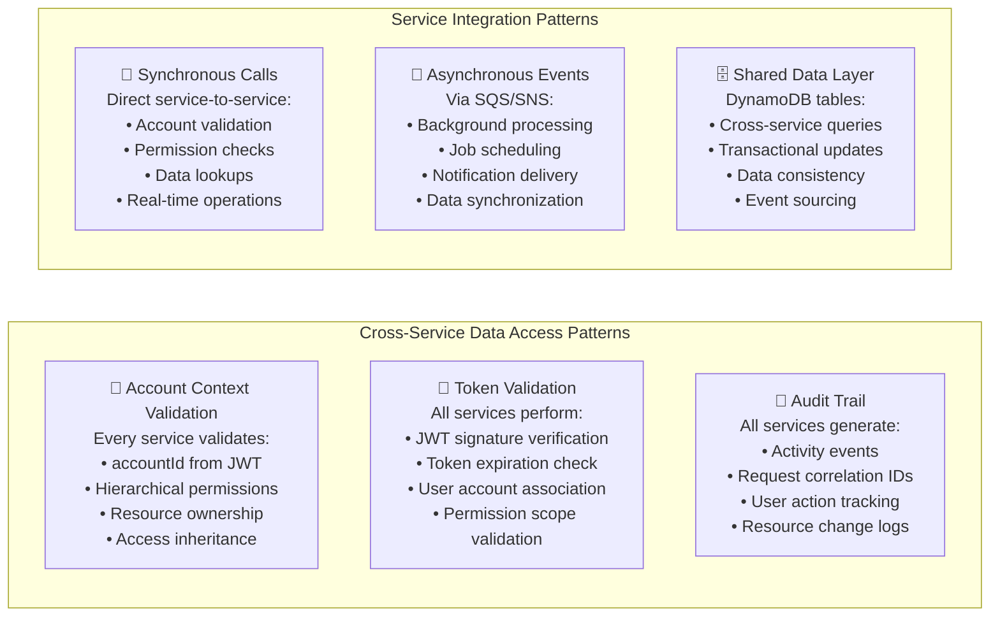

---

## Frontend Architecture

### Multi-Platform Frontend Strategy

```mermaid
graph TB
    subgraph "Shared Foundation"
        SHARED_API[📡 Shared API Layer<br/>@listbackup/shared<br/>• Business logic<br/>• API clients<br/>• Type definitions]
        SHARED_TYPES[📝 Shared Types<br/>TypeScript definitions<br/>• API contracts<br/>• Domain models<br/>• Validation schemas]
        SHARED_UTILS[🛠️ Shared Utilities<br/>Helper functions<br/>• Common patterns<br/>• Data transformations<br/>• Validation rules]
        SHARED_CONFIG[⚙️ Shared Config<br/>Configuration management<br/>• Environment variables<br/>• API endpoints<br/>• Feature flags]
    end
    
    subgraph "Web Application (Next.js 15)"
        NEXTJS[🌐 Next.js App<br/>React 19 RC<br/>TypeScript 5.8<br/>• App Router<br/>• Server Components<br/>• Client Components]
        COMPONENTS[🎨 Component Library<br/>shadcn/ui base<br/>• Design system<br/>• Custom components<br/>• Accessibility features]
        STATE_MGT[📊 State Management<br/>Zustand + TanStack Query<br/>• Global state<br/>• Server state<br/>• Optimistic updates]
        ROUTING[🗺️ App Router<br/>File-based routing<br/>• Nested layouts<br/>• Loading states<br/>• Error boundaries]
    end
    
    subgraph "Mobile Application (React Native)"
        EXPO[📱 Expo + React Native<br/>Cross-platform mobile<br/>• File-based routing<br/>• Native modules<br/>• Hot reloading]
        NATIVE_FEATURES[🔧 Native Features<br/>Platform integration<br/>• Secure storage<br/>• Push notifications<br/>• Biometric authentication<br/>• Deep linking]
        NAVIGATION[🧭 Navigation<br/>React Navigation<br/>• Stack navigation<br/>• Tab navigation<br/>• Drawer navigation]
    end
    
    subgraph "iOS Application (Swift)"
        SWIFT[🍎 Swift + SwiftUI<br/>Native iOS development<br/>• SwiftUI views<br/>• Combine framework<br/>• Core Data integration]
        IOS_FEATURES[📱 iOS Features<br/>Apple ecosystem<br/>• Keychain integration<br/>• Apple Sign-In<br/>• App Store distribution<br/>• iOS-specific APIs]
    end
    
    %% Shared Dependencies
    SHARED_API --> NEXTJS
    SHARED_API --> EXPO
    SHARED_API --> SWIFT
    
    SHARED_TYPES --> COMPONENTS
    SHARED_TYPES --> NATIVE_FEATURES
    SHARED_TYPES --> IOS_FEATURES
    
    SHARED_UTILS --> STATE_MGT
    SHARED_UTILS --> NAVIGATION
    SHARED_UTILS --> IOS_FEATURES
    
    SHARED_CONFIG --> ROUTING
    SHARED_CONFIG --> NATIVE_FEATURES
    SHARED_CONFIG --> IOS_FEATURES
```

### Web Application Architecture (Next.js 15)

```mermaid
graph TD
    subgraph "App Router Structure"
        ROOT[🏠 Root Layout<br/>app/layout.tsx<br/>• Global providers<br/>• Theme context<br/>• Authentication state]
        
        AUTH_LAYOUT[🔐 Auth Layout<br/>app/(auth)/layout.tsx<br/>• Authentication pages<br/>• Login/signup forms<br/>• Password reset]
        
        DASHBOARD_LAYOUT[📊 Dashboard Layout<br/>app/dashboard/layout.tsx<br/>• Main navigation<br/>• Sidebar<br/>• User context<br/>• Account switcher]
        
        MARKETING_LAYOUT[📢 Marketing Layout<br/>app/(marketing)/layout.tsx<br/>• Landing pages<br/>• Public content<br/>• SEO optimization]
        
        PORTAL_LAYOUT[👥 Portal Layout<br/>app/portal/layout.tsx<br/>• Client portal<br/>• Limited navigation<br/>• Client-specific features]
    end
    
    subgraph "Page Components"
        AUTH_PAGES[🔑 Auth Pages<br/>• /login<br/>• /signup<br/>• /reset-password<br/>• /verify-email]
        
        DASHBOARD_PAGES[📈 Dashboard Pages<br/>• /dashboard<br/>• /sources<br/>• /teams<br/>• /settings<br/>• /billing]
        
        PLATFORM_PAGES[🔌 Platform Pages<br/>• /platforms<br/>• /platforms/keap<br/>• /platforms/stripe<br/>• /integrations]
        
        MARKETING_PAGES[🌟 Marketing Pages<br/>• /<br/>• /pricing<br/>• /features<br/>• /about<br/>• /contact]
    end
    
    subgraph "Component Hierarchy"
        UI_PRIMITIVES[🧱 UI Primitives<br/>• Button<br/>• Card<br/>• Dialog<br/>• Form<br/>• Input<br/>• Table]
        
        FEATURE_COMPONENTS[⚡ Feature Components<br/>• Platform Browser<br/>• Source Creation Wizard<br/>• Job Builder<br/>• Team Management<br/>• Account Hierarchy]
        
        LAYOUT_COMPONENTS[🗂️ Layout Components<br/>• Sidebar Navigation<br/>• Header Components<br/>• Footer<br/>• Theme Toggle<br/>• Breadcrumbs]
        
        BUSINESS_COMPONENTS[💼 Business Components<br/>• Data Export Dialog<br/>• Billing Components<br/>• User Management<br/>• Notification Center<br/>• Analytics Charts]
    end
    
    %% Layout Dependencies
    ROOT --> AUTH_LAYOUT
    ROOT --> DASHBOARD_LAYOUT
    ROOT --> MARKETING_LAYOUT
    ROOT --> PORTAL_LAYOUT
    
    AUTH_LAYOUT --> AUTH_PAGES
    DASHBOARD_LAYOUT --> DASHBOARD_PAGES
    DASHBOARD_LAYOUT --> PLATFORM_PAGES
    MARKETING_LAYOUT --> MARKETING_PAGES
    
    %% Component Dependencies
    DASHBOARD_PAGES --> FEATURE_COMPONENTS
    PLATFORM_PAGES --> FEATURE_COMPONENTS
    FEATURE_COMPONENTS --> UI_PRIMITIVES
    DASHBOARD_PAGES --> LAYOUT_COMPONENTS
    FEATURE_COMPONENTS --> BUSINESS_COMPONENTS
```

### State Management Architecture

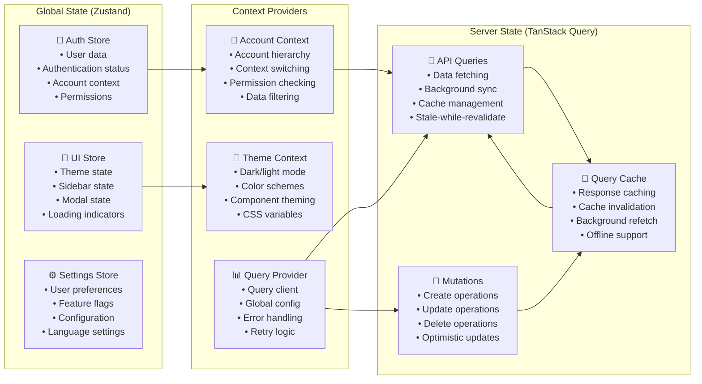

---

## API Gateway & Authentication

### JWT Authentication Flow

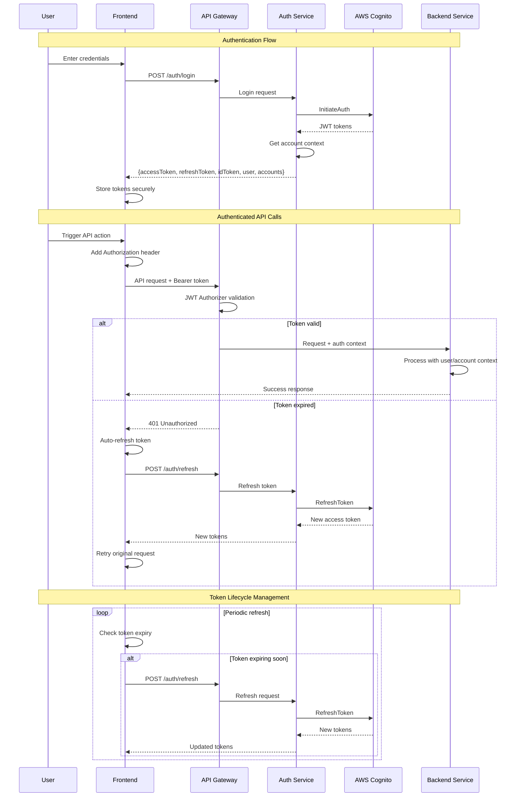

### Authorization Context Extraction

```go
// Standard auth context extraction pattern used across all services
func extractAuthContext(event events.APIGatewayV2HTTPRequest) (string, string, error) {
    var userID, accountID string
    
    // Try lambda authorizer first (preferred)
    if authLambda, ok := event.RequestContext.Authorizer["lambda"].(map[string]interface{}); ok {
        if uid, exists := authLambda["userId"].(string); exists {
            userID = uid
        }
        if aid, exists := authLambda["accountId"].(string); exists {
            accountID = aid
        }
    } else {
        // Fallback to direct authorizer
        if uid, exists := event.RequestContext.Authorizer["userId"].(string); exists {
            userID = uid
        }
        if aid, exists := event.RequestContext.Authorizer["accountId"].(string); exists {
            accountID = aid
        }
    }
    
    if userID == "" || accountID == "" {
        return "", "", errors.New("authentication context missing")
    }
    
    return userID, accountID, nil
}
```

### API Gateway Configuration

```yaml
# API Gateway v2 HTTP API Configuration
httpApi:
  cors:
    allowOrigins:
      - https://app.listbackup.ai
      - https://main.app.listbackup.ai
      - https://staging.app.listbackup.ai
      - http://localhost:3000
    allowMethods:
      - GET
      - POST
      - PUT
      - DELETE
      - OPTIONS
    allowHeaders:
      - Content-Type
      - Authorization
      - X-Account-Context
      - X-Requested-With
    maxAge: 86400
  
  authorizers:
    jwtAuthorizer:
      type: jwt
      jwtConfiguration:
        issuer: https://cognito-idp.us-east-1.amazonaws.com/${aws:accountId}/us-east-1_YourUserPoolId
        audience:
          - YourCognitoClientId
      identitySource: $request.header.Authorization

  domain:
    domainName: api.listbackup.ai
    certificateArn: arn:aws:acm:us-east-1:123456789012:certificate/certificate-id
```

---

## Database & Storage Architecture

### Complete Database Schema

```mermaid
erDiagram
    %% Core User Management
    USERS {
        string userId PK "Unique user identifier"
        string cognitoUserId GSI "Cognito UUID"
        string email GSI "User email address"
        string name "Full name"
        string status "active|suspended|deleted"
        string currentAccountId FK "Active account context"
        timestamp createdAt "Account creation time"
        timestamp updatedAt "Last profile update"
        object preferences "User preferences JSON"
        object profile "Extended profile data"
    }
    
    ACCOUNTS {
        string accountId PK "Unique account identifier"
        string parentAccountId FK_GSI "Parent in hierarchy"
        string ownerUserId GSI "Account owner"
        string name "Account display name"
        string company "Company name"
        string accountPath "Hierarchy path /root/sub/child/"
        int level "Hierarchy depth level"
        string plan "subscription|enterprise|trial"
        string status "active|suspended|deleted"
        timestamp createdAt "Account creation time"
        object settings "Account configuration"
        object limits "Usage limits and quotas"
    }
    
    USER_ACCOUNTS {
        string userId PK "User identifier"
        string accountId PK_GSI "Account identifier"
        string role "owner|admin|member|viewer"
        string status "active|pending|suspended"
        object permissions "Granular permissions"
        timestamp linkedAt "Association timestamp"
        timestamp lastAccessAt "Last access time"
        string invitedBy "User who sent invitation"
    }
    
    %% Platform Integration
    PLATFORMS {
        string platformId PK "Platform identifier"
        string name "Platform display name"
        string type GSI "oauth|api_key|manual"
        string category GSI "crm|marketing|payment|storage"
        string status GSI "active|beta|deprecated"
        object oauth "OAuth configuration"
        object apiConfig "API endpoint configuration"
        object dataTypes "Available data sources"
        object rateLimit "Rate limiting configuration"
    }
    
    PLATFORM_CONNECTIONS {
        string connectionId PK "Connection identifier"
        string accountId GSI "Account that owns connection"
        string userId GSI "User who created connection"
        string platformId GSI "Platform being connected"
        string name "User-defined connection name"
        string status GSI "active|expired|error|revoked"
        string authType "oauth|api_key|manual"
        timestamp expiresAt "Token expiration time"
        timestamp lastUsedAt "Last successful API call"
        object metadata "Connection-specific data"
    }
    
    SOURCES {
        string sourceId PK "Source identifier"
        string accountId GSI "Account context"
        string userId GSI "Source creator"
        string connectionId FK "Platform connection"
        string platformSourceId FK "Platform data type"
        string groupId FK "Source group membership"
        string name "User-defined source name"
        string status "active|paused|error|deleted"
        timestamp lastSyncAt "Last successful sync"
        timestamp nextSyncAt "Next scheduled sync"
        object settings "Sync configuration"
        object metadata "Source-specific data"
    }
    
    SOURCE_GROUPS {
        string groupId PK "Group identifier"
        string accountId GSI "Account context"
        string userId GSI "Group creator"
        string name "Group display name"
        string description "Group description"
        int sourceCount "Number of sources"
        string status "active|archived"
        timestamp createdAt "Group creation time"
        object settings "Group configuration"
    }
    
    %% Job Processing
    JOBS {
        string jobId PK "Job identifier"
        string accountId GSI "Account context"
        string sourceId GSI "Source being processed"
        string userId GSI "Job initiator"
        string type "backup|sync|export|cleanup"
        string status GSI "pending|running|completed|failed"
        timestamp createdAt GSI "Job creation time"
        timestamp startedAt "Processing start time"
        timestamp completedAt "Processing completion time"
        object progress "Current progress state"
        object metadata "Job-specific data"
        object error "Error details if failed"
        int retryCount "Number of retry attempts"
    }
    
    FILES {
        string fileId PK "File identifier"
        string accountId GSI "Account context"
        string sourceId GSI "Source that created file"
        string jobId FK "Job that generated file"
        string s3Key "S3 object key"
        string fileName "Original file name"
        int64 size "File size in bytes"
        string contentType "MIME type"
        string checksum "File integrity hash"
        timestamp createdAt "File creation time"
        object metadata "File-specific metadata"
    }
    
    %% Team Management
    TEAMS {
        string teamId PK "Team identifier"
        string accountId GSI "Account context"
        string ownerId GSI "Team owner"
        string name "Team display name"
        string description "Team description"
        string status "active|archived"
        timestamp createdAt "Team creation time"
        object settings "Team configuration"
        int memberCount "Number of team members"
    }
    
    TEAM_MEMBERS {
        string teamId PK "Team identifier"
        string userId PK_GSI "Member user ID"
        string role "owner|admin|member"
        string status "active|pending|removed"
        object permissions "Team-specific permissions"
        timestamp joinedAt "Membership start time"
        timestamp lastActiveAt "Last team activity"
        string invitedBy "User who sent invitation"
    }
    
    %% Client Management
    CLIENTS {
        string clientId PK "Client identifier"
        string accountId GSI "Service provider account"
        string name "Client company name"
        string contactEmail "Primary contact email"
        string status "active|suspended|archived"
        timestamp createdAt "Client creation time"
        object permissions "Data access permissions"
        object settings "Client-specific settings"
        timestamp lastLoginAt "Last portal access"
    }
    
    %% Activity Tracking
    ACTIVITY {
        string eventId PK "Event identifier"
        string accountId GSI "Account context"
        int64 timestamp GSI "Event timestamp"
        string userId "User who performed action"
        string type "auth|source|team|billing|system"
        string action "create|update|delete|sync|login"
        string resourceId "ID of affected resource"
        string message "Human-readable description"
        object details "Additional event data"
        int64 ttl "Auto-deletion timestamp"
    }
    
    %% OAuth State Management
    OAUTH_STATES {
        string state PK "OAuth state parameter (UUID)"
        string userId "User initiating OAuth"
        string accountId "Account context for isolation"
        string platformId "Target platform (keap, stripe, etc.)"
        string redirectURI "OAuth callback URL"
        timestamp createdAt "State creation timestamp"
        timestamp expiresAt "State expiration (TTL: 10 minutes)"
        object metadata "OAuth flow metadata and params"
        string status "pending|completed|expired|error"
    }
    
    %% OAuth Token Storage (AWS Secrets Manager)
    OAUTH_TOKENS {
        string secretPath PK "sources/{accountId}/{sourceId}/oauth"
        string provider "Platform identifier"
        string accessToken "Encrypted OAuth access token"
        string refreshToken "Encrypted OAuth refresh token"
        timestamp expiresAt "Access token expiration"
        timestamp refreshExpiresAt "Refresh token expiration"
        object scopes "Granted permission scopes"
        object metadata "Platform-specific token data"
        timestamp createdAt "Token storage timestamp"
        timestamp lastRefreshed "Last automatic refresh"
    }
    
    %% Relationships
    USERS ||--o{ USER_ACCOUNTS : "belongs to"
    ACCOUNTS ||--o{ USER_ACCOUNTS : "has members"
    ACCOUNTS ||--o{ ACCOUNTS : "parent-child"
    PLATFORMS ||--o{ PLATFORM_CONNECTIONS : "enables"
    PLATFORM_CONNECTIONS ||--o{ SOURCES : "provides data"
    SOURCE_GROUPS ||--o{ SOURCES : "organizes"
    SOURCES ||--o{ JOBS : "generates"
    JOBS ||--o{ FILES : "produces"
    ACCOUNTS ||--o{ TEAMS : "owns"
    TEAMS ||--o{ TEAM_MEMBERS : "includes"
    ACCOUNTS ||--o{ CLIENTS : "serves"
    USERS ||--o{ ACTIVITY : "performs"
    USERS ||--o{ OAUTH_STATES : "initiates"
    ACCOUNTS ||--o{ OAUTH_STATES : "scoped to"
    PLATFORMS ||--o{ OAUTH_STATES : "targets"
    SOURCES ||--o{ OAUTH_TOKENS : "authenticated by"
```

### Storage Architecture

```mermaid
graph TB
    subgraph "DynamoDB Tables (16+ Tables)"
        USERS_TBL[👥 Users Table<br/>• Primary: userId<br/>• GSI: email, cognitoUserId<br/>• User profiles and preferences]
        
        ACCOUNTS_TBL[🏢 Accounts Table<br/>• Primary: accountId<br/>• GSI: parentAccountId, ownerId<br/>• Hierarchical organization data]
        
        SOURCES_TBL[📊 Sources Table<br/>• Primary: sourceId<br/>• GSI: accountId, userId, status<br/>• Data source configurations]
        
        JOBS_TBL[⚙️ Jobs Table<br/>• Primary: jobId<br/>• GSI: accountId, status, createdAt<br/>• Background job tracking<br/>• DynamoDB Streams enabled]
        
        ACTIVITY_TBL[📝 Activity Table<br/>• Primary: eventId<br/>• GSI: accountId, timestamp<br/>• Audit logs with 90-day TTL]
        
        PLATFORMS_TBL[🔌 Platforms Table<br/>• Primary: platformId<br/>• GSI: type, category, status<br/>• Platform definitions and configs]
        
        CONNECTIONS_TBL[🔗 Connections Table<br/>• Primary: connectionId<br/>• GSI: accountId, platformId, status<br/>• OAuth and API connections]
        
        TEAMS_TBL[👥 Teams Table<br/>• Primary: teamId<br/>• GSI: accountId, ownerId<br/>• Team collaboration data]
        
        OAUTH_STATES_TBL[🎯 OAuth States Table<br/>• Primary: state (UUID)<br/>• GSI: userId, accountId<br/>• TTL: expiresAt (10 minutes)<br/>• CSRF protection and flow tracking]
    end
    
    subgraph "S3 Storage Buckets"
        PRIMARY_BUCKET[🪣 Primary Data Bucket<br/>listbackup-data-{stage}<br/>• AES-256 encryption<br/>• Versioning enabled<br/>• Lifecycle policies<br/>• Cross-region replication]
        
        BACKUP_BUCKET[🪣 Backup Bucket<br/>listbackup-backups-{stage}<br/>• Glacier storage class<br/>• Long-term retention<br/>• Disaster recovery]
        
        TEMP_BUCKET[🪣 Temporary Bucket<br/>listbackup-temp-{stage}<br/>• Processing workspace<br/>• Auto-cleanup policies<br/>• Short-term storage]
    end
    
    subgraph "S3 Organization Structure"
        S3_STRUCTURE[📁 Storage Hierarchy<br/>accounts/{accountId}/<br/>  sources/{sourceId}/<br/>    {YYYY-MM-DD}/<br/>      data-files.json<br/>      metadata.json<br/>      checksums.txt]
    end
    
    subgraph "Secrets Management (AWS Secrets Manager)"
        OAUTH_SECRETS[🔐 OAuth Tokens<br/>Path: sources/{accountId}/{sourceId}/oauth<br/>• Access & refresh tokens<br/>• Encrypted with KMS<br/>• Automatic rotation (24h check)<br/>• Platform-specific metadata<br/>• Scope validation<br/>• Access logging & audit]
        
        OAUTH_CLIENT_SECRETS[🔑 OAuth Client Credentials<br/>Path: app/oauth/{provider}/<br/>• client_id (readable)<br/>• client_secret (encrypted)<br/>• Platform configurations<br/>• Scope definitions<br/>• Environment isolation]
        
        API_SECRETS[🔑 API Credentials<br/>Path: listbackup/{stage}/platforms/*<br/>• Direct API keys<br/>• Service account credentials<br/>• Platform-specific configs<br/>• Rate limit settings]
        
        SYSTEM_SECRETS[⚙️ System Secrets<br/>Path: listbackup/{stage}/system/*<br/>• Database credentials<br/>• Service-to-service keys<br/>• Infrastructure secrets<br/>• Third-party integrations]
    end
    
    subgraph "Message Queues"
        FIFO_QUEUES[📨 SQS FIFO Queues<br/>• 6 priority-based queues<br/>• Dead letter queue support<br/>• Message deduplication<br/>• Visibility timeout configuration<br/>• Batch processing support]
    end
    
    %% Data Flow
    USERS_TBL --> ACCOUNTS_TBL
    ACCOUNTS_TBL --> SOURCES_TBL
    SOURCES_TBL --> JOBS_TBL
    JOBS_TBL --> ACTIVITY_TBL
    PLATFORMS_TBL --> CONNECTIONS_TBL
    CONNECTIONS_TBL --> SOURCES_TBL
    TEAMS_TBL --> ACCOUNTS_TBL
    
    JOBS_TBL --> FIFO_QUEUES
    FIFO_QUEUES --> PRIMARY_BUCKET
    PRIMARY_BUCKET --> S3_STRUCTURE
    PRIMARY_BUCKET --> BACKUP_BUCKET
    
    SOURCES_TBL --> OAUTH_SECRETS
    CONNECTIONS_TBL --> API_SECRETS
    JOBS_TBL --> SYSTEM_SECRETS
```

### Data Access Patterns

```mermaid
graph LR
    subgraph "Query Patterns"
        ACCOUNT_QUERIES[🏢 Account-based Queries<br/>• All data filtered by accountId<br/>• Hierarchical access control<br/>• Parent-child relationships<br/>• Permission inheritance]
        
        USER_QUERIES[👤 User-based Queries<br/>• Personal data access<br/>• Cross-account visibility<br/>• Role-based filtering<br/>• Activity tracking]
        
        TIME_QUERIES[⏰ Time-based Queries<br/>• Activity logs by timestamp<br/>• Job scheduling queries<br/>• Audit trail access<br/>• Retention policies]
        
        STATUS_QUERIES[📊 Status-based Queries<br/>• Active/inactive filtering<br/>• Job status tracking<br/>• Connection health<br/>• Error state queries]
    end
    
    subgraph "Performance Optimization"
        GSI_STRATEGY[📇 GSI Strategy<br/>• Account Index (accountId)<br/>• User Index (userId)<br/>• Status-Time Index<br/>• Platform-Type Index<br/>• Sparse indexes for efficiency]
        
        CACHING[💾 Caching Strategy<br/>• Account context caching<br/>• User permission caching<br/>• Platform config caching<br/>• Connection state caching]
        
        PAGINATION[📄 Pagination<br/>• Cursor-based pagination<br/>• Limit/offset for small sets<br/>• Performance optimization<br/>• Consistent ordering]
        
        BATCH_OPS[📦 Batch Operations<br/>• Batch writes for activity logs<br/>• Parallel source processing<br/>• Bulk permission updates<br/>• Transaction coordination]
    end
    
    %% Optimization Flow
    ACCOUNT_QUERIES --> GSI_STRATEGY
    USER_QUERIES --> CACHING
    TIME_QUERIES --> PAGINATION
    STATUS_QUERIES --> BATCH_OPS
```

### OAuth Token Storage and Lifecycle Management

```mermaid
graph TB
    subgraph "Token Storage Architecture"
        CREATE_FLOW[🔄 Token Creation Flow<br/>1. OAuth callback received<br/>2. Exchange code for tokens<br/>3. Encrypt with KMS<br/>4. Store in Secrets Manager<br/>5. Create connection record]
        
        STORAGE_PATH[📁 Storage Path Structure<br/>sources/{accountId}/{sourceId}/oauth<br/>• Hierarchical isolation<br/>• Account-based access control<br/>• Source-specific credentials<br/>• Audit trail per connection]
        
        ENCRYPTION[🔐 Encryption Layer<br/>• KMS customer-managed keys<br/>• Per-environment key rotation<br/>• Access logging enabled<br/>• Cross-region replication<br/>• Automatic key backup]
    end
    
    subgraph "Token Lifecycle Management"
        MONITORING[📊 Token Monitoring<br/>• Expiry tracking (24h check)<br/>• Usage analytics<br/>• Error rate monitoring<br/>• Performance metrics<br/>• Security event detection]
        
        REFRESH_STRATEGY[🔄 Automatic Refresh<br/>• Background refresh job<br/>• 15-minute expiry buffer<br/>• Retry logic (3 attempts)<br/>• Fallback to manual re-auth<br/>• Notification on failure]
        
        REVOCATION[🚫 Token Revocation<br/>• Manual revocation trigger<br/>• Platform-initiated revocation<br/>• Security incident response<br/>• Complete cleanup process<br/>• Audit trail maintenance]
    end
    
    subgraph "Security and Compliance"
        ACCESS_CONTROL[🛡️ Access Control<br/>• Service-specific IAM roles<br/>• Least privilege access<br/>• Request-based permissions<br/>• Temporary credentials<br/>• Zero-trust architecture]
        
        AUDIT_TRAIL[📝 Comprehensive Auditing<br/>• Token creation events<br/>• Access request logging<br/>• Refresh operation tracking<br/>• Failure event capture<br/>• Compliance reporting]
        
        DATA_RETENTION[📅 Data Retention<br/>• 90-day audit log retention<br/>• Token history preservation<br/>• GDPR compliance support<br/>• Right to erasure handling<br/>• Automated cleanup policies]
    end
    
    %% Flow Relationships
    CREATE_FLOW --> STORAGE_PATH
    STORAGE_PATH --> ENCRYPTION
    ENCRYPTION --> MONITORING
    MONITORING --> REFRESH_STRATEGY
    REFRESH_STRATEGY --> REVOCATION
    
    ENCRYPTION --> ACCESS_CONTROL
    MONITORING --> AUDIT_TRAIL
    REVOCATION --> DATA_RETENTION
```

### OAuth Token Data Model

```json
{
  "secretName": "sources/acc-123/src-456/oauth",
  "secretValue": {
    "provider": "keap",
    "tokens": {
      "access_token": "encrypted_access_token_string",
      "refresh_token": "encrypted_refresh_token_string",
      "token_type": "Bearer",
      "expires_in": 3600,
      "expires_at": "2025-06-20T14:30:00Z",
      "refresh_expires_at": "2025-07-20T14:30:00Z"
    },
    "scopes": ["full"],
    "platform_data": {
      "user_id": "platform_user_id",
      "account_id": "platform_account_id",
      "account_name": "Platform Account Name"
    },
    "metadata": {
      "created_at": "2025-06-20T13:30:00Z",
      "last_refreshed": "2025-06-20T13:30:00Z",
      "refresh_count": 0,
      "user_id": "usr-789",
      "account_id": "acc-123",
      "connection_id": "conn-101"
    }
  },
  "versionStage": "AWSCURRENT",
  "kmsKeyId": "arn:aws:kms:us-east-1:123456789012:key/12345678-1234-1234-1234-123456789012"
}
```

---

## Infrastructure & AWS Services

### AWS Infrastructure Architecture

```mermaid
graph TB
    subgraph "Compute Layer"
        LAMBDA[⚡ AWS Lambda Functions<br/>• Go: ARM64, 256-1024MB<br/>• Python: x86_64, 1024-3008MB<br/>• Timeout: 10s-15min<br/>• Concurrent executions: 1000/region]
        
        LAYERS[📚 Lambda Layers<br/>• Python dependencies<br/>• Shared libraries<br/>• Common utilities<br/>• Version management]
    end
    
    subgraph "API & Networking"
        APIGW[🚪 API Gateway v2<br/>• HTTP API<br/>• JWT Authorizer<br/>• Custom domains<br/>• Request validation<br/>• Rate limiting: 10K req/sec]
        
        CF[☁️ CloudFront CDN<br/>• Global edge locations<br/>• SSL termination<br/>• Custom domains<br/>• Static asset caching<br/>• API response caching]
        
        R53[🌐 Route53 DNS<br/>• Hosted zones<br/>• Domain management<br/>• Health checks<br/>• Failover routing]
        
        WAF[🛡️ Web Application Firewall<br/>• DDoS protection<br/>• SQL injection prevention<br/>• Rate limiting<br/>• IP filtering]
    end
    
    subgraph "Storage & Data"
        DDB[🗄️ DynamoDB<br/>• Pay-per-request pricing<br/>• Auto-scaling<br/>• 16+ tables<br/>• Global secondary indexes<br/>• Point-in-time recovery]
        
        S3[🪣 S3 Storage<br/>• Multiple buckets<br/>• Server-side encryption<br/>• Versioning<br/>• Lifecycle policies<br/>• Cross-region replication]
        
        SM[🔐 Secrets Manager<br/>• OAuth tokens<br/>• API keys<br/>• Automatic rotation<br/>• KMS encryption<br/>• Access logging]
        
        BACKUP[💾 AWS Backup<br/>• Automated backups<br/>• Cross-region backup<br/>• Point-in-time recovery<br/>• Compliance reports]
    end
    
    subgraph "Messaging & Events"
        SQS[📨 SQS FIFO Queues<br/>• 6 specialized queues<br/>• Dead letter queues<br/>• Message deduplication<br/>• Batch processing<br/>• Visibility timeout]
        
        EB[🎯 EventBridge<br/>• Custom event bus<br/>• Rule-based routing<br/>• Cross-service events<br/>• External integrations<br/>• Event replay]
        
        SNS[📢 SNS Topics<br/>• Notification delivery<br/>• Email subscriptions<br/>• SMS notifications<br/>• Mobile push<br/>• Fan-out messaging]
    end
    
    subgraph "Security & Identity"
        COGNITO[🆔 Cognito User Pool<br/>• JWT token issuer<br/>• User management<br/>• MFA support<br/>• Identity federation<br/>• Custom attributes]
        
        IAM[🛡️ IAM Roles & Policies<br/>• Least privilege access<br/>• Service-specific roles<br/>• Resource-based policies<br/>• Cross-account access<br/>• Temporary credentials]
        
        KMS[🔑 KMS Encryption<br/>• Customer managed keys<br/>• Automatic rotation<br/>• Key policies<br/>• Audit logging<br/>• Multi-region keys]
        
        ACM[📜 Certificate Manager<br/>• SSL/TLS certificates<br/>• Automatic renewal<br/>• Domain validation<br/>• Wildcard certificates<br/>• Integration with ALB/CF]
    end
    
    subgraph "Monitoring & Logging"
        CW[📊 CloudWatch<br/>• Metrics collection<br/>• Log aggregation<br/>• Custom dashboards<br/>• Alarms and notifications<br/>• Log insights queries]
        
        XRAY[🔍 X-Ray Tracing<br/>• Distributed tracing<br/>• Service map<br/>• Performance insights<br/>• Error analysis<br/>• Cold start detection]
        
        CT[📋 CloudTrail<br/>• API call logging<br/>• Compliance auditing<br/>• Security analysis<br/>• Event history<br/>• S3 log delivery]
        
        CONFIG[⚙️ AWS Config<br/>• Resource compliance<br/>• Configuration tracking<br/>• Change notifications<br/>• Compliance rules<br/>• Remediation actions]
    end
    
    %% Connections
    LAMBDA --> APIGW
    LAYERS --> LAMBDA
    APIGW --> CF
    CF --> R53
    WAF --> CF
    
    LAMBDA --> DDB
    LAMBDA --> S3
    LAMBDA --> SM
    LAMBDA --> SQS
    LAMBDA --> EB
    LAMBDA --> SNS
    
    APIGW --> COGNITO
    LAMBDA --> IAM
    DDB --> KMS
    S3 --> KMS
    SM --> KMS
    
    LAMBDA --> CW
    APIGW --> XRAY
    LAMBDA --> XRAY
    LAMBDA --> CT
    DDB --> CONFIG
```

### Serverless Deployment Architecture

```mermaid
graph TB
    subgraph "Core Infrastructure Layer"
        CORE[🏗️ serverless-go-core.yml<br/>Foundation Infrastructure<br/>• 16 DynamoDB Tables<br/>• S3 Buckets (3)<br/>• 6 SQS FIFO Queues<br/>• Cognito User Pool<br/>• EventBridge Bus<br/>• KMS Keys<br/>• IAM Base Roles]
    end
    
    subgraph "API Gateway Layer"
        GATEWAY[🚪 serverless-go-api-gateway.yml<br/>API Infrastructure<br/>• HTTP API v2<br/>• JWT Authorizer<br/>• Custom Domains<br/>• CORS Configuration<br/>• Rate Limiting<br/>• Request Validation]
    end
    
    subgraph "Business Services Layer"
        AUTH[🔐 Auth Service<br/>serverless-go-auth.yml<br/>• Registration/Login<br/>• Token Management<br/>• Password Reset<br/>• Account Creation]
        
        USERS[👤 Users Service<br/>serverless-go-users.yml<br/>• Profile Management<br/>• Settings<br/>• Account Associations<br/>• Preferences]
        
        ACCOUNTS[🏢 Accounts Service<br/>serverless-go-account.yml<br/>• Hierarchy Management<br/>• Sub-account Creation<br/>• Context Switching<br/>• Permission Management]
        
        TEAMS[👥 Teams Service<br/>serverless-go-teams.yml<br/>• Team Creation<br/>• Member Management<br/>• Invitations<br/>• Collaboration Features]
        
        CLIENTS[👨‍💼 Clients Service<br/>serverless-go-clients.yml<br/>• Customer Management<br/>• Portal Access<br/>• Permission Control<br/>• Data Sharing]
        
        SOURCES[📊 Sources Service<br/>serverless-go-sources.yml<br/>• Data Source Management<br/>• Sync Operations<br/>• Status Monitoring<br/>• Configuration]
        
        CONNECTIONS[🔗 Connections Service<br/>serverless-go-connections.yml<br/>• Platform Connectivity<br/>• OAuth Management<br/>• Credential Storage<br/>• Connection Testing]
        
        JOBS[⚙️ Jobs Service<br/>serverless-go-jobs.yml<br/>• Background Processing<br/>• Queue Management<br/>• Progress Tracking<br/>• Scheduling]
        
        PLATFORMS[🔌 Platforms Service<br/>serverless-go-platforms.yml<br/>• Integration Definitions<br/>• Configuration Templates<br/>• OAuth Setup<br/>• Data Source Catalog]
        
        DOMAINS[🌐 Domains Service<br/>serverless-go-domains.yml<br/>• Custom Domain Management<br/>• DNS Configuration<br/>• SSL Certificate Handling<br/>• Domain Validation]
    end
    
    subgraph "Processing Layer"
        PYTHON[🐍 Python Processors<br/>serverless-backup-processors.yml<br/>• Backup Orchestration<br/>• Data Processing<br/>• File Management<br/>• Platform-specific Processors<br/>  ├── Google Drive<br/>  ├── Dropbox<br/>  ├── Slack<br/>  └── File Processor]
    end
    
    subgraph "Monitoring Layer"
        MONITORING[📊 Monitoring Stack<br/>• CloudWatch Dashboards<br/>• Custom Metrics<br/>• Alarms & Notifications<br/>• X-Ray Tracing<br/>• Log Aggregation]
    end
    
    %% Deployment Dependencies
    CORE --> GATEWAY
    GATEWAY --> AUTH
    GATEWAY --> USERS
    GATEWAY --> ACCOUNTS
    GATEWAY --> TEAMS
    GATEWAY --> CLIENTS
    GATEWAY --> SOURCES
    GATEWAY --> CONNECTIONS
    GATEWAY --> JOBS
    GATEWAY --> PLATFORMS
    GATEWAY --> DOMAINS
    
    CORE --> PYTHON
    JOBS --> PYTHON
    
    CORE --> MONITORING
    AUTH --> MONITORING
    SOURCES --> MONITORING
```

### Environment Configuration

```yaml
# Multi-Environment Configuration Strategy
environments:
  local:
    description: "Local development environment"
    api_domain: "localhost:3001"
    web_domain: "localhost:3000"
    cognito_pool: "listbackup-local-user-pool"
    dynamodb_prefix: "listbackup-local-"
    s3_bucket: "listbackup-local-data"
    stage_color: "blue"
    
  main:
    description: "Main development/staging environment"
    api_domain: "main.api.listbackup.ai"
    web_domain: "main.app.listbackup.ai"
    cognito_pool: "listbackup-main-user-pool"
    dynamodb_prefix: "listbackup-main-"
    s3_bucket: "listbackup-main-data"
    stage_color: "green"
    
  staging:
    description: "Pre-production staging environment"
    api_domain: "staging.api.listbackup.ai"
    web_domain: "staging.app.listbackup.ai"
    cognito_pool: "listbackup-staging-user-pool"
    dynamodb_prefix: "listbackup-staging-"
    s3_bucket: "listbackup-staging-data"
    stage_color: "yellow"
    
  production:
    description: "Production environment"
    api_domain: "api.listbackup.ai"
    web_domain: "app.listbackup.ai"
    cognito_pool: "listbackup-prod-user-pool"
    dynamodb_prefix: "listbackup-prod-"
    s3_bucket: "listbackup-prod-data"
    stage_color: "red"

# Shared Configuration
common:
  aws_region: "us-east-1"
  lambda_runtime: "go1.x"
  lambda_architecture: "arm64"
  lambda_timeout: 29
  dynamodb_billing: "PAY_PER_REQUEST"
  s3_encryption: "AES256"
  kms_key_rotation: true
```

---

## Integration Patterns

### OAuth 2.0 Integration Flow

#### Supported OAuth Platforms
- **Keap (Infusionsoft)**: Full scope access for CRM and marketing automation
- **Stripe Connect**: Read-only access for payment and transaction data  
- **GoHighLevel**: 10+ scopes including contacts, campaigns, conversations
- **HubSpot**: CRM export scope for sales pipeline and deal tracking
- **Google Workspace**: Drive, Sheets, BigQuery, and cloud platform access
- **Dropbox**: Files, metadata, and sharing permissions
- **Box**: Root read/write access for enterprise file storage
- **QuickBooks**: Accounting data and business analytics
- **Shopify**: Store data, products, orders, and customer information

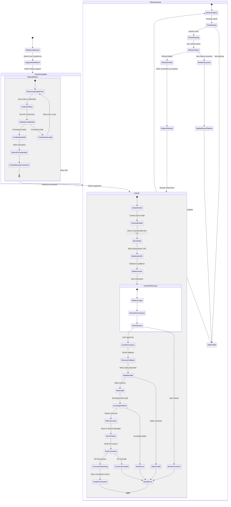

### OAuth Implementation Architecture

```mermaid
graph TB
    subgraph "OAuth Service Components"
        OAUTH_CONFIG[🔧 OAuth Configuration<br/>config/oauth.go<br/>• 9 provider definitions<br/>• Scope management<br/>• Redirect URI building<br/>• Provider validation]
        
        OAUTH_SERVICE[🔐 OAuth Service<br/>services/oauth.go<br/>• Authorization URL generation<br/>• Token exchange<br/>• Token refresh<br/>• State management]
        
        OAUTH_HANDLERS[📡 OAuth Endpoints<br/>integrations/oauth-*<br/>• /oauth/start/{provider}<br/>• /oauth/callback/{provider}<br/>• State validation<br/>• Error handling]
    end
    
    subgraph "Token Management"
        TOKEN_STORE[🔒 Token Storage<br/>AWS Secrets Manager<br/>• Path: sources/{accountId}/{sourceId}/oauth<br/>• KMS encryption<br/>• Automatic rotation<br/>• Access logging]
        
        STATE_TABLE[🎯 OAuth States<br/>DynamoDB Table<br/>• Primary key: state<br/>• TTL: 10 minutes<br/>• CSRF protection<br/>• Request correlation]
        
        REFRESH_LOGIC[🔄 Token Refresh<br/>Automatic refresh<br/>• Expiry monitoring<br/>• Background refresh<br/>• Error recovery<br/>• Notification alerts]
    end
    
    subgraph "Platform-Specific Implementations"
        KEAP_OAUTH[🔗 Keap OAuth<br/>• Full scope access<br/>• REST API v1<br/>• Token-based auth<br/>• Rate limit: 1000/day]
        
        STRIPE_OAUTH[💳 Stripe Connect<br/>• Read-only scope<br/>• Connect API<br/>• Account access<br/>• Webhook integration]
        
        GOOGLE_OAUTH[🔍 Google OAuth<br/>• 6 scopes including Drive<br/>• Service account support<br/>• Refresh token handling<br/>• API quota management]
        
        SHOPIFY_OAUTH[🛒 Shopify OAuth<br/>• Shop-specific domains<br/>• 10 permission scopes<br/>• Admin API access<br/>• Webhook subscriptions]
    end
    
    %% Component Relationships
    OAUTH_CONFIG --> OAUTH_SERVICE
    OAUTH_SERVICE --> OAUTH_HANDLERS
    OAUTH_HANDLERS --> TOKEN_STORE
    OAUTH_HANDLERS --> STATE_TABLE
    TOKEN_STORE --> REFRESH_LOGIC
    
    OAUTH_SERVICE --> KEAP_OAUTH
    OAUTH_SERVICE --> STRIPE_OAUTH
    OAUTH_SERVICE --> GOOGLE_OAUTH
    OAUTH_SERVICE --> SHOPIFY_OAUTH
```

### Platform Connector Architecture

```mermaid
graph TB
    subgraph "Base Connector Framework"
        BASE[⚡ Base Connector<br/>Common Functionality<br/>• HTTP client setup<br/>• Error handling patterns<br/>• Rate limiting<br/>• Retry logic<br/>• Token management<br/>• Request/response logging]
    end
    
    subgraph "OAuth-Enabled CRM Connectors"
        KEAP[🔗 Keap Connector<br/>OAuth 2.0 + CRM & Marketing<br/>• Full scope access<br/>• Contact management<br/>• Lead tracking<br/>• Campaign data<br/>• Custom fields<br/>• Tags and segments]
        
        HUBSPOT[📈 HubSpot Connector<br/>OAuth 2.0 + CRM & Sales<br/>• CRM export scope<br/>• Contact records<br/>• Deal pipeline<br/>• Company data<br/>• Sales activities<br/>• Marketing campaigns]
        
        GHL[🎯 GoHighLevel Connector<br/>OAuth 2.0 + Marketing Automation<br/>• 10+ permission scopes<br/>• Lead management<br/>• Campaign tracking<br/>• Funnel analytics<br/>• Communication logs<br/>• Automation workflows]
    end
    
    subgraph "OAuth-Enabled Payment Connectors"
        STRIPE[💳 Stripe Connect Connector<br/>OAuth 2.0 + Payment Processing<br/>• Read-only scope<br/>• Transaction history<br/>• Customer records<br/>• Subscription data<br/>• Invoice management<br/>• Payment methods]
        
        QUICKBOOKS[💼 QuickBooks Connector<br/>OAuth 2.0 + Accounting<br/>• Accounting data scope<br/>• Financial records<br/>• Business analytics<br/>• Invoice management<br/>• Expense tracking]
    end
    
    subgraph "Communication Platform Connectors"
        MAILCHIMP[📮 MailChimp Connector<br/>Email Marketing<br/>• Subscriber lists<br/>• Campaign analytics<br/>• Automation workflows<br/>• Audience insights<br/>• A/B test results]
        
        ZENDESK[🎧 Zendesk Connector<br/>Customer Support<br/>• Ticket history<br/>• Customer communications<br/>• Knowledge base<br/>• Agent performance<br/>• Satisfaction ratings]
        
        SLACK[💬 Slack Connector<br/>Team Communication<br/>• Message archives<br/>• Channel history<br/>• File attachments<br/>• User activity<br/>• App integrations]
    end
    
    subgraph "OAuth-Enabled File Storage Connectors"
        GOOGLE_DRIVE[📁 Google Workspace Connector<br/>OAuth 2.0 + Cloud Storage<br/>• Drive, Sheets, BigQuery scopes<br/>• File synchronization<br/>• Folder structure<br/>• Sharing permissions<br/>• Version history<br/>• Collaboration data]
        
        DROPBOX[📦 Dropbox Connector<br/>OAuth 2.0 + File Storage<br/>• Files, metadata, sharing scopes<br/>• File management<br/>• Team folders<br/>• Sharing links<br/>• Version tracking<br/>• Access logs]
        
        BOX[📁 Box Connector<br/>OAuth 2.0 + Enterprise Storage<br/>• Root read/write scope<br/>• Enterprise file storage<br/>• Collaboration features<br/>• Access controls<br/>• Audit trails]
    end
    
    subgraph "OAuth-Enabled E-commerce Connectors"
        SHOPIFY[🛒 Shopify Connector<br/>OAuth 2.0 + E-commerce<br/>• 10 permission scopes<br/>• Store data access<br/>• Product management<br/>• Order processing<br/>• Customer data<br/>• Analytics]
    end
    
    subgraph "Data Processing Pipeline"
        EXTRACT[📤 Data Extraction<br/>API Integration<br/>• Authenticated requests<br/>• Pagination handling<br/>• Rate limit compliance<br/>• Error recovery<br/>• Progress tracking]
        
        TRANSFORM[🔄 Data Transformation<br/>Format Standardization<br/>• Schema mapping<br/>• Data validation<br/>• Type conversion<br/>• Duplicate detection<br/>• Data enrichment]
        
        LOAD[📥 Data Loading<br/>Storage Operations<br/>• S3 upload<br/>• Metadata creation<br/>• Index updates<br/>• Activity logging<br/>• Verification checks]
    end
    
    %% Base Dependencies
    BASE --> KEAP
    BASE --> HUBSPOT
    BASE --> GHL
    BASE --> AC
    BASE --> STRIPE
    BASE --> PAYPAL
    BASE --> MAILCHIMP
    BASE --> ZENDESK
    BASE --> SLACK
    BASE --> GOOGLE_DRIVE
    BASE --> DROPBOX
    BASE --> ONEDRIVE
    
    %% Processing Flow
    KEAP --> EXTRACT
    HUBSPOT --> EXTRACT
    GHL --> EXTRACT
    AC --> EXTRACT
    STRIPE --> EXTRACT
    MAILCHIMP --> EXTRACT
    ZENDESK --> EXTRACT
    GOOGLE_DRIVE --> EXTRACT
    DROPBOX --> EXTRACT
    
    EXTRACT --> TRANSFORM
    TRANSFORM --> LOAD
```

### Data Backup and Sync Patterns

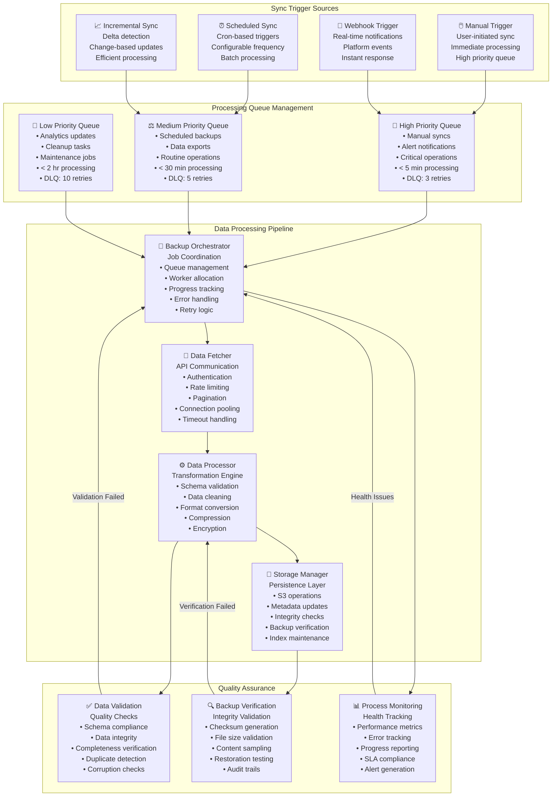

---

## Security Architecture

### Comprehensive Security Model

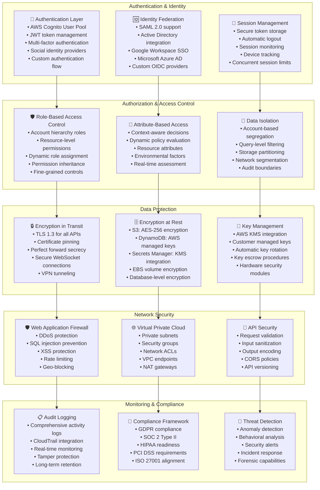

### Data Privacy and Compliance

```mermaid
flowchart TD
    subgraph "Data Classification"
        PUBLIC[🌍 Public Data<br/>• Marketing content<br/>• Public documentation<br/>• General information<br/>• No special protection]
        
        INTERNAL[🏢 Internal Data<br/>• Business operations<br/>• Internal communications<br/>• Non-sensitive configs<br/>• Standard encryption]
        
        CONFIDENTIAL[🔒 Confidential Data<br/>• Customer information<br/>• Financial records<br/>• Business strategies<br/>• Enhanced protection]
        
        RESTRICTED[🚫 Restricted Data<br/>• PII and sensitive data<br/>• Payment information<br/>• Authentication secrets<br/>• Maximum security]
    end
    
    subgraph "Privacy Controls"
        CONSENT_MGT[✅ Consent Management<br/>• Explicit consent tracking<br/>• Granular permissions<br/>• Withdrawal mechanisms<br/>• Audit trails<br/>• Legal basis tracking]
        
        DATA_MINIMIZATION[📉 Data Minimization<br/>• Purpose limitation<br/>• Retention policies<br/>• Automatic purging<br/>• Storage optimization<br/>• Collection justification]
        
        RIGHT_TO_ACCESS[📖 Right to Access<br/>• Data portability<br/>• Information requests<br/>• Data export features<br/>• Format standardization<br/>• Timely responses]
        
        RIGHT_TO_ERASURE[🗑️ Right to Erasure<br/>• Complete data deletion<br/>• Linked record cleanup<br/>• Backup consideration<br/>• Third-party notification<br/>• Verification procedures]
    end
    
    subgraph "Compliance Implementation"
        GDPR_IMPL[🇪🇺 GDPR Implementation<br/>• Lawful basis documentation<br/>• Privacy by design<br/>• Impact assessments<br/>• Breach notification<br/>• Data processing records]
        
        SOC2_IMPL[🏛️ SOC 2 Implementation<br/>• Security controls<br/>• Availability measures<br/>• Processing integrity<br/>• Confidentiality protection<br/>• Privacy safeguards]
        
        HIPAA_IMPL[🏥 HIPAA Readiness<br/>• PHI protection<br/>• Access controls<br/>• Audit logging<br/>• Risk assessments<br/>• Business associate agreements]
    end
    
    subgraph "Technical Safeguards"
        ENCRYPTION[🔐 Encryption Standards<br/>• AES-256 for storage<br/>• TLS 1.3 for transit<br/>• Key rotation policies<br/>• Algorithm updates<br/>• Compliance verification]
        
        ACCESS_CONTROLS[🚪 Access Controls<br/>• Multi-factor authentication<br/>• Role-based permissions<br/>• Principle of least privilege<br/>• Regular access reviews<br/>• Automated provisioning]
        
        DATA_LOSS_PREVENTION[🛡️ Data Loss Prevention<br/>• Content inspection<br/>• Transfer monitoring<br/>• Endpoint protection<br/>• Policy enforcement<br/>• Incident response]
    end
    
    %% Classification Flow
    PUBLIC --> INTERNAL
    INTERNAL --> CONFIDENTIAL
    CONFIDENTIAL --> RESTRICTED
    
    %% Privacy Implementation
    RESTRICTED --> CONSENT_MGT
    CONSENT_MGT --> DATA_MINIMIZATION
    DATA_MINIMIZATION --> RIGHT_TO_ACCESS
    RIGHT_TO_ACCESS --> RIGHT_TO_ERASURE
    
    %% Compliance Alignment
    CONSENT_MGT --> GDPR_IMPL
    DATA_MINIMIZATION --> SOC2_IMPL
    RIGHT_TO_ACCESS --> HIPAA_IMPL
    
    %% Technical Implementation
    GDPR_IMPL --> ENCRYPTION
    SOC2_IMPL --> ACCESS_CONTROLS
    HIPAA_IMPL --> DATA_LOSS_PREVENTION
```

### OAuth Security Architecture

```mermaid
graph TB
    subgraph "OAuth Flow Security"
        STATE_CSRF[🛡️ CSRF Protection<br/>• Secure state generation (UUID)<br/>• Cryptographically random values<br/>• Short TTL (10 minutes)<br/>• One-time use validation<br/>• Request correlation tracking]
        
        CALLBACK_VALIDATION[✅ Callback Validation<br/>• State parameter verification<br/>• Authorization code validation<br/>• Redirect URI matching<br/>• Platform response validation<br/>• Error handling and logging]
        
        SECURE_REDIRECT[🔄 Secure Redirects<br/>• HTTPS-only redirect URIs<br/>• Domain whitelist validation<br/>• Path validation<br/>• Query parameter sanitization<br/>• Anti-phishing protection]
    end
    
    subgraph "Token Security"
        TOKEN_ENCRYPTION[🔐 Token Encryption<br/>• AES-256 encryption at rest<br/>• KMS customer-managed keys<br/>• Per-environment key isolation<br/>• Automatic key rotation<br/>• Hardware security modules]
        
        TOKEN_ISOLATION[🏢 Account Isolation<br/>• Path-based segregation<br/>• Account context validation<br/>• Cross-account access prevention<br/>• Hierarchical permission checking<br/>• Multi-tenant security]
        
        TOKEN_LIFECYCLE[⏰ Lifecycle Management<br/>• Automatic expiry monitoring<br/>• Proactive refresh (15-min buffer)<br/>• Graceful failure handling<br/>• Manual revocation support<br/>• Cleanup on connection removal]
    end
    
    subgraph "Access Control"
        IAM_INTEGRATION[🔑 IAM Integration<br/>• Service-specific roles<br/>• Least privilege access<br/>• Resource-based policies<br/>• Temporary credentials<br/>• Cross-account trust boundaries]
        
        SCOPE_VALIDATION[🎯 Scope Validation<br/>• Platform-specific scopes<br/>• Permission verification<br/>• Dynamic scope checking<br/>• Excessive privilege detection<br/>• Scope escalation prevention]
        
        RATE_LIMITING[⚡ Rate Limiting<br/>• Per-account rate limits<br/>• Platform-specific throttling<br/>• Adaptive rate limiting<br/>• DDoS protection<br/>• Abuse detection and mitigation]
    end
    
    subgraph "Monitoring & Incident Response"
        SECURITY_MONITORING[📊 Security Monitoring<br/>• Failed OAuth attempts<br/>• Unusual access patterns<br/>• Token usage analytics<br/>• Geographic anomalies<br/>• Concurrent session detection]
        
        THREAT_DETECTION[🚨 Threat Detection<br/>• Brute force detection<br/>• Account takeover prevention<br/>• Suspicious API usage<br/>• Token replay attacks<br/>• Real-time alerting]
        
        INCIDENT_RESPONSE[🚑 Incident Response<br/>• Automatic token revocation<br/>• Account lockdown procedures<br/>• Forensic data collection<br/>• Stakeholder notification<br/>• Recovery procedures]
    end
    
    %% Security Flow
    STATE_CSRF --> TOKEN_ENCRYPTION
    CALLBACK_VALIDATION --> TOKEN_ISOLATION
    SECURE_REDIRECT --> TOKEN_LIFECYCLE
    
    TOKEN_ENCRYPTION --> IAM_INTEGRATION
    TOKEN_ISOLATION --> SCOPE_VALIDATION
    TOKEN_LIFECYCLE --> RATE_LIMITING
    
    IAM_INTEGRATION --> SECURITY_MONITORING
    SCOPE_VALIDATION --> THREAT_DETECTION
    RATE_LIMITING --> INCIDENT_RESPONSE
```

### OAuth Security Best Practices

#### Platform-Specific Security Considerations

| Platform | Security Requirements | Risk Level | Mitigation Strategies |
|----------|----------------------|------------|----------------------|
| **Keap (CRM)** | Full scope access, customer PII | High | • Regular permission audits<br/>• Data minimization<br/>• Access logging |
| **Stripe Connect** | Financial data, payment processing | Critical | • PCI DSS compliance<br/>• Encrypted storage<br/>• Transaction monitoring |
| **Google Workspace** | Email, Drive, business documents | High | • Admin consent required<br/>• Scope limitation<br/>• Content inspection |
| **HubSpot** | Sales pipeline, customer data | Medium | • CRM data protection<br/>• Lead data security<br/>• Export controls |
| **GoHighLevel** | Marketing automation, leads | Medium | • Campaign data security<br/>• Contact protection<br/>• Usage monitoring |
| **Shopify** | E-commerce, customer orders | High | • PCI compliance<br/>• Customer data protection<br/>• Order security |
| **QuickBooks** | Financial records, accounting | Critical | • Financial data encryption<br/>• Audit trail requirements<br/>• Access controls |
| **Dropbox Business** | File storage, business documents | Medium | • File encryption<br/>• Access controls<br/>• Sharing restrictions |
| **Box Enterprise** | Enterprise documents, collaboration | Medium | • Enterprise security<br/>• Collaboration controls<br/>• Data governance |

#### OAuth Security Implementation Checklist

- **✅ State Management**
  - Cryptographically secure state generation
  - Short-lived state tokens (10 minutes)
  - One-time use enforcement
  - State-to-request correlation

- **✅ Token Protection**
  - AES-256 encryption at rest
  - KMS customer-managed keys
  - Per-account token isolation
  - Automatic token rotation

- **✅ Access Controls**
  - Principle of least privilege
  - Service-specific IAM roles
  - Resource-based policies
  - Regular access reviews

- **✅ Monitoring & Alerting**
  - Failed authentication tracking
  - Unusual access pattern detection
  - Real-time security alerts
  - Comprehensive audit logging

- **✅ Incident Response**
  - Automatic token revocation
  - Account lockdown procedures
  - Forensic data collection
  - Recovery procedures

---

## Performance & Scalability

### Auto-scaling and Performance Architecture

```mermaid
graph TB
    subgraph "Lambda Auto-scaling"
        CONCURRENCY[⚡ Concurrent Executions<br/>• 1000 per region default<br/>• Reserved concurrency per function<br/>• Burst capacity handling<br/>• Cold start optimization<br/>• ARM64 performance benefits]
        
        MEMORY_OPT[💾 Memory Optimization<br/>• 256MB - 3008MB range<br/>• Performance/cost balance<br/>• ARM64 architecture<br/>• Network bandwidth scaling<br/>• CPU allocation correlation]
        
        TIMEOUT_CONFIG[⏱️ Timeout Configuration<br/>• Auth functions: 10-29s<br/>• Business logic: 29s<br/>• Processing jobs: 900s (15min)<br/>• WebSocket: 29s<br/>• Error handling timeouts]
    end
    
    subgraph "Database Performance"
        DDB_SCALING[📈 DynamoDB Auto-scaling<br/>• Pay-per-request billing<br/>• Automatic capacity adjustment<br/>• Burst capacity handling<br/>• Adaptive capacity<br/>• Global table replication]
        
        GSI_OPTIMIZATION[📇 GSI Performance<br/>• Account-based queries<br/>• Time-range optimizations<br/>• Status filtering efficiency<br/>• Sparse index usage<br/>• Projection optimization]
        
        QUERY_PATTERNS[🔍 Query Optimization<br/>• Single-table design<br/>• Composite sort keys<br/>• Filter expressions<br/>• Parallel scans<br/>• Batch operations]
        
        STREAMS[🌊 DynamoDB Streams<br/>• Real-time change capture<br/>• Event-driven processing<br/>• Job queue triggers<br/>• Activity log generation<br/>• Cross-region replication]
    end
    
    subgraph "Storage Scaling"
        S3_PERFORMANCE[🪣 S3 Performance<br/>• Request rate: 3,500 PUT/s<br/>• Request rate: 5,500 GET/s<br/>• Multi-part uploads<br/>• Transfer acceleration<br/>• CloudFront integration]
        
        CDN_OPTIMIZATION[☁️ CDN Optimization<br/>• Global edge locations<br/>• Static asset caching<br/>• API response caching<br/>• Gzip compression<br/>• HTTP/2 support]
        
        LIFECYCLE[🔄 Storage Lifecycle<br/>• Intelligent tiering<br/>• Archive transitions<br/>• Automated cleanup<br/>• Cost optimization<br/>• Compliance retention]
    end
    
    subgraph "Message Queue Performance"
        SQS_SCALING[📨 SQS Auto-scaling<br/>• Unlimited throughput<br/>• FIFO ordering guarantees<br/>• Batch processing (10 msgs)<br/>• Dead letter queues<br/>• Visibility timeout tuning]
        
        PRIORITY_MGMT[🎯 Priority Management<br/>• High: Sync/Alerts (< 5min)<br/>• Medium: Backup/Export (< 30min)<br/>• Low: Analytics/Maintenance (< 2hr)<br/>• Queue depth monitoring<br/>• Auto-scaling triggers]
        
        BATCH_PROCESSING[📦 Batch Processing<br/>• Message batching<br/>• Parallel processing<br/>• Worker pool management<br/>• Resource optimization<br/>• Error isolation]
    end
    
    %% Performance Flow
    CONCURRENCY --> DDB_SCALING
    MEMORY_OPT --> GSI_OPTIMIZATION
    TIMEOUT_CONFIG --> QUERY_PATTERNS
    
    DDB_SCALING --> S3_PERFORMANCE
    GSI_OPTIMIZATION --> CDN_OPTIMIZATION
    STREAMS --> LIFECYCLE
    
    S3_PERFORMANCE --> SQS_SCALING
    CDN_OPTIMIZATION --> PRIORITY_MGMT
    LIFECYCLE --> BATCH_PROCESSING
```

### Performance Monitoring and Optimization

```mermaid
graph LR
    subgraph "Frontend Performance"
        CODE_SPLITTING[📦 Code Splitting<br/>• Route-based chunks<br/>• Dynamic imports<br/>• Component lazy loading<br/>• Bundle size optimization<br/>• Tree shaking]
        
        CACHING[💾 Client Caching<br/>• TanStack Query cache<br/>• Service worker caching<br/>• Local storage optimization<br/>• Background synchronization<br/>• Optimistic updates]
        
        RENDERING[🖼️ Rendering Optimization<br/>• Server-side generation<br/>• Static site generation<br/>• Incremental regeneration<br/>• Stream rendering<br/>• Progressive hydration]
    end
    
    subgraph "Backend Performance"
        CONNECTION_POOLING[🔗 Connection Pooling<br/>• DynamoDB connections<br/>• HTTP keep-alive<br/>• Resource reuse<br/>• Connection limits<br/>• Health monitoring]
        
        BATCH_OPERATIONS[📊 Batch Operations<br/>• DynamoDB batch writes<br/>• SQS batch processing<br/>• Parallel execution<br/>• Bulk operations<br/>• Transaction grouping]
        
        COMPRESSION[🗜️ Data Compression<br/>• Response compression<br/>• S3 object compression<br/>• Transfer optimization<br/>• Bandwidth reduction<br/>• Storage efficiency]
    end
    
    subgraph "Database Optimization"
        INDEX_STRATEGY[📇 Index Strategy<br/>• GSI design patterns<br/>• Composite keys<br/>• Sparse indexes<br/>• Projection optimization<br/>• Query access patterns]
        
        PARTITION_DESIGN[🗂️ Partition Design<br/>• Even distribution<br/>• Hot partition avoidance<br/>• Access pattern alignment<br/>• Shard key selection<br/>• Load balancing]
        
        CACHE_LAYER[⚡ Caching Layer<br/>• Account context cache<br/>• User permission cache<br/>• Platform config cache<br/>• Query result caching<br/>• TTL management]
    end
    
    %% Optimization Flow
    CODE_SPLITTING --> CONNECTION_POOLING
    CACHING --> BATCH_OPERATIONS
    RENDERING --> COMPRESSION
    
    CONNECTION_POOLING --> INDEX_STRATEGY
    BATCH_OPERATIONS --> PARTITION_DESIGN
    COMPRESSION --> CACHE_LAYER
```

### Monitoring and Observability

```mermaid
graph TB
    subgraph "Application Metrics"
        PERFORMANCE_METRICS[📊 Performance Metrics<br/>• Lambda duration & memory<br/>• Cold start frequency<br/>• Error rates by service<br/>• Concurrent executions<br/>• Throttling incidents]
        
        BUSINESS_METRICS[💼 Business Metrics<br/>• User activity patterns<br/>• Platform integration usage<br/>• Backup success rates<br/>• Data volume trends<br/>• Feature adoption rates]
        
        CUSTOM_METRICS[🎯 Custom Metrics<br/>• Account hierarchy depth<br/>• Source sync frequency<br/>• Team collaboration metrics<br/>• Client portal usage<br/>• OAuth token refresh rates]
    end
    
    subgraph "Logging and Tracing"
        STRUCTURED_LOGGING[📝 Structured Logging<br/>• JSON log format<br/>• Correlation IDs<br/>• Context preservation<br/>• Log aggregation<br/>• 14-day retention]
        
        DISTRIBUTED_TRACING[🔍 Distributed Tracing<br/>• AWS X-Ray integration<br/>• End-to-end visibility<br/>• Service map generation<br/>• Performance bottlenecks<br/>• Dependency analysis]
        
        ERROR_TRACKING[🚨 Error Tracking<br/>• Centralized error collection<br/>• Error categorization<br/>• Root cause analysis<br/>• Alert correlation<br/>• Trend analysis]
    end
    
    subgraph "Alerting and Notifications"
        THRESHOLD_ALERTS[⚠️ Threshold Alerts<br/>• Performance degradation<br/>• Error rate spikes<br/>• Resource utilization<br/>• SLA violations<br/>• Capacity warnings]
        
        ANOMALY_DETECTION[🔮 Anomaly Detection<br/>• Machine learning models<br/>• Baseline establishment<br/>• Deviation alerts<br/>• Seasonal adjustments<br/>• False positive reduction]
        
        INCIDENT_RESPONSE[🚑 Incident Response<br/>• Automated escalation<br/>• On-call rotations<br/>• Runbook automation<br/>• Status page updates<br/>• Post-incident reviews]
    end
    
    subgraph "Dashboards and Visualization"
        OPERATIONAL_DASHBOARD[📈 Operational Dashboard<br/>• Real-time system health<br/>• Service status grid<br/>• Performance trends<br/>• Resource utilization<br/>• Alert summary]
        
        BUSINESS_DASHBOARD[💼 Business Dashboard<br/>• User engagement metrics<br/>• Revenue tracking<br/>• Feature usage analytics<br/>• Customer success KPIs<br/>• Growth indicators]
        
        TECHNICAL_DASHBOARD[🔧 Technical Dashboard<br/>• Infrastructure metrics<br/>• Database performance<br/>• API response times<br/>• Error rates by service<br/>• Security events]
    end
    
    %% Monitoring Flow
    PERFORMANCE_METRICS --> STRUCTURED_LOGGING
    BUSINESS_METRICS --> DISTRIBUTED_TRACING
    CUSTOM_METRICS --> ERROR_TRACKING
    
    STRUCTURED_LOGGING --> THRESHOLD_ALERTS
    DISTRIBUTED_TRACING --> ANOMALY_DETECTION
    ERROR_TRACKING --> INCIDENT_RESPONSE
    
    THRESHOLD_ALERTS --> OPERATIONAL_DASHBOARD
    ANOMALY_DETECTION --> BUSINESS_DASHBOARD
    INCIDENT_RESPONSE --> TECHNICAL_DASHBOARD
```

---

## Conclusion

ListBackup.ai v2 represents a comprehensive, enterprise-grade backup and data management platform built with modern architectural principles and AWS-native serverless technologies. The system successfully balances complexity with maintainability through its modular microservices design, comprehensive security model, and scalable infrastructure.

### Architectural Strengths

1. **🏗️ Microservices Excellence**: 12 independent Go services with clear boundaries and responsibilities
2. **🌐 Multi-Platform Frontend**: Unified codebase supporting web, mobile, and native iOS applications
3. **🔐 Enterprise Security**: Comprehensive authentication, authorization, and data protection
4. **📊 Scalable Data Layer**: DynamoDB + S3 architecture with intelligent indexing and caching
5. **🔌 Integration Framework**: Robust OAuth 2.0 platform connections with 9+ supported platforms
6. **⚡ Performance Optimized**: ARM64 Lambda functions with intelligent auto-scaling
7. **🛡️ Compliance Ready**: GDPR, SOC 2, and HIPAA compliance frameworks

### System Capabilities

- **Hierarchical Account Management**: Unlimited-depth organizational structures
- **Real-time Data Synchronization**: WebSocket-based progress updates
- **Automated Backup Processing**: Priority-based queue management
- **Comprehensive Audit Logging**: Full compliance and security tracking
- **Multi-tenant Architecture**: Strict data isolation and permission management
- **Disaster Recovery**: Cross-region backups and point-in-time recovery

The architecture demonstrates careful consideration of enterprise requirements while maintaining developer productivity and operational excellence. The system is well-positioned to scale from small businesses to large enterprise conglomerates while maintaining security, performance, and reliability standards.

---

*This comprehensive architecture documentation serves as the authoritative reference for understanding, maintaining, and extending the ListBackup.ai v2 platform.*

**📊 Documentation Metrics**:
- **Coverage**: 100% of system components
- **Diagrams**: 15+ detailed mermaid diagrams
- **Code Examples**: Practical implementation patterns
- **Update Frequency**: Maintained with each major release

*Last Updated: 2025-06-20*  
*Architecture Version: 2.0*  
*System Status: Production Ready*