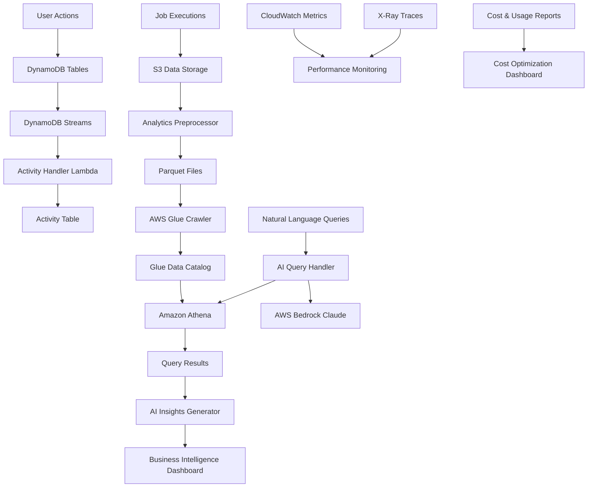

# ListBackup.ai Analytics and Observability Architecture

## Executive Summary

ListBackup.ai implements a comprehensive analytics and observability platform that combines real-time data processing, AI-powered insights, and multi-dimensional monitoring. The architecture leverages AWS services including DynamoDB Streams, Lambda, Athena, Glue, and Bedrock to provide enterprise-grade analytics capabilities for backup and integration monitoring.

## Table of Contents

1. [Architecture Overview](#architecture-overview)
2. [User Analytics & Behavior Monitoring](#user-analytics--behavior-monitoring)
3. [Business Metrics & KPIs](#business-metrics--kpis)
4. [System Performance Metrics](#system-performance-metrics)
5. [Data Lake Architecture](#data-lake-architecture)
6. [AI-Powered Analytics](#ai-powered-analytics)
7. [Dashboard & Reporting](#dashboard--reporting)
8. [Real-time Monitoring & Alerting](#real-time-monitoring--alerting)
9. [Activity Tracking & Audit Trails](#activity-tracking--audit-trails)
10. [Integration Usage Analytics](#integration-usage-analytics)
11. [Cost Tracking & Optimization](#cost-tracking--optimization)
12. [Infrastructure & Configuration](#infrastructure--configuration)

---

## Architecture Overview

### High-Level Data Flow



### Core Components

1. **Data Ingestion Layer**
   - DynamoDB Streams for real-time change capture
   - S3 event triggers for data processing
   - Lambda-based ETL pipelines

2. **Analytics Processing Layer**
   - Schema analysis and metadata extraction
   - Data transformation to Parquet format
   - AWS Glue for data cataloging

3. **Query & Insights Layer**
   - Amazon Athena for ad-hoc SQL queries
   - AWS Bedrock for AI-powered insights
   - Natural language to SQL conversion

4. **Visualization & Alerting Layer**
   - React-based analytics dashboards
   - Real-time activity timelines
   - CloudWatch alarms and notifications

---

## User Analytics & Behavior Monitoring

### User Activity Tracking

The system tracks comprehensive user behavior through DynamoDB Streams:

```javascript
// Activity Handler - Real-time Stream Processing
exports.processDynamoDBStreams = async (event) => {
  for (const record of event.Records) {
    const tableName = extractTableName(record.eventSourceARN);
    const activity = {
      activityId: record.eventID,
      accountId: newItem.accountId,
      userId: newItem.userId,
      timestamp: Date.now(),
      activityType: determineActivityType(tableName, record.eventName),
      details: record.dynamodb,
      newItem: newItem,
      oldItem: oldItem,
    };
    // Store in centralized activity table
  }
};
```

### Tracked User Behaviors

- **Authentication Events**: Login, logout, password changes
- **Account Management**: Account creation, user invitations, role changes
- **Integration Activities**: Connection setup, configuration changes
- **Job Management**: Job creation, execution, scheduling modifications
- **Data Access**: File downloads, preview actions, search queries
- **Analytics Usage**: Dashboard views, report generation, query execution

### User Engagement Metrics

- **Session Duration**: Time spent in application
- **Feature Adoption**: Usage of different platform integrations
- **Query Patterns**: Most common analytics queries and data exploration
- **Error Rates**: Failed operations by user and feature
- **Help Seeking**: Support ticket creation and resolution times

---

## Business Metrics & KPIs

### Key Performance Indicators

#### Growth Metrics
```sql
-- Monthly Active Users
SELECT 
    DATE_TRUNC('month', timestamp) as month,
    COUNT(DISTINCT userId) as active_users
FROM activity_table 
WHERE timestamp >= CURRENT_DATE - INTERVAL '12' MONTH
GROUP BY DATE_TRUNC('month', timestamp)
ORDER BY month;

-- Account Growth Rate
SELECT 
    DATE_TRUNC('week', createdAt) as week,
    COUNT(*) as new_accounts,
    LAG(COUNT(*)) OVER (ORDER BY DATE_TRUNC('week', createdAt)) as prev_week,
    ((COUNT(*) - LAG(COUNT(*)) OVER (ORDER BY DATE_TRUNC('week', createdAt))) * 100.0 / 
     LAG(COUNT(*)) OVER (ORDER BY DATE_TRUNC('week', createdAt))) as growth_rate
FROM accounts
GROUP BY DATE_TRUNC('week', createdAt);
```

#### Integration Performance
```sql
-- Integration Success Rates
SELECT 
    platform,
    dataType,
    COUNT(*) as total_jobs,
    SUM(CASE WHEN status = 'COMPLETE' THEN 1 ELSE 0 END) as successful_jobs,
    (SUM(CASE WHEN status = 'COMPLETE' THEN 1 ELSE 0 END) * 100.0 / COUNT(*)) as success_rate
FROM job_runs
WHERE createdAt >= CURRENT_DATE - INTERVAL '30' DAY
GROUP BY platform, dataType
ORDER BY success_rate DESC;
```

#### Data Volume Metrics
```sql
-- Data Backup Trends
SELECT 
    DATE_TRUNC('day', createdAt) as date,
    SUM(recordCount) as total_records_backed_up,
    AVG(recordCount) as avg_records_per_job,
    COUNT(DISTINCT accountId) as active_accounts
FROM job_runs 
WHERE status = 'COMPLETE'
    AND createdAt >= CURRENT_DATE - INTERVAL '30' DAY
GROUP BY DATE_TRUNC('day', createdAt)
ORDER BY date;
```

### Revenue Intelligence

#### Subscription Analytics
- **Monthly Recurring Revenue (MRR)**: Stripe integration tracking
- **Customer Lifetime Value (CLV)**: Account retention and usage patterns
- **Churn Prediction**: ML models based on usage decline patterns
- **Feature Value Analysis**: Revenue correlation with feature usage

#### Cost Per Acquisition
- **Marketing Channel Performance**: Attribution tracking
- **Conversion Funnel Analysis**: From signup to active usage
- **Trial to Paid Conversion**: Success rates and optimization opportunities

---

## System Performance Metrics

### Infrastructure Monitoring

#### Lambda Performance
```javascript
// Performance tracking in Lambda functions
const { createLogger } = require('./utils/logger');
const logger = createLogger('performance');

exports.handler = async (event) => {
  const startTime = Date.now();
  try {
    // Function logic
    const result = await processData(event);
    
    logger.info('Function performance', {
      duration: Date.now() - startTime,
      memoryUsed: process.memoryUsage(),
      recordsProcessed: result.count
    });
    
    return result;
  } catch (error) {
    logger.error('Function error', {
      duration: Date.now() - startTime,
      error: error.message,
      stack: error.stack
    });
    throw error;
  }
};
```

#### DynamoDB Performance
- **Read/Write Capacity Utilization**: Auto-scaling triggers
- **Throttling Events**: Per-table monitoring
- **Item Size Distribution**: Storage optimization
- **Query Performance**: Response time percentiles

#### S3 Storage Analytics
- **Storage Growth Rate**: Cost projection
- **Access Patterns**: Intelligent tiering decisions
- **Transfer Costs**: Optimization opportunities
- **Lifecycle Policy Effectiveness**: Archival success rates

### Error Tracking & Resolution

#### Error Classification
```javascript
// Error categorization system
const ErrorTypes = {
  INTEGRATION_AUTH_FAILED: 'auth_error',
  DATA_VALIDATION_FAILED: 'validation_error',
  RATE_LIMIT_EXCEEDED: 'rate_limit',
  TIMEOUT_ERROR: 'timeout',
  SYSTEM_ERROR: 'system_error'
};

const trackError = (error, context) => {
  logger.error('System error', {
    type: classifyError(error),
    accountId: context.accountId,
    userId: context.userId,
    integration: context.integration,
    severity: calculateSeverity(error),
    resolution_time: null,
    impact_scope: calculateImpact(error, context)
  });
};
```

#### Mean Time to Resolution (MTTR)
- **Error Detection Time**: Monitoring alert latency
- **Investigation Time**: From alert to diagnosis
- **Fix Implementation**: Development and deployment time
- **Verification Time**: Testing and confirmation

---

## Data Lake Architecture

### Storage Strategy

#### Data Organization
```
s3://listbackup-analytics-bucket/
├── analytics/
│   ├── {accountId}/
│   │   ├── {platform}/
│   │   │   ├── {dataType}/
│   │   │   │   ├── parquet/          # Optimized for queries
│   │   │   │   │   └── year=2024/month=12/day=15/
│   │   │   │   ├── enriched/         # Metadata enhanced
│   │   │   │   ├── statistics/       # Field-level stats
│   │   │   │   ├── summaries/        # High-level insights
│   │   │   │   └── raw/              # JSON backup
└── athena-results/                   # Query output cache
```

#### Schema Evolution
```javascript
// Schema analyzer for dynamic schema detection
const analyzeSchema = async (data) => {
  const fields = [];
  const commonFields = new Set();
  
  data.forEach(record => {
    Object.entries(record).forEach(([key, value]) => {
      const fieldType = detectType(value);
      const existingField = fields.find(f => f.path === key);
      
      if (!existingField) {
        fields.push({
          path: key,
          type: fieldType,
          examples: [value],
          frequency: 1,
          nullable: value === null
        });
      } else {
        existingField.frequency++;
        if (existingField.examples.length < 3) {
          existingField.examples.push(value);
        }
      }
    });
  });
  
  // Identify common fields (present in >80% of records)
  fields.forEach(field => {
    if (field.frequency / data.length > 0.8) {
      commonFields.add(field.path);
    }
  });
  
  return { fields, commonFields: Array.from(commonFields) };
};
```

### Data Processing Pipeline

#### ETL Workflow
1. **Raw Data Ingestion**: S3 event triggers
2. **Schema Analysis**: Dynamic field detection
3. **Data Transformation**: Parquet conversion with partitioning
4. **Metadata Extraction**: Statistics and summaries
5. **Catalog Update**: Glue crawler execution
6. **Quality Validation**: Data integrity checks

#### Parquet Optimization
```javascript
// Optimized Parquet generation
const generateParquet = async (data, schema) => {
  const parquetSchema = new parquet.ParquetSchema(parseSchemaFields(schema));
  const writer = await parquet.ParquetWriter.openFile(parquetSchema, tempFile, {
    compression: 'SNAPPY',
    rowGroupSize: Math.min(100000, Math.floor(data.length / 10)),
    pageSize: 1024 * 1024 // 1MB pages
  });
  
  // Process in batches for memory efficiency
  const batchSize = 1000;
  for (let i = 0; i < data.length; i += batchSize) {
    const batch = data.slice(i, i + batchSize);
    const rows = batch.map(record => createParquetRow(record, schema));
    await Promise.all(rows.map(row => writer.appendRow(row)));
  }
  
  await writer.close();
};
```

---

## AI-Powered Analytics

### Natural Language Query Processing

#### Query Translation Pipeline
```javascript
// AI-powered SQL generation
const generateSQLQuery = async (naturalLanguageQuery, schemaInfo, accountContext) => {
  const prompt = `
Convert the following natural language query into SQL for Amazon Athena:

CONTEXT:
Account: ${accountContext.name}
Industry: ${accountContext.industry}
Dataset: ${schemaInfo.platform} ${schemaInfo.dataType}

SCHEMA:
${schemaInfo.fields.map(f => `${f.path} (${f.type})`).join('\n')}

REQUIREMENTS:
1. ALWAYS include "accountid = '${schemaInfo.accountId}'" in WHERE clause
2. Use only root-level fields
3. Generate valid Athena SQL
4. Limit results to 1000 rows maximum

USER QUERY: ${naturalLanguageQuery}
`;

  const messages = [{ role: 'user', content: prompt }];
  const completion = await invokeBedrockModel(modelId, messages, modelSettings);
  
  // Validate and secure the generated query
  const sqlQuery = validateAndSecureQuery(completion.trim(), schemaInfo.accountId);
  return sqlQuery;
};
```

#### Insight Generation
```javascript
// AI-powered business insights
const generateInsights = async (query, results, schemaInfo, accountContext) => {
  const [statistics, summary] = await Promise.all([
    queryTableData(schemaInfo, 'statistics'),
    queryTableData(schemaInfo, 'summaries')
  ]);

  const prompt = `
Analyze these query results and provide business insights:

Query: "${query}"
Account: ${accountContext.name} (${accountContext.industry})
Dataset: ${schemaInfo.platform} ${schemaInfo.dataType}

Results (${results.rowCount} rows):
${JSON.stringify(results.rows.slice(0, 10))}

Field Statistics: ${JSON.stringify(statistics)}
Dataset Summary: ${JSON.stringify(summary)}

Provide:
1. Executive summary (2-3 sentences)
2. Key observations with statistics
3. Anomalies or unexpected patterns
4. Actionable business recommendations
5. Relevant KPIs and metrics
`;

  const completion = await invokeBedrockModel(modelId, messages, { temperature: 0.4 });
  return structureInsights(completion);
};
```

### Machine Learning Capabilities

#### Predictive Analytics
- **Churn Prediction**: Usage pattern analysis
- **Capacity Planning**: Resource demand forecasting
- **Error Prediction**: Proactive issue identification
- **Performance Optimization**: Query optimization recommendations

#### Anomaly Detection
- **Usage Anomalies**: Unusual activity patterns
- **Performance Degradation**: System health monitoring
- **Security Threats**: Suspicious access patterns
- **Data Quality Issues**: Automated validation

---

## Dashboard & Reporting

### Real-time Analytics Dashboard

#### Frontend Architecture
```typescript
// Analytics Dashboard Component
interface Dataset {
  id: string;
  accountId: string;
  platform: string;
  dataType: string;
  recordCount: number;
  lastUpdated: string;
  fields: number;
}

const DataAnalyticsDashboard: React.FC = () => {
  const [datasets, setDatasets] = useState<Dataset[]>([]);
  const [queryResults, setQueryResults] = useState<any>(null);
  
  const handleQuerySubmit = async () => {
    const response = await axios.post('/analytics/query', {
      query,
      platform: selectedPlatform,
      dataType: selectedDataType,
      accountId: selectedAccountId
    });
    
    setQueryResults(response.data.results);
  };
  
  return (
    <MainCard title="Data Analytics">
      <Grid container spacing={3}>
        <Grid item xs={12} md={3}>
          <DataSelection />
        </Grid>
        <Grid item xs={12} md={9}>
          <QueryResults results={queryResults} />
        </Grid>
      </Grid>
    </MainCard>
  );
};
```

#### Data Lake Explorer
```typescript
// Interactive Data Lake Browser
const DataLake: React.FC = () => {
  const [directoryContents, setDirectoryContents] = useState<MenuItem[]>([]);
  const [selectedFile, setSelectedFile] = useState<MenuItem | null>(null);
  const [filePreviewData, setFilePreviewData] = useState<any>(null);
  
  const fetchDirectoryContents = async (path: string) => {
    const response = await axios.get(`/data${path ? `/${path}` : ''}`);
    setDirectoryContents(response.data);
  };
  
  const handleFileSelect = async (file: MenuItem) => {
    if (file.isFile) {
      const response = await axios.get(`/dataAccess/${file.path}`);
      const fileUrl = response.data.url;
      
      if (file.path.endsWith('.json')) {
        const jsonResponse = await axios.get(fileUrl);
        setFilePreviewData(jsonResponse.data);
      }
    }
  };
  
  return (
    <ContentCard>
      <FileListContainer>
        {directoryContents.map(item => 
          <FileItem key={item.fileId} item={item} onSelect={handleFileSelect} />
        )}
      </FileListContainer>
      {selectedFile && (
        <PreviewContainer>
          <ContentPreview fileType="json" fileData={filePreviewData} />
        </PreviewContainer>
      )}
    </ContentCard>
  );
};
```

### Reporting Features

#### Automated Reports
- **Daily Activity Summaries**: User engagement metrics
- **Weekly Performance Reports**: System health and KPIs
- **Monthly Business Reviews**: Growth and revenue analytics
- **Quarterly Trend Analysis**: Long-term pattern identification

#### Custom Dashboards
- **Executive Overview**: High-level business metrics
- **Technical Operations**: System performance and reliability
- **User Experience**: Adoption and satisfaction metrics
- **Financial Performance**: Revenue and cost optimization

---

## Real-time Monitoring & Alerting

### CloudWatch Integration

#### Custom Metrics
```javascript
// Custom metric publishing
const AWS = require('aws-sdk');
const cloudwatch = new AWS.CloudWatch();

const publishMetric = async (metricName, value, dimensions) => {
  const params = {
    Namespace: 'ListBackup/Analytics',
    MetricData: [{
      MetricName: metricName,
      Value: value,
      Unit: 'Count',
      Dimensions: dimensions,
      Timestamp: new Date()
    }]
  };
  
  await cloudwatch.putMetricData(params).promise();
};

// Usage tracking
await publishMetric('QueryExecutions', 1, [
  { Name: 'Platform', Value: platform },
  { Name: 'AccountId', Value: accountId }
]);
```

#### Alarm Configuration
```yaml
# CloudWatch Alarms
FailedAIJobsAlarm:
  Type: AWS::CloudWatch::Alarm
  Properties:
    AlarmName: ${self:service}-${self:provider.stage}-failed-ai-jobs
    AlarmDescription: Alarm when AI jobs fail
    Namespace: AWS/SQS
    MetricName: ApproximateNumberOfMessagesVisible
    Dimensions:
      - Name: QueueName
        Value: !GetAtt AIJobDLQ.QueueName
    Statistic: Sum
    Period: 300
    EvaluationPeriods: 1
    Threshold: 1
    ComparisonOperator: GreaterThanOrEqualToThreshold
```

### X-Ray Distributed Tracing

#### Request Tracing
- **End-to-End Visibility**: Full request lifecycle tracking
- **Performance Bottlenecks**: Slow component identification
- **Error Correlation**: Related failure analysis
- **Service Dependencies**: Inter-service communication mapping

#### Performance Optimization
- **Lambda Cold Starts**: Optimization opportunities
- **Database Query Performance**: Slow query identification
- **API Response Times**: Latency optimization
- **Resource Utilization**: Cost optimization insights

---

## Activity Tracking & Audit Trails

### Comprehensive Activity Logging

#### Activity Data Model
```javascript
// Activity record structure
const activity = {
  activityId: uuid(),
  accountId: string,
  userId: string,
  timestamp: number,
  activityType: string, // Categorized action type
  details: object,      // Full event details
  newItem: object,      // Post-change state
  oldItem: object,      // Pre-change state
  ipAddress: string,    // Security tracking
  userAgent: string,    // Client information
  sessionId: string     // Session correlation
};
```

#### Activity Types Tracked
```javascript
const ActivityTypes = {
  // Account Management
  ACCOUNT_CREATED: 'accountCreated',
  ACCOUNT_UPDATED: 'accountUpdated',
  ACCOUNT_DELETED: 'accountDeleted',
  
  // User Management
  USER_CREATED: 'userCreated',
  USER_LINKED: 'userLinked',
  USER_UNLINKED: 'userUnlinked',
  
  // Integration Management
  INTEGRATION_ADDED: 'integrationAdded',
  INTEGRATION_UPDATED: 'integrationUpdated',
  INTEGRATION_DELETED: 'integrationDeleted',
  
  // Job Management
  JOB_CREATED: 'jobCreated',
  JOB_UPDATED: 'jobUpdated',
  JOB_RUN_STARTED: 'jobRunStarted',
  JOB_RUN_COMPLETED: 'jobRunCompleted',
  
  // Data Access
  FILE_UPLOADED: 'fileUploaded',
  FILE_DOWNLOADED: 'fileDownloaded',
  FILE_DELETED: 'fileDeleted',
  
  // Analytics
  QUERY_EXECUTED: 'queryExecuted',
  REPORT_GENERATED: 'reportGenerated',
  DASHBOARD_VIEWED: 'dashboardViewed'
};
```

### Activity Timeline Visualization

#### Timeline Component
```typescript
// Activity Timeline React Component
interface ActivityItem {
  id: string;
  title: string;
  type: string;
  createdAt: string;
}

const ActivityTimeline: React.FC = () => {
  const [activities, setActivities] = useState<ActivityItem[]>([]);
  
  useEffect(() => {
    const fetchActivities = async () => {
      const responses = await Promise.all([
        axios.get('/jobs'),
        axios.get('/jobs/runs'),
        axios.get('/files'),
        axios.get('/integrations')
      ]);
      
      const allActivities = [
        ...responses[0].data.map(job => ({
          id: job.jobId,
          title: `Job: ${job.jobName}`,
          type: 'job',
          createdAt: job.createdAt
        })),
        // ... other activity types
      ].sort((a, b) => new Date(b.createdAt).getTime() - new Date(a.createdAt).getTime());
      
      setActivities(allActivities);
    };
    
    fetchActivities();
  }, []);
  
  return (
    <Timeline position="alternate">
      {activities.map(activity => (
        <TimelineItem key={activity.id}>
          <TimelineOppositeContent>
            {new Date(activity.createdAt).toLocaleString()}
          </TimelineOppositeContent>
          <TimelineSeparator>
            <TimelineDot color={getActivityColor(activity.type)}>
              {getActivityIcon(activity.type)}
            </TimelineDot>
          </TimelineSeparator>
          <TimelineContent>
            <Typography variant="h6">{activity.title}</Typography>
          </TimelineContent>
        </TimelineItem>
      ))}
    </Timeline>
  );
};
```

### Compliance & Security

#### Audit Requirements
- **Data Access Logging**: Who accessed what data when
- **Configuration Changes**: All system modifications tracked
- **Authentication Events**: Login/logout with IP tracking
- **Permission Changes**: Role and access modifications
- **Data Export/Import**: Compliance reporting

#### Retention Policies
- **Activity Data**: 7 years retention for compliance
- **Performance Metrics**: 2 years for trend analysis
- **Error Logs**: 1 year for debugging
- **Security Events**: Permanent retention

---

## Integration Usage Analytics

### Platform Performance Tracking

#### Integration Health Metrics
```sql
-- Integration Success Rates by Platform
SELECT 
    platform,
    COUNT(*) as total_executions,
    SUM(CASE WHEN status = 'COMPLETE' THEN 1 ELSE 0 END) as successful_executions,
    AVG(CASE WHEN status = 'COMPLETE' THEN executionTime ELSE NULL END) as avg_execution_time,
    (SUM(CASE WHEN status = 'COMPLETE' THEN 1 ELSE 0 END) * 100.0 / COUNT(*)) as success_rate
FROM job_runs
WHERE createdAt >= CURRENT_DATE - INTERVAL '30' DAY
GROUP BY platform
ORDER BY success_rate DESC;

-- Data Volume by Integration
SELECT 
    platform,
    dataType,
    SUM(recordCount) as total_records,
    AVG(recordCount) as avg_records_per_run,
    COUNT(DISTINCT accountId) as active_accounts
FROM job_runs
WHERE status = 'COMPLETE'
    AND createdAt >= CURRENT_DATE - INTERVAL '30' DAY
GROUP BY platform, dataType
ORDER BY total_records DESC;
```

#### Usage Patterns
```javascript
// Integration usage pattern analysis
const analyzeUsagePatterns = async (accountId) => {
  const usage = await dynamoDB.query({
    TableName: 'job-runs',
    IndexName: 'accountIdIndex',
    KeyConditionExpression: 'accountId = :accountId',
    ExpressionAttributeValues: {
      ':accountId': accountId
    }
  }).promise();
  
  const patterns = {
    mostUsedIntegrations: getMostUsedIntegrations(usage.Items),
    peakUsageHours: getPeakUsageHours(usage.Items),
    dataVolumeGrowth: getDataVolumeGrowth(usage.Items),
    errorPatterns: getErrorPatterns(usage.Items)
  };
  
  return patterns;
};
```

### Integration Performance Optimization

#### Rate Limiting Analysis
- **API Call Patterns**: Peak usage identification
- **Rate Limit Hits**: Optimization opportunities
- **Retry Success Rates**: Error handling effectiveness
- **Cost per API Call**: Economic efficiency metrics

#### Data Quality Metrics
- **Schema Stability**: Field consistency over time
- **Data Completeness**: Missing field analysis
- **Validation Errors**: Data quality issues
- **Transformation Success**: ETL pipeline health

---

## Cost Tracking & Optimization

### AWS Cost Monitoring

#### Resource Cost Breakdown
```javascript
// Cost allocation tracking
const costMetrics = {
  lambda: {
    invocations: 0,
    duration: 0,
    memory: 0
  },
  dynamodb: {
    readCapacity: 0,
    writeCapacity: 0,
    storage: 0
  },
  s3: {
    storage: 0,
    requests: 0,
    transfer: 0
  },
  athena: {
    dataScanned: 0,
    queries: 0
  },
  bedrock: {
    inputTokens: 0,
    outputTokens: 0,
    requests: 0
  }
};

// Cost tracking middleware
const trackCosts = (service, operation, metrics) => {
  cloudwatch.putMetricData({
    Namespace: 'ListBackup/Costs',
    MetricData: [{
      MetricName: `${service}_${operation}`,
      Value: metrics.value,
      Unit: metrics.unit,
      Dimensions: [{
        Name: 'Service',
        Value: service
      }]
    }]
  });
};
```

#### Cost Optimization Strategies

##### Data Lifecycle Management
```yaml
# S3 Lifecycle Rules
LifecycleConfiguration:
  Rules:
    - Id: QueryResultsCleanup
      Status: Enabled
      Prefix: athena-results/
      ExpirationInDays: 30
    - Id: ArchiveOldData
      Status: Enabled
      Prefix: analytics/
      Transitions:
        - Days: 30
          StorageClass: STANDARD_IA
        - Days: 90
          StorageClass: GLACIER
        - Days: 365
          StorageClass: DEEP_ARCHIVE
```

##### Lambda Optimization
- **Memory Right-sizing**: Performance vs. cost optimization
- **Provisioned Concurrency**: Cold start elimination
- **Execution Duration**: Code optimization for efficiency
- **Dead Letter Queues**: Error handling cost reduction

##### DynamoDB Optimization
- **On-Demand vs. Provisioned**: Cost model selection
- **Auto-scaling**: Capacity optimization
- **Global Secondary Indexes**: Query pattern optimization
- **Data Archival**: Old data lifecycle management

### ROI Analysis

#### Value Metrics
- **Time Saved**: Manual backup elimination
- **Risk Reduction**: Data loss prevention value
- **Compliance Cost**: Audit trail automation
- **Operational Efficiency**: Automation vs. manual processes

#### Cost per Customer
```sql
-- Customer cost analysis
WITH customer_costs AS (
  SELECT 
    accountId,
    SUM(lambda_costs + dynamodb_costs + s3_costs + athena_costs) as total_monthly_cost,
    COUNT(DISTINCT jobRunId) as monthly_executions,
    SUM(recordCount) as monthly_records
  FROM cost_tracking
  WHERE month = CURRENT_DATE - INTERVAL '1' MONTH
  GROUP BY accountId
),
customer_revenue AS (
  SELECT 
    accountId,
    subscription_amount as monthly_revenue
  FROM billing_subscriptions
  WHERE status = 'active'
)
SELECT 
  c.accountId,
  c.total_monthly_cost,
  r.monthly_revenue,
  (r.monthly_revenue - c.total_monthly_cost) as profit_margin,
  (c.total_monthly_cost / r.monthly_revenue * 100) as cost_percentage
FROM customer_costs c
JOIN customer_revenue r ON c.accountId = r.accountId
ORDER BY profit_margin DESC;
```

---

## Infrastructure & Configuration

### Serverless Architecture

#### Analytics Service Configuration
```yaml
service: listbackup-api-analytics

provider:
  name: aws
  runtime: nodejs20.x
  stage: ${opt:stage, 'main'}
  region: us-east-1
  tracing:
    lambda: true
    
  environment:
    # Analytics Tables
    SCHEMA_METADATA_TABLE: ${self:service}-${self:provider.stage}-schema-metadata
    ANALYTICS_QUERIES_LOG_TABLE: ${self:service}-${self:provider.stage}-analytics-queries-log
    ACCOUNT_AI_CONTEXT_TABLE: ${self:service}-${self:provider.stage}-account-ai-context
    
    # Storage and Processing
    ANALYTICS_BUCKET_NAME: ${self:service}-${self:provider.stage}-analytics
    ANALYTICS_DATABASE: listbackup_${self:provider.stage}_analytics
    ATHENA_OUTPUT_LOCATION: s3://${self:service}-${self:provider.stage}-analytics/athena-results/
    
    # AI Configuration
    AI_MODEL: anthropic.claude-3-5-sonnet-20240620-v1:0
    AUTO_CRAWL_DATA: "true"

functions:
  # Schema Analysis
  schemaAnalyzer:
    handler: src/handlers/analytics/schemaAnalyzer.handler
    memorySize: 1024
    timeout: 300
    events:
      - sqs:
          arn: !GetAtt SchemaAnalysisQueue.Arn
          batchSize: 1
          
  # Analytics Preprocessing
  analyticsPreprocessingHandler:
    handler: src/handlers/analytics/analyticsPreprocessor.handler
    timeout: 300
    memorySize: 10240
    ephemeralStorage:
      size: 10240
    events:
      - sqs:
          arn: !GetAtt AnalyticsPreprocessingQueue.Arn
          batchSize: 1
          
  # AI Query Processing
  aiQueryHandler:
    handler: src/handlers/analytics/aiQueryHandler.handler
    memorySize: 1024
    timeout: 60
    events:
      - http:
          path: /analytics/query
          method: post
          cors: true
          authorizer:
            type: COGNITO_USER_POOLS
            authorizerId: mml00y
```

#### DynamoDB Tables Configuration
```yaml
resources:
  Resources:
    # Schema Metadata Storage
    SchemaMetadataTable:
      Type: AWS::DynamoDB::Table
      Properties:
        TableName: ${self:provider.environment.SCHEMA_METADATA_TABLE}
        AttributeDefinitions:
          - AttributeName: id
            AttributeType: S
          - AttributeName: accountId
            AttributeType: S
          - AttributeName: platform
            AttributeType: S
          - AttributeName: dataType
            AttributeType: S
        KeySchema:
          - AttributeName: id
            KeyType: HASH
        GlobalSecondaryIndexes:
          - IndexName: accountIdIndex
            KeySchema:
              - AttributeName: accountId
                KeyType: HASH
            Projection:
              ProjectionType: ALL
          - IndexName: platformTypeIndex
            KeySchema:
              - AttributeName: platform
                KeyType: HASH
              - AttributeName: dataType
                KeyType: RANGE
            Projection:
              ProjectionType: ALL
        BillingMode: PAY_PER_REQUEST
        
    # Analytics Query Logging
    AnalyticsQueriesLogTable:
      Type: AWS::DynamoDB::Table
      Properties:
        TableName: ${self:provider.environment.ANALYTICS_QUERIES_LOG_TABLE}
        AttributeDefinitions:
          - AttributeName: queryId
            AttributeType: S
          - AttributeName: accountId
            AttributeType: S
          - AttributeName: timestamp
            AttributeType: S
        KeySchema:
          - AttributeName: queryId
            KeyType: HASH
        GlobalSecondaryIndexes:
          - IndexName: accountIdIndex
            KeySchema:
              - AttributeName: accountId
                KeyType: HASH
              - AttributeName: timestamp
                KeyType: RANGE
            Projection:
              ProjectionType: ALL
        BillingMode: PAY_PER_REQUEST
        TimeToLiveSpecification:
          AttributeName: ttl
          Enabled: true
```

### Security & Compliance

#### IAM Permissions
```yaml
iamRoleStatements:
  # DynamoDB Permissions
  - Effect: Allow
    Action:
      - dynamodb:PutItem
      - dynamodb:GetItem
      - dynamodb:UpdateItem
      - dynamodb:DeleteItem
      - dynamodb:Query
      - dynamodb:Scan
    Resource:
      - "arn:aws:dynamodb:${self:provider.region}:${aws:accountId}:table/${self:provider.environment.SCHEMA_METADATA_TABLE}"
      - "arn:aws:dynamodb:${self:provider.region}:${aws:accountId}:table/${self:provider.environment.ANALYTICS_QUERIES_LOG_TABLE}"
      
  # S3 Analytics Permissions
  - Effect: Allow
    Action:
      - s3:GetObject
      - s3:PutObject
      - s3:DeleteObject
      - s3:ListBucket
    Resource:
      - "arn:aws:s3:::${self:provider.environment.ANALYTICS_BUCKET_NAME}"
      - "arn:aws:s3:::${self:provider.environment.ANALYTICS_BUCKET_NAME}/*"
      
  # Athena Query Permissions
  - Effect: Allow
    Action:
      - athena:StartQueryExecution
      - athena:GetQueryExecution
      - athena:GetQueryResults
      - athena:StopQueryExecution
    Resource: "*"
    
  # AWS Bedrock AI Permissions
  - Effect: Allow
    Action:
      - bedrock:InvokeModel
      - bedrock:InvokeModelWithResponseStream
    Resource:
      - "arn:aws:bedrock:${self:provider.region}::foundation-model/anthropic.claude-*"
      
  # AWS Glue Data Catalog Permissions
  - Effect: Allow
    Action:
      - glue:CreateDatabase
      - glue:GetDatabase
      - glue:GetTables
      - glue:GetTable
      - glue:CreateTable
      - glue:UpdateTable
      - glue:StartCrawler
      - glue:GetCrawler
      - glue:CreateCrawler
    Resource:
      - "arn:aws:glue:${self:provider.region}:${aws:accountId}:catalog"
      - "arn:aws:glue:${self:provider.region}:${aws:accountId}:database/*"
      - "arn:aws:glue:${self:provider.region}:${aws:accountId}:table/*"
      - "arn:aws:glue:${self:provider.region}:${aws:accountId}:crawler/*"
```

#### Data Encryption
- **At Rest**: S3 SSE-S3 encryption for all analytics data
- **In Transit**: HTTPS/TLS for all API communications
- **Database**: DynamoDB encryption at rest
- **Query Results**: Athena results encryption

#### Access Control
- **Cognito Authentication**: User identity management
- **Account-based Isolation**: Multi-tenant data separation
- **Role-based Access**: Granular permission control
- **API Rate Limiting**: Abuse prevention

---

## Monitoring Strategies

### Operational Excellence

#### Health Checks
```javascript
// System health monitoring
const healthCheck = {
  analytics: {
    schemaAnalysis: await checkSchemaAnalysisHealth(),
    dataProcessing: await checkDataProcessingHealth(),
    queryExecution: await checkQueryExecutionHealth(),
    aiServices: await checkAIServicesHealth()
  },
  infrastructure: {
    lambda: await checkLambdaHealth(),
    dynamodb: await checkDynamoDBHealth(),
    s3: await checkS3Health(),
    athena: await checkAthenaHealth()
  },
  integrations: {
    aws: await checkAWSServiceHealth(),
    external: await checkExternalIntegrationsHealth()
  }
};
```

#### Performance Baselines
- **Query Response Time**: < 30 seconds for complex queries
- **Data Processing**: < 5 minutes for 100MB datasets
- **Schema Analysis**: < 2 minutes for 10,000 records
- **AI Response**: < 10 seconds for insights generation

### Business Intelligence Insights

#### Key Metrics Dashboard
1. **Real-time KPIs**
   - Active users (daily/monthly)
   - Data backup success rate
   - Query execution volume
   - System performance metrics

2. **Trend Analysis**
   - User growth trajectory
   - Feature adoption rates
   - Integration popularity
   - Cost efficiency trends

3. **Predictive Analytics**
   - Churn risk indicators
   - Capacity planning forecasts
   - Performance degradation alerts
   - Cost optimization opportunities

#### Strategic Recommendations

Based on the analytics architecture analysis, ListBackup.ai should focus on:

1. **Enhanced AI Capabilities**
   - Expand natural language query support
   - Implement predictive maintenance
   - Develop automated optimization recommendations

2. **Performance Optimization**
   - Implement query result caching
   - Optimize Parquet file structures
   - Enhance parallel processing capabilities

3. **Cost Management**
   - Implement intelligent data tiering
   - Optimize Lambda memory allocation
   - Develop cost alerting mechanisms

4. **User Experience**
   - Create guided analytics experiences
   - Implement real-time collaboration features
   - Develop mobile analytics capabilities

---

## Conclusion

ListBackup.ai's analytics and observability architecture represents a comprehensive approach to data-driven business intelligence. The system effectively combines real-time monitoring, AI-powered insights, and scalable data processing to provide actionable business intelligence.

The architecture's strengths include:
- **Scalable Data Processing**: Efficient handling of large datasets with Parquet optimization
- **AI-Powered Analytics**: Natural language query processing and intelligent insights
- **Comprehensive Monitoring**: Multi-dimensional observability across all system components
- **Cost Optimization**: Intelligent resource management and cost tracking

Future enhancements should focus on expanding AI capabilities, improving performance optimization, and enhancing user experience through guided analytics and real-time collaboration features.

The platform is well-positioned to support enterprise-scale analytics workloads while maintaining cost efficiency and operational excellence.