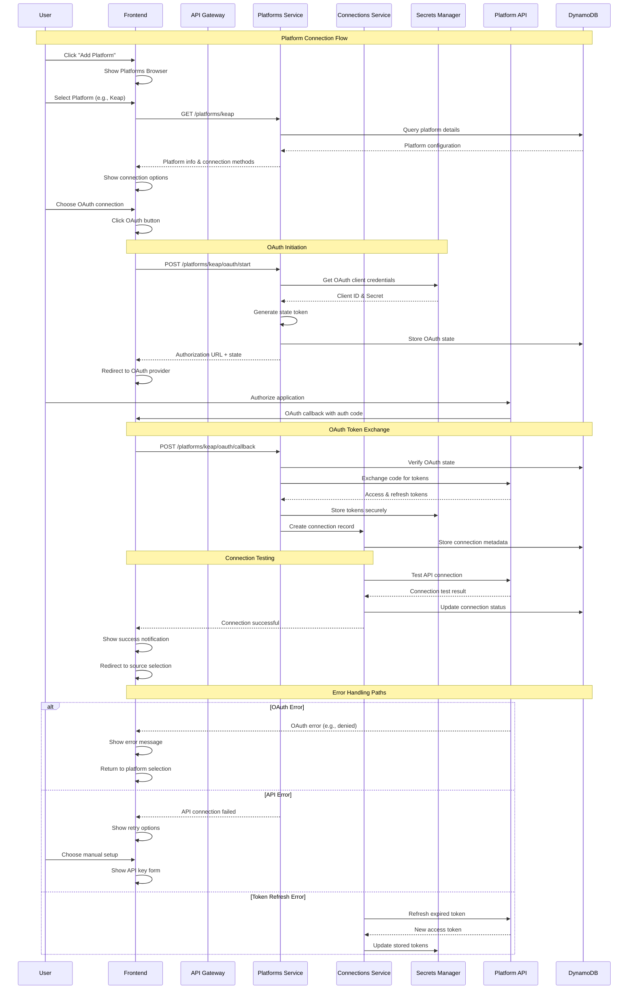
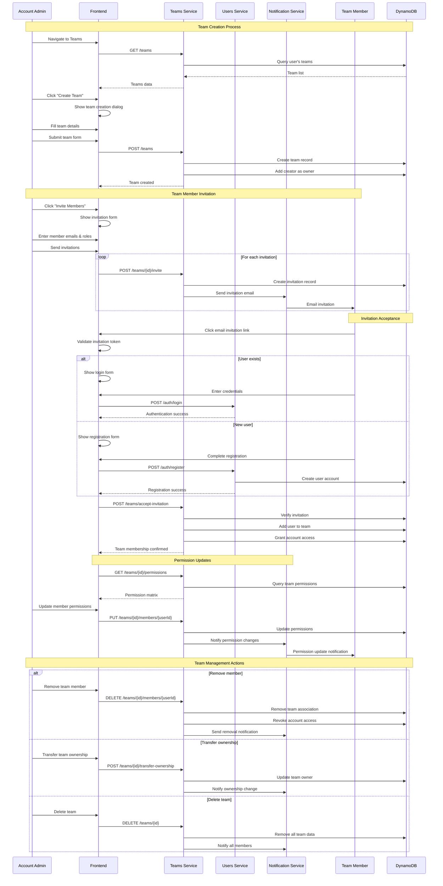
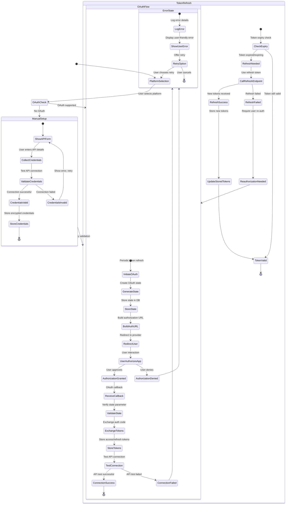
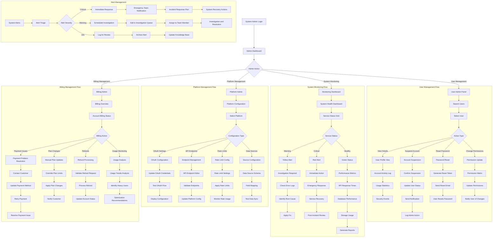

# ListBackup.ai v2 - Comprehensive User Flow Diagrams

This document contains detailed mermaid diagrams showing complete user flows and system interactions for all major scenarios in the ListBackup.ai v2 platform.

## Table of Contents

1. [Complete Signup Journey](#1-complete-signup-journey)
2. [Platform Integration Flow](#2-platform-integration-flow)
3. [Account Hierarchy Setup](#3-account-hierarchy-setup)
4. [Team Collaboration Flow](#4-team-collaboration-flow)
5. [Client Access Management](#5-client-access-management)
6. [Data Backup Process](#6-data-backup-process)
7. [Billing and Subscription](#7-billing-and-subscription)
8. [OAuth Integration Flow](#8-oauth-integration-flow)
9. [Error Handling Scenarios](#9-error-handling-scenarios)
10. [Admin Management Flows](#10-admin-management-flows)

---

## 1. Complete Signup Journey
*From landing page to first successful backup*

```mermaid
flowchart TD
    A[Landing Page Visit] --> B{User Authenticated?}
    B -->|No| C[View Features & Pricing]
    B -->|Yes| Z[Redirect to Dashboard]
    
    C --> D[Click "Sign Up"]
    D --> E[Registration Form]
    
    E --> F[Fill Required Fields]
    F --> G[Submit Registration]
    G --> H[POST /auth/register]
    
    H --> I{Registration Valid?}
    I -->|No| J[Show Validation Errors]
    J --> F
    
    I -->|Yes| K[Create Cognito User]
    K --> L[Create Root Account]
    L --> M[Send Verification Email]
    M --> N[Redirect to Email Verification]
    
    N --> O[User Clicks Email Link]
    O --> P[Verify Email Token]
    P --> Q{Verification Success?}
    
    Q -->|No| R[Show Error Message]
    R --> S[Resend Verification]
    S --> M
    
    Q -->|Yes| T[Redirect to Login]
    T --> U[Enter Credentials]
    U --> V[POST /auth/login]
    
    V --> W[Cognito Authentication]
    W --> X{Login Success?}
    X -->|No| Y[Show Login Error]
    Y --> U
    
    X -->|Yes| AA[Store JWT Tokens]
    AA --> BB[Redirect to Dashboard]
    BB --> CC[Check First Login]
    
    CC --> DD{New User?}
    DD -->|Yes| EE[Show Welcome Screen]
    DD -->|No| FF[Show Regular Dashboard]
    
    EE --> GG[Setup Guide Modal]
    GG --> HH[Step 1: Choose Platform]
    HH --> II[Browse Available Platforms]
    II --> JJ[Select Platform (e.g., Keap)]
    
    JJ --> KK[Platform Setup Dialog]
    KK --> LL[Choose Connection Method]
    LL --> MM{OAuth Available?}
    
    MM -->|Yes| NN[OAuth Button Click]
    MM -->|No| OO[Manual API Key Form]
    
    NN --> PP[Initiate OAuth Flow]
    PP --> QQ[Redirect to Provider]
    QQ --> RR[User Authorizes]
    RR --> SS[OAuth Callback]
    SS --> TT[Exchange Code for Tokens]
    TT --> UU[Store Connection Tokens]
    
    OO --> VV[Enter API Credentials]
    VV --> WW[Test Connection]
    WW --> XX{Connection Valid?}
    XX -->|No| YY[Show Connection Error]
    YY --> VV
    XX -->|Yes| UU
    
    UU --> ZZ[Create Connection Record]
    ZZ --> AAA[Show Available Data Sources]
    AAA --> BBB[Select Data Sources]
    BBB --> CCC[Configure Backup Settings]
    
    CCC --> DDD[Create Source Records]
    DDD --> EEE[Trigger First Backup]
    EEE --> FFF[Create Backup Job]
    FFF --> GGG[Execute Backup Process]
    
    GGG --> HHH[Connect to Platform API]
    HHH --> III[Fetch Data]
    III --> JJJ[Transform & Store in S3]
    JJJ --> KKK[Update Job Status]
    KKK --> LLL[Send Success Notification]
    
    LLL --> MMM[Update Dashboard]
    MMM --> NNN[Show Backup Success]
    NNN --> OOO[Complete Onboarding]
    
    OOO --> PPP[Regular Dashboard View]
```

---

## 2. Platform Integration Flow
*Detailed OAuth and manual connection setup*



---

## 3. Account Hierarchy Setup
*Enterprise multi-level account management*

```mermaid
flowchart TD
    A[Enterprise Admin Login] --> B[Dashboard View]
    B --> C[Navigate to Account Management]
    C --> D[Current Account Tree View]
    
    D --> E[Click "Create Sub-Account"]
    E --> F[Sub-Account Creation Dialog]
    F --> G[Fill Account Details]
    
    G --> H[Account Information Form]
    H --> I[Enter Account Name]
    I --> J[Select Account Type]
    J --> K{Account Type}
    
    K -->|Subsidiary| L[Subsidiary Setup]
    K -->|Division| M[Division Setup]  
    K -->|Location| N[Location Setup]
    K -->|Team| O[Team Setup]
    
    L --> P[Select Parent Account]
    M --> P
    N --> P
    O --> P
    
    P --> Q[Configure Permissions]
    Q --> R[Data Access Levels]
    R --> S[Billing Responsibility]
    S --> T[User Management Rights]
    
    T --> U[Submit Account Creation]
    U --> V[POST /account/sub-accounts]
    
    V --> W[Validate Hierarchy Rules]
    W --> X{Validation Passed?}
    X -->|No| Y[Show Validation Errors]
    Y --> G
    
    X -->|Yes| Z[Generate Account Path]
    Z --> AA[Create Account Record]
    AA --> BB[Update Parent Account]
    BB --> CC[Set Default Permissions]
    
    CC --> DD[Account Created Successfully]
    DD --> EE[Update Account Tree View]
    EE --> FF[Send Invite to Account Admin]
    
    FF --> GG{Invite Type}
    GG -->|Internal User| HH[Assign Existing User]
    GG -->|External User| II[Send Email Invitation]
    
    HH --> JJ[POST /account/assign-user]
    JJ --> KK[Update User Permissions]
    KK --> LL[Send Notification]
    
    II --> MM[Generate Invitation Token]
    MM --> NN[Send Email with Setup Link]
    NN --> OO[User Clicks Invitation]
    OO --> PP[Invitation Acceptance Page]
    
    PP --> QQ{User Exists?}
    QQ -->|No| RR[Registration Form]
    QQ -->|Yes| SS[Login Form]
    
    RR --> TT[Create User Account]
    TT --> UU[Link to Sub-Account]
    SS --> VV[Authenticate User]
    VV --> UU
    
    UU --> WW[Set Account Context]
    WW --> XX[Grant Account Permissions]
    XX --> YY[Welcome to Sub-Account]
    YY --> ZZ[Sub-Account Dashboard]
    
    subgraph "Account Hierarchy Examples"
        direction TB
        AAA[PepsiCo Root] --> BBB[Frito-Lay Subsidiary]
        BBB --> CCC[Lay's Brand Division]
        CCC --> DDD[Regional Operations]
        DDD --> EEE[Store Locations]
        
        FFF[Agency Root] --> GGG[Client Account 1]
        FFF --> HHH[Client Account 2]
        GGG --> III[Client Project Teams]
        
        JJJ[Franchise Root] --> KKK[Franchise Location A]
        JJJ --> LLL[Franchise Location B]
        KKK --> MMM[Department Teams]
    end
```

---

## 4. Team Collaboration Flow
*Team creation, invitations, and permission management*



---

## 5. Client Access Management
*Client portal setup and data access control*

```mermaid
flowchart TD
    A[Agency/Service Provider] --> B[Navigate to Clients]
    B --> C[Click "Add Client"]
    C --> D[Client Creation Form]
    
    D --> E[Enter Client Details]
    E --> F[Client Name & Contact Info]
    F --> G[Select Access Permissions]
    G --> H[Choose Data Sources]
    H --> I[Set Access Duration]
    
    I --> J[Submit Client Creation]
    J --> K[POST /clients]
    K --> L[Create Client Record]
    L --> M[Generate Client Portal Access]
    M --> N[Create Invitation Token]
    
    N --> O[Send Client Invitation]
    O --> P[Email with Portal Link]
    P --> Q[Client Receives Email]
    Q --> R[Client Clicks Portal Link]
    
    R --> S[Client Portal Login Page]
    S --> T{Client Account Exists?}
    
    T -->|No| U[Client Registration]
    T -->|Yes| V[Client Login Form]
    
    U --> W[Enter Client Details]
    W --> X[Create Client Account]
    X --> Y[Link to Provider Account]
    Y --> Z[Set Initial Password]
    Z --> AA[POST /clients/{id}/register]
    
    V --> BB[Enter Credentials]
    BB --> CC[POST /clients/{id}/login]
    CC --> DD[Validate Client Access]
    
    AA --> EE[Client Account Created]
    CC --> EE
    EE --> FF[Generate Client Session]
    FF --> GG[Redirect to Client Portal]
    
    GG --> HH[Client Portal Dashboard]
    HH --> II[Available Data Sources]
    II --> JJ[Data Export Options]
    JJ --> KK[Access History Log]
    
    subgraph "Client Portal Features"
        LL[View Allowed Data] --> MM[Export Data]
        MM --> NN[Download Reports]
        NN --> OO[Schedule Reports]
        OO --> PP[Request Additional Access]
    end
    
    KK --> QQ{Client Action}
    QQ -->|View Data| LL
    QQ -->|Export Request| MM
    QQ -->|Access Request| PP
    
    PP --> RR[Request Additional Data]
    RR --> SS[Submit Access Request]
    SS --> TT[POST /clients/{id}/access-request]
    TT --> UU[Notify Service Provider]
    UU --> VV[Provider Reviews Request]
    
    VV --> WW{Request Approved?}
    WW -->|Yes| XX[Grant Additional Access]
    WW -->|No| YY[Send Rejection Notice]
    
    XX --> ZZ[Update Client Permissions]
    ZZ --> AAA[Notify Client of Changes]
    YY --> BBB[Client Sees Rejection]
    
    subgraph "Security & Audit"
        CCC[Track All Client Actions] --> DDD[Log Data Access]
        DDD --> EEE[Monitor Export Activity]
        EEE --> FFF[Generate Audit Reports]
    end
    
    AAA --> GGG[Updated Portal View]
    BBB --> HHH[Portal with Current Access]
```

---

## 6. Data Backup Process
*Complete backup lifecycle from source to storage*

```mermaid
flowchart TD
    A[Backup Trigger] --> B{Trigger Type}
    B -->|Manual| C[User Initiated]
    B -->|Scheduled| D[Cron Job]
    B -->|Event| E[Platform Webhook]
    
    C --> F[POST /sources/{id}/sync]
    D --> G[Lambda Scheduler]
    E --> H[Webhook Handler]
    
    F --> I[Validate Source Access]
    G --> I
    H --> I
    
    I --> J[Get Source Configuration]
    J --> K[Retrieve Connection Credentials]
    K --> L[Decrypt OAuth Tokens]
    L --> M[Test Platform Connection]
    
    M --> N{Connection Valid?}
    N -->|No| O[Refresh OAuth Token]
    O --> P{Refresh Success?}
    P -->|No| Q[Mark Source as Failed]
    P -->|Yes| R[Update Stored Tokens]
    R --> M
    
    N -->|Yes| S[Create Backup Job]
    S --> T[Generate Job ID]
    T --> U[Set Job Status: Running]
    U --> V[Initialize Progress Tracking]
    
    V --> W[Connect to Platform API]
    W --> X[Determine Data Endpoints]
    X --> Y[Calculate Total Records]
    Y --> Z[Start Data Fetching]
    
    subgraph "Data Processing Pipeline"
        AA[Fetch Data Batch] --> BB[Transform Data Format]
        BB --> CC[Validate Data Schema]
        CC --> DD[Encrypt Sensitive Fields]
        DD --> EE[Compress Data]
        EE --> FF[Generate S3 Key]
        FF --> GG[Upload to S3]
        GG --> HH[Update Progress]
        HH --> II{More Data?}
        II -->|Yes| AA
        II -->|No| JJ[Complete Processing]
    end
    
    Z --> AA
    JJ --> KK[Generate Backup Metadata]
    KK --> LL[Store Metadata in DynamoDB]
    LL --> MM[Calculate Storage Usage]
    MM --> NN[Update Account Quotas]
    
    NN --> OO[Create Success Activity Log]
    OO --> PP[Send Notification]
    PP --> QQ[Update Job Status: Completed]
    QQ --> RR[Clean Up Temp Files]
    
    subgraph "Error Handling"
        Q --> SS[Log Error Details]
        SS --> TT[Increment Retry Count]
        TT --> UU{Retry Limit Reached?}
        UU -->|No| VV[Schedule Retry]
        UU -->|Yes| WW[Mark as Permanently Failed]
        VV --> XX[Wait Backoff Period]
        XX --> I
        WW --> YY[Send Failure Notification]
    end
    
    subgraph "Real-time Updates"
        V --> ZZ[WebSocket Connection]
        HH --> ZZ
        QQ --> ZZ
        YY --> ZZ
        ZZ --> AAA[Frontend Progress Updates]
    end
    
    subgraph "Data Verification"
        GG --> BBB[Verify Upload Integrity]
        BBB --> CCC[Generate Checksums]
        CCC --> DDD[Store Verification Hashes]
    end
    
    RR --> EEE[Backup Complete]
    
    subgraph "Post-Backup Actions"
        EEE --> FFF[Update Source Last Sync]
        FFF --> GGG[Trigger Downstream Jobs]
        GGG --> HHH[External Storage Sync]
        HHH --> III[Data Analytics Update]
    end
```

---

## 7. Billing and Subscription
*Payment processing and plan management*

```mermaid
sequenceDiagram
    participant U as User
    participant F as Frontend
    participant BS as Billing Service
    participant S as Stripe API
    participant PS as Payment Service
    participant DB as DynamoDB
    participant NS as Notification Service
    
    Note over U,NS: Subscription Upgrade Flow
    
    U->>F: Navigate to Billing
    F->>BS: GET /billing/subscription
    BS->>DB: Query current plan
    DB-->>BS: Subscription details
    BS-->>F: Current plan info
    
    U->>F: Click "Upgrade Plan"
    F->>F: Show pricing plans
    U->>F: Select new plan
    F->>F: Show payment form
    
    alt New customer
        U->>F: Enter payment details
        F->>S: Create payment method
        S-->>F: Payment method ID
        F->>BS: POST /billing/create-subscription
        BS->>S: Create Stripe customer
        S-->>BS: Customer ID
        BS->>S: Create subscription
        S-->>BS: Subscription details
        BS->>DB: Store subscription
    else Existing customer
        U->>F: Confirm plan change
        F->>BS: POST /billing/update-subscription
        BS->>S: Modify subscription
        S-->>BS: Updated subscription
        BS->>DB: Update subscription
    end
    
    Note over BS,NS: Payment Processing
    
    BS->>S: Process payment
    
    alt Payment successful
        S-->>BS: Payment confirmation
        BS->>DB: Update payment status
        BS->>DB: Update plan limits
        BS->>NS: Send upgrade confirmation
        NS->>U: Success email
        BS-->>F: Upgrade successful
        F->>F: Show success message
        F->>F: Update plan display
    else Payment failed
        S-->>BS: Payment error
        BS->>DB: Log failed payment
        BS->>NS: Send payment failure notice
        NS->>U: Payment failed email
        BS-->>F: Payment failed
        F->>F: Show error message
        F->>F: Retry payment option
    end
    
    Note over U,DB: Plan Downgrade Flow
    
    U->>F: Request plan downgrade
    F->>BS: GET /billing/downgrade-preview
    BS->>DB: Calculate usage vs new limits
    BS-->>F: Downgrade impact preview
    
    alt Usage exceeds new limits
        F->>F: Show usage reduction required
        U->>F: Reduce usage or cancel
        F->>BS: POST /billing/reduce-usage
        BS->>DB: Archive/delete excess data
    else Usage within limits
        F->>F: Show immediate downgrade option
    end
    
    U->>F: Confirm downgrade
    F->>BS: POST /billing/downgrade
    BS->>S: Update subscription
    S-->>BS: Subscription updated
    BS->>DB: Update plan limits
    BS->>NS: Send downgrade confirmation
    NS->>U: Plan change confirmation
    
    Note over U,NS: Payment Method Management
    
    U->>F: Manage payment methods
    F->>BS: GET /billing/payment-methods
    BS->>S: List customer payment methods
    S-->>BS: Payment methods
    BS-->>F: Payment method list
    
    U->>F: Add new payment method
    F->>S: Create setup intent
    S-->>F: Client secret
    F->>F: Show Stripe Elements form
    U->>F: Enter new card details
    F->>S: Confirm setup intent
    S-->>F: Payment method created
    F->>BS: POST /billing/add-payment-method
    BS->>DB: Store payment method reference
    
    Note over BS,NS: Billing Alerts & Notifications
    
    loop Daily billing check
        BS->>DB: Check account usage
        BS->>DB: Check plan limits
        
        alt Usage approaching limit
            BS->>NS: Send usage warning
            NS->>U: Usage alert email
        else Usage exceeded
            BS->>NS: Send overage notice
            NS->>U: Overage warning email
            BS->>DB: Apply overage charges
        else Payment due soon
            BS->>NS: Send payment reminder
            NS->>U: Payment reminder email
        end
    end
```



---

## 8. OAuth Integration Flow
*Detailed OAuth 2.0 implementation across platforms*



---

## 9. Error Handling Scenarios
*Comprehensive error recovery flows*

```mermaid
flowchart TD
    A[API Request] --> B{Request Type}
    B -->|Authentication| C[Auth Error Handling]
    B -->|Data Operation| D[Data Error Handling] 
    B -->|External API| E[Integration Error Handling]
    B -->|System| F[System Error Handling]
    
    subgraph "Authentication Error Handling"
        C --> C1{Error Type}
        C1 -->|401 Unauthorized| C2[Token Expired]
        C1 -->|403 Forbidden| C3[Insufficient Permissions]
        C1 -->|Invalid Token| C4[Malformed Token]
        
        C2 --> C5[Attempt Token Refresh]
        C5 --> C6{Refresh Success?}
        C6 -->|Yes| C7[Retry Original Request]
        C6 -->|No| C8[Force Re-login]
        
        C3 --> C9[Show Permission Error]
        C9 --> C10[Contact Admin Option]
        
        C4 --> C11[Clear Stored Tokens]
        C11 --> C8
        
        C7 --> C12[Request Successful]
        C8 --> C13[Redirect to Login]
        C10 --> C14[Send Support Request]
    end
    
    subgraph "Data Error Handling"
        D --> D1{Error Type}
        D1 -->|Validation Error| D2[Field Validation]
        D1 -->|Not Found| D3[Resource Missing]
        D1 -->|Conflict| D4[Data Conflict]
        D1 -->|Quota Exceeded| D5[Usage Limit]
        
        D2 --> D6[Highlight Invalid Fields]
        D6 --> D7[Show Inline Errors]
        D7 --> D8[User Corrects Data]
        D8 --> D9[Retry Submission]
        
        D3 --> D10[Show Not Found Message]
        D10 --> D11[Redirect to List View]
        
        D4 --> D12[Show Conflict Resolution]
        D12 --> D13[User Chooses Resolution]
        D13 --> D14[Apply Resolution]
        
        D5 --> D15[Show Quota Message]
        D15 --> D16[Upgrade Plan Option]
        D16 --> D17[Billing Flow]
    end
    
    subgraph "Integration Error Handling"
        E --> E1{Error Type}
        E1 -->|OAuth Error| E2[OAuth Issues]
        E1 -->|API Rate Limit| E3[Rate Limiting]
        E1 -->|Platform Down| E4[Service Unavailable]
        E1 -->|Data Format| E5[Data Parsing Error]
        
        E2 --> E6[Token Refresh Flow]
        E6 --> E7{Refresh Success?}
        E7 -->|Yes| E8[Retry Operation]
        E7 -->|No| E9[Re-authorization Required]
        E9 --> E10[OAuth Setup Flow]
        
        E3 --> E11[Calculate Backoff Delay]
        E11 --> E12[Schedule Retry]
        E12 --> E13[Exponential Backoff]
        E13 --> E14[Retry with Delay]
        
        E4 --> E15[Check Platform Status]
        E15 --> E16[Queue for Later Retry]
        E16 --> E17[Notify User of Delay]
        
        E5 --> E18[Log Data Sample]
        E18 --> E19[Skip Invalid Records]
        E19 --> E20[Continue Processing]
        E20 --> E21[Report Skipped Items]
    end
    
    subgraph "System Error Handling"
        F --> F1{Error Type}
        F1 -->|Database Error| F2[DB Connection Issue]
        F1 -->|Service Timeout| F3[Lambda Timeout]
        F1 -->|Memory Error| F4[Resource Exhaustion]
        F1 -->|Unknown Error| F5[Unexpected Error]
        
        F2 --> F6[Retry with Backoff]
        F6 --> F7{DB Restored?}
        F7 -->|Yes| F8[Resume Operation]
        F7 -->|No| F9[Fallback Mode]
        
        F3 --> F10[Break into Smaller Chunks]
        F10 --> F11[Process in Batches]
        F11 --> F12[Continue Processing]
        
        F4 --> F13[Reduce Memory Usage]
        F13 --> F14[Stream Processing]
        F14 --> F15[Resume Operation]
        
        F5 --> F16[Log Full Error Context]
        F16 --> F17[Send Alert to Team]
        F17 --> F18[Show Generic Error]
        F18 --> F19[Offer Support Contact]
    end
    
    subgraph "Error Recovery Actions"
        G[Error Logged] --> G1[Categorize Error]
        G1 --> G2[Update Error Metrics]
        G2 --> G3[Check Error Frequency]
        G3 --> G4{Frequent Error?}
        G4 -->|Yes| G5[Alert Operations Team]
        G4 -->|No| G6[Standard Handling]
        
        G5 --> G7[Investigate Root Cause]
        G7 --> G8[Deploy Fix]
        G8 --> G9[Monitor Resolution]
        
        G6 --> G10[User Feedback Collection]
        G10 --> G11[Improve Error Messages]
    end
```



---

## 10. Admin Management Flows
*System administration and monitoring*



---

## Summary

These comprehensive flow diagrams cover all major user scenarios in the ListBackup.ai v2 system:

1. **Complete Signup Journey** - From initial landing page visit through first successful backup
2. **Platform Integration Flow** - OAuth and manual platform connection setup
3. **Account Hierarchy Setup** - Enterprise multi-level account management
4. **Team Collaboration Flow** - Team creation, invitations, and permissions
5. **Client Access Management** - Client portal setup and data access control
6. **Data Backup Process** - Complete backup lifecycle with error handling
7. **Billing and Subscription** - Payment processing and plan management
8. **OAuth Integration Flow** - Detailed OAuth 2.0 state management
9. **Error Handling Scenarios** - Comprehensive error recovery across all systems
10. **Admin Management Flows** - System administration and monitoring

Each diagram shows:
- **Entry and exit points** for each flow
- **Decision nodes** with branching logic
- **API call annotations** with specific endpoints
- **Error handling paths** with recovery options
- **User role considerations** and permissions
- **Page/component transitions** in the frontend
- **Backend service interactions** and data flow
- **Real-time updates** and notification patterns

These diagrams serve as a complete reference for understanding how users interact with the ListBackup.ai v2 system and how the system responds to various scenarios, including both happy path and error conditions.